# Claude Code 项目完整分析报告

## 📋 执行摘要

本报告是对 Claude Code 项目的全面分析，旨在为零基础新手提供由浅入深的项目讲解。报告包含项目架构、核心功能模块、技术栈分析以及学习路径建议。

---

## 🎯 一、项目概述

### 1.1 项目定位

**Claude Code** 是一个驻留在终端中的智能编码助手，它理解你的代码库，通过自然语言命令帮助你：
- ✅ 执行日常任务
- ✅ 解释复杂代码
- ✅ 处理 Git 工作流
- ✅ 自动化开发流程

**核心理念：** 通过 AI 协作提升开发效率，而非简单替代。

### 1.2 项目规模

```
目录结构统计：
├── 插件系统 (plugins/)         - 15+ 个功能插件
├── 学习文档 (项目学习文档/)     - 12 个核心模块
├── 脚本工具 (scripts/)         - 8 个自动化脚本
├── 配置示例 (examples/)        - 4 套配置方案
└── 开发容器 (.devcontainer/)   - 完整的开发环境
```

---

## 🏗️ 二、整体架构

### 2.1 三层架构模型

```
┌─────────────────────────────────────────┐
│          用户交互层                      │
│  ┌─────────┐  ┌─────────┐  ┌─────────┐ │
│  │ Terminal│  │   IDE   │  │ GitHub  │ │
│  └─────────┘  └─────────┘  └─────────┘ │
└─────────────────────────────────────────┘
              ↓
┌─────────────────────────────────────────┐
│          核心引擎层                      │
│  ┌─────────────────────────────────┐   │
│  │  Claude Code CLI (Node.js)     │   │
│  │  - 命令解析                     │   │
│  │  - 上下文管理                   │   │
│  │  - 工具调用                     │   │
│  └─────────────────────────────────┘   │
└─────────────────────────────────────────┘
              ↓
┌─────────────────────────────────────────┐
│          扩展能力层                      │
│  ┌──────┐ ┌──────┐ ┌──────┐ ┌──────┐  │
│  │ Hook │ │ Agent│ │Plugin│ │ MCP  │  │
│  │ 系统  │ │ 协作 │ │ 市场 │ │集成  │  │
│  └──────┘ └──────┘ └──────┘ └──────┘  │
└─────────────────────────────────────────┘
```

### 2.2 核心组件详解

#### 组件 1: Hook 系统（安全与自动化）

**位置：** `plugins/hookify/`

**作用：** 在关键事件点插入自定义逻辑

**Hook 类型：**
```
SessionStart → 会话开始初始化
    ↓
UserPromptSubmit → 用户提示词提交
    ↓
PreToolUse → 工具使用前检查（安全检查）
    ↓
[工具执行]
    ↓
PostToolUse → 工具使用后处理（验证结果）
    ↓
Stop → 任务完成前审核（质量门控）
```

**实战案例：**
```json
// hooks/hooks.json
{
  "PreToolUse": [
    {
      "type": "prompt",
      "tool": "Bash",
      "command_contains": ["rm", "delete"],
      "prompt": "警告：此操作会删除文件，请确认！",
      "timeout": 30
    }
  ],
  "Stop": [
    {
      "type": "command",
      "script": "验证测试是否通过"
    }
  ]
}
```

---

#### 组件 2: Agent 协作系统（多角色配合）

**位置：** `plugins/feature-dev/agents/`

**核心理念：** 不同 Agent 扮演不同专家角色

**三大核心 Agent：**

| Agent | 职责 | 触发时机 | 输出 |
|-------|------|----------|------|
| **code-explorer** | 代码探索者 | Phase 2 | 代码分析报告 + 关键文件清单 |
| **code-architect** | 架构设计师 | Phase 4 | 架构蓝图 + 实施路线图 |
| **code-reviewer** | 质量审查员 | Phase 6 | 问题清单 + 修复建议 |

**协作流程图：**

```mermaid
graph LR
    A[用户需求] --> B[Phase 1: Discovery]
    B --> C[Phase 2: Exploration]
    C --> D[启动 2-3 个 code-explorer Agents]
    D --> E[整合分析报告]
    E --> F[Phase 3: Clarification]
    F --> G[Phase 4: Architecture]
    G --> H[启动 2-3 个 code-architect Agents]
    H --> I[整合设计方案]
    I --> J[Phase 5: Implementation]
    J --> K[Phase 6: Review]
    K --> L[启动 3 个 code-reviewer Agents]
    L --> M[整合审查结果]
    M --> N[Phase 7: Summary]
```


---

#### 组件 3: 七阶段流程（结构化开发方法论）

**位置：** `plugins/feature-dev/commands/feature-dev.md`

**七个阶段：**

```
Phase 1: Discovery（发现）
    ├── 目标：理解需求
    ├── 活动：5W1H 分析、MoSCoW 优先级
    └── 产出：需求发现报告

Phase 2: Exploration（探索）
    ├── 目标：了解代码库
    ├── 活动：启动 code-explorer Agents
    └── 产出：代码库探索报告

Phase 3: Clarification（澄清）
    ├── 目标：消除模糊地带
    ├── 活动：提出高质量问题
    └── 产出：需求规格说明书

Phase 4: Architecture（架构）
    ├── 目标：设计方案
    ├── 活动：启动 code-architect Agents
    └── 产出：架构设计文档

Phase 5: Implementation（实现）
    ├── 目标：编写代码
    ├── 活动：编码 + 单元测试
    └── 产出：可运行代码 + 测试

Phase 6: Review（审查）
    ├── 目标：质量保证
    ├── 活动：启动 code-reviewer Agents
    └── 产出：质量审查报告

Phase 7: Summary（总结）
    ├── 目标：交付复盘
    ├── 活动：项目复盘、文档归档
    └── 产出：项目总结报告
```

**时间分配原则：**
- 前期（Phase 1-4）：45-65% 时间
- 后期（Phase 5-7）：35-55% 时间

**重要原则：** ⚠️ **不要跳过任何阶段！**

---

#### 组件 4: 插件系统（能力扩展）

**位置：** `plugins/`

**插件结构：**
```
plugin-name/
├── .claude-plugin/
│   └── plugin.json       # 插件元信息
├── commands/
│   └── command-name.md   # 命令定义
├── agents/
│   └── agent-name.md     # Agent 定义
├── skills/
│   └── skill-name/
│       └── SKILL.md      # 技能知识包
└── README.md             # 使用说明
```

**核心插件列表：**

| 插件 | 功能 | 使用场景 |
|------|------|----------|
| **feature-dev** | 七阶段流程 | 新功能开发 |
| **security-guidance** | 安全门机制 | 安全检查 |
| **hookify** | Hook 开发工具 | 自定义规则 |
| **code-review** | 代码审查 | PR 审查 |
| **plugin-dev** | 插件开发工具包 | 创建新插件 |
| **commit-commands** | Git 提交工具 | 版本管理 |

---

#### 组件 5: MCP 集成（外部服务连接）

**MCP（Model Context Protocol）：** 用于连接外部服务的标准协议

**支持的服务器类型：**
- stdio：本地进程通信
- SSE：Server-Sent Events
- HTTP：REST API
- WebSocket：实时通信

**配置示例：**
```json
{
  "mcpServers": {
    "filesystem": {
      "command": "npx",
      "args": ["@modelcontextprotocol/server-filesystem", "/path/to/watch"]
    },
    "database": {
      "url": "http://localhost:3000/sse"
    }
  }
}
```

---

## 🔧 三、技术栈分析

### 3.1 核心技术栈

```yaml
运行时环境:
  - Node.js 18+ (必需)
  - npm / yarn / pnpm (包管理)

主要语言:
  - TypeScript/JavaScript (核心逻辑)
  - Python (辅助工具、Hook 脚本)
  - Bash/Shell (自动化脚本)

配置语言:
  - Markdown (CLAUDE.md、Agent 定义)
  - JSON (插件配置、Hook 配置)

开发工具:
  - Git (版本控制)
  - VSCode / Cursor (推荐 IDE)
  - Docker (容器化开发)
```

### 3.2 文件组织规范

**Markdown 文件结构：**
```markdown
---
name: agent-name           # Agent 名称
description: 功能描述       # 简短描述
tools: Glob, Read, Bash    # 可用工具列表
model: sonnet              # 使用的模型
color: blue                # UI 颜色
---

# 角色定义

你是...

## 核心使命

...

## 工作流程

1. ...
2. ...

## 输出格式

...
```

**JSON 配置结构：**
```json
{
  "name": "plugin-name",
  "version": "1.0.0",
  "description": "插件描述",
  "author": {
    "name": "作者名",
    "email": "邮箱"
  }
}
```

---

## 📚 四、学习文档体系分析

### 4.1 现有文档结构

```
项目学习文档/
├── 01-项目概述/
│   └── 01-项目简介.md              ✅ 已完成
├── 02-Hook 系统/
│   ├── 01-Hook 系统基础.md          ✅ 已完成
│   ├── 02-Hook 开发工具链.md        ✅ 已完成
│   └── 03-Hook 项目组织最佳实践.md  ✅ 已完成
├── 03-安全门机制/
│   └── 01-安全门机制详解.md         ✅ 已完成
├── 04-Agent 协作系统/
│   ├── 01-Agent 协作系统详解.md     ✅ 已完成
│   ├── 02-Agent 协作流程图集.md     ✅ 已完成
│   ├── 03-其他专用 Agent 详解.md    ✅ 已完成
│   ├── 04-Agent vs Skill 机制对比.md ✅ 已完成
│   ├── 05-核心 Agent 逐行解读.md    ✅ 已完成
│   └── 06-Agent-Hook 配合实战.md    ✅ 已完成
├── 05-七阶段流程/
│   └── 01-七阶段流程详解.md         ✅ 已完成
├── 06-CLAUDE.md 规范/
│   └── 01-CLAUDE.md 规范详解.md     ✅ 已完成
├── 07-插件系统/
│   └── 01-插件系统详解.md           ✅ 已完成
├── 08-MCP 集成/                    ❌ 空目录
├── 09-Git 工作树/                  ❌ 空目录
├── 10-提示词工程与质量保障/        ❌ 空目录
├── 11-多语言知识点/
│   └── 01-语言知识点详解.md         ✅ 已完成
└── 12-学习次序指南/
    └── 01-完整学习路径.md           ✅ 已完成
```

### 4.2 【05-七阶段流程】内容完整性检查

**当前内容：**
- ✅ Phase 1: Discovery（需求发现）- 详细讲解
- ✅ Phase 2: Exploration（代码库探索）- 详细讲解
- ✅ Phase 3: Clarification（需求澄清）- 详细讲解
- ✅ Phase 4: Architecture（架构设计）- 详细讲解
- ✅ Phase 5: Implementation（实现）- 详细讲解
- ✅ Phase 6: Review（质量审查）- 详细讲解
- ✅ Phase 7: Summary（项目总结）- 详细讲解
- ✅ 自动化集成（feature-dev 插件）
- ✅ Hook 系统集成
- ✅ 最佳实践总结

**遗漏内容检查：**

通过与 `plugins/feature-dev/` 下的源代码对比，发现以下内容**可以补充**：

#### 缺失内容 1：三个核心 Agent 的详细解读
- 📋 **code-explorer** 完整配置文件解读
- 📋 **code-architect** 完整配置文件解读  
- 📋 **code-reviewer** 完整配置文件解读

**建议补充位置：** `05-七阶段流程/02-核心 Agent 配置详解.md`

#### 缺失内容 2：各阶段的触发条件与判断标准
- 📋 何时进入下一阶段？
- 📋 每个阶段的完成标志是什么？
- 📋 阶段转换的自动化判断逻辑

**建议补充位置：** `05-七阶段流程/03-阶段转换判断标准.md`

#### 缺失内容 3：TodoWrite 追踪机制
- 📋 如何使用 TodoWrite 跟踪进度
- 📋 Todo 列表的结构设计
- 📋 完成状态管理

**建议补充位置：** `05-七阶段流程/04-TodoWrite 进度追踪.md`

#### 缺失内容 4：实战案例全流程演练
- 📋 完整的需求场景
- 📋 每个阶段的实际对话示例
- 📋 最终代码实现展示

**建议补充位置：** `05-七阶段流程/05-实战案例全流程.md`

---

## 🎓 五、学习路径建议

### 5.1 零基础入门路径（推荐）

```
第 1 周：项目认知
├── 阅读 01-项目简介
├── 安装并体验 Claude Code
└── 完成第一个简单任务

第 2-3 周：Hook 系统基础
├── 学习 02-Hook 系统基础
├── 创建第一个 SessionStart Hook
└── 配置 PreToolUse 安全检查

第 4-5 周：安全门机制
├── 学习 03-安全门机制详解
├── 实现 SQL 注入检测
└── 实现 XSS 检测

第 6-9 周：Agent 协作系统
├── 学习 04-Agent 协作系统全部 6 个小节
├── 创建简单的 code-reviewer Agent
└── 实践多 Agent 协作

第 10-12 周：七阶段流程
├── 学习 05-七阶段流程详解
├── 使用 /feature-dev 完成一个小功能
└── 补充学习建议的三个小节

第 13 周：CLAUDE.md 规范
├── 学习 06-CLAUDE.md 规范详解
└── 为项目编写 CLAUDE.md

第 14-16 周：插件开发
├── 学习 07-插件系统详解
├── 开发第一个简单插件
└── 发布到 Marketplace
```

### 5.2 快速上手路径（有基础）

```
Day 1-2: Hook 系统速成
├── 02-Hook 系统基础
└── 03-Hook 开发工具链

Day 3-5: Agent 协作实战
├── 04-Agent 协作系统详解
├── 04-Agent 协作流程图集
└── 06-Agent-Hook 配合实战

Day 6-10: 七阶段流程精通
├── 05-七阶段流程详解
├── 补充：核心 Agent 配置
├── 补充：实战案例全流程
└── 实际项目开发
```

---

## 💡 六、核心功能深度解析

### 6.1 feature-dev 插件完整流程

**启动命令：**
```bash
/feature-dev 开发用户积分系统
```

**详细流程拆解：**

#### Step 1: Phase 1 - Discovery

```markdown
Claude 的行为：
1. 创建 Todo 列表（包含所有 7 个阶段）
2. 如果需求不清晰，提问：
   - 你要解决什么问题？
   - 功能应该做什么？
   - 有什么约束或要求吗？
3. 总结理解并与用户确认

示例对话：
用户：我需要一个积分系统
Claude: 好的，让我先了解一下：
       1. 这个积分系统要解决什么业务问题？
       2. 用户如何获得和使用积分？
       3. 技术上有什么要求吗？（技术栈、性能等）
```

#### Step 2: Phase 2 - Exploration

```markdown
Claude 的行为：
1. 启动 2-3 个 code-explorer Agents（并行）
   
   Agent 1: "找到类似积分的功能并追踪实现"
   Agent 2: "映射代码架构和抽象层次"
   Agent 3: "分析 UI 模式、测试方法"

2. Agents 返回后，阅读所有识别的关键文件
3. 呈现综合分析报告

code-explorer Agent 输出示例：
## 代码探索报告

### 入口点
- src/routes/rewards.ts:12 - 奖励路由
- src/controllers/pointsController.ts:45 - 积分控制器

### 调用链
pointsController.addPoints()
    ↓
pointsService.calculatePoints()
    ↓
userRepository.update()

### 关键文件清单
1. src/services/pointsService.ts (L1-L234)
2. src/models/PointsTransaction.ts (L1-L89)
3. src/middleware/pointsValidator.ts (L1-L156)
```

#### Step 3: Phase 3 - Clarification

```markdown
Claude 的行为：
1. 审查代码库发现和原始需求
2. 识别未明确的方面：
   - 边界情况
   - 错误处理
   - 集成点
   - 性能需求
3. 以清晰的列表形式向用户呈现所有问题
4. **等待用户回答后再继续**

示例问题清单：
在开始设计架构之前，我需要澄清以下几点：

1. 积分获取规则：
   - 注册送多少积分？(建议：100)
   - 每日签到送多少？(建议：10 积分/天)
   - 消费返积分比例？(建议：1 元=1 积分)

2. 积分使用规则：
   - 抵扣比例？(建议：100 积分=1 元)
   - 是否可以转赠？(建议：允许，最低 100 积分)

3. 技术细节：
   - 需要支持多大并发？(建议：10000 QPS)
   - 响应时间要求？(建议：P95 < 200ms)

请确认以上规则，或有其他想法？
```

#### Step 4: Phase 4 - Architecture

```markdown
Claude 的行为：
1. 启动 2-3 个 code-architect Agents（并行）
   
   Agent 1: 最小改动方案（最小变更、最大复用）
   Agent 2: 整洁架构方案（可维护性、优雅抽象）
   Agent 3: 务实平衡方案（速度 + 质量）

2. 审查所有方案并形成自己的观点
3. 向用户呈现：
   - 每个方案的简要总结
   - 权衡比较
   - **推荐方案及理由**
4. **询问用户偏好哪个方案**

输出示例：
我设计了 3 种方案：

方案 1：最小改动
- 扩展现有的 RewardsService 添加积分方法
- 在现有 auth 路由中添加 OAuth 路由
- 最少重构

优点：快速、低风险
缺点：OAuth 与现有认证耦合、难测试

方案 2：整洁架构
- 新的 OAuthService 和专用接口
- 独立的路由和中间件
- 重构 AuthService 使用通用接口

优点：清晰分离、可测试、可维护
缺点：更多文件、更多重构

方案 3：务实平衡（推荐）
- 新的 OAuthProvider 抽象
- 集成到现有 AuthService
- 最小重构、良好边界

优点：平衡复杂度和整洁性
缺点：一些耦合仍然存在

推荐：方案 3 - 给你清晰的边界，同时不需要过度重构，
并且非常适合你现有的架构。

你想用哪个方案？
```

#### Step 5: Phase 5 - Implementation

```markdown
Claude 的行为：
1. **等待用户明确批准后才开始**
2. 阅读之前阶段识别的所有相关文件
3. 按照选定的架构实现
4. 严格遵守代码库约定
5. 编写干净、注释良好的代码
6. 更新 Todo 进度

关键原则：
- 没有用户批准绝不开始
- 遵循 Phase 2 发现的模式
- 使用 Phase 4 设计的架构
- 持续跟踪进度
```

#### Step 6: Phase 6 - Quality Review

```markdown
Claude 的行为：
1. 启动 3 个 code-reviewer Agents（并行）
   
   Agent 1: 简洁性/DRY/优雅性
   Agent 2: Bug/功能正确性
   Agent 3: 约定/抽象

2. 整合发现并识别最高优先级问题
3. **向用户呈现结果并询问想做什么**：
   - 现在修复
   - 稍后修复
   - 按原样继续
4. 根据用户决定处理问题

输出示例：
代码审查结果：

高优先级问题：
1. OAuth 回调中缺少错误处理 (src/auth/oauth.ts:67)
2. 内存泄漏：OAuth 状态未清理 (src/auth/oauth.ts:89)

中优先级：
1. 可以简化令牌刷新逻辑 (src/auth/oauth.ts:120)
2. 考虑提取 OAuth 配置验证

所有测试通过。代码符合项目约定。

你想怎么做？
```

#### Step 7: Phase 7 - Summary

```markdown
Claude 的行为：
1. 标记所有 Todo 完成
2. 总结：
   - 构建了什么
   - 做出的关键决策
   - 修改的文件
   - 建议的下一步

输出示例：
功能完成：OAuth 认证

构建内容：
- 支持 Google 和 GitHub 的 OAuth 提供者抽象
- 与现有认证集成的 OAuth 路由和中间件
- 令牌刷新和会话集成
- 所有 OAuth 流程的错误处理

关键决策：
- 使用务实方法与 OAuthProvider 抽象
- 与现有会话管理集成
- 添加 OAuth 状态防止 CSRF

修改的文件：
- src/auth/OAuthProvider.ts (新建)
- src/auth/AuthService.ts
- src/routes/auth.ts
- src/middleware/authMiddleware.ts

建议的下一步：
- 为 OAuth 流程添加测试
- 添加更多 OAuth 提供者（Microsoft、Apple）
- 更新文档
```

---

### 6.2 三个核心 Agent 深度解析

#### code-explorer Agent

**配置文件位置：** `plugins/feature-dev/agents/code-explorer.md`

**核心使命：**
```markdown
通过追踪执行路径、映射架构层次、理解模式和抽象、记录依赖关系，
提供对功能如何工作的完整理解。
```

**工作流程（四步法）：**

```
Step 1: Feature Discovery（功能发现）
├── 找到入口点（API、UI 组件、命令行）
├── 定位核心实现文件
└── 映射功能边界和配置

Step 2: Code Flow Tracing（代码流追踪）
├── 跟踪调用链从入口到输出
├── 追踪每一步的数据转换
├── 识别所有依赖和集成
└── 记录状态变化和副作用

Step 3: Architecture Analysis（架构分析）
├── 映射抽象层次（展示层 → 业务逻辑 → 数据层）
├── 识别设计模式和架构决策
├── 记录组件之间的接口
└── 注意横切关注点（认证、日志、缓存）

Step 4: Implementation Details（实现细节）
├── 关键算法和数据结构
├── 错误处理和边界情况
├── 性能考虑
└── 技术债务或改进空间
```

**输出要求（必须包含）：**
- ✅ 入口点带文件：行号引用（如 `src/auth.ts:42`）
- ✅ 逐步执行流程和数据转换
- ✅ 关键组件及其职责
- ✅ 架构洞察：模式、层次、设计决策
- ✅ 依赖关系（内部和外部）
- ✅ 优势、问题、改进机会的观察
- ✅ 认为绝对必要的文件清单

---

#### code-architect Agent

**配置文件位置：** `plugins/feature-dev/agents/code-architect.md`

**核心使命：**
```markdown
通过分析现有代码库模式和约定，设计功能架构，
然后提供全面的实施蓝图，包括具体要创建/修改的文件、
组件职责、数据流和构建序列。
```

**工作流程（三步曲）：**

```
Step 1: Codebase Pattern Analysis（代码库模式分析）
├── 提取现有模式、约定和架构决策
├── 识别技术栈、模块边界、抽象层次
├── 阅读 CLAUDE.md 指南
└── 找到类似功能了解既有方法

Step 2: Architecture Design（架构设计）
├── 基于发现的模式设计完整架构
├── 关键点：做出果断选择
│   - Make decisive choices
│   - pick one approach and commit
│   - 不要模棱两可，不要罗列多个选项
├── 确保与现有代码无缝集成
└── 为可测试性、性能、可维护性而设计

Step 3: Complete Implementation Blueprint（实施蓝图）
├── 指定每个要创建或修改的文件
├── 组件职责
├── 集成点
├── 数据流
└── 分阶段实施清单
```

**输出要求（必须包含）：**
- ✅ **模式与约定发现**：带文件：行号引用的现有模式、类似功能、关键抽象
- ✅ **架构决策**：你选择的方法及理由和权衡
- ✅ **组件设计**：每个组件带文件路径、职责、依赖、接口
- ✅ **实施地图**：具体要创建/修改的文件及详细变更描述
- ✅ **数据流**：从入口点经过转换到输出的完整流程
- ✅ **构建序列**：分阶段实施步骤作为检查清单
- ✅ **关键细节**：错误处理、状态管理、测试、性能、安全考虑

**关键原则：**
> 做出自信的架构选择，而不是提供多个选项。要具体且可操作——提供文件路径、函数名和具体步骤。

---

#### code-reviewer Agent

**配置文件位置：** `plugins/feature-dev/agents/code-reviewer.md`

**核心使命：**
```markdown
审查代码是否存在 bug、逻辑错误、安全漏洞、代码质量问题，
以及对项目约定的遵守情况，使用置信度评分过滤，
只报告真正重要的高优先级问题。
```

**审查范围（默认）：**
- 审查 `git diff` 中的未暂存更改
- 用户可以指定不同的文件或范围

**审查职责（四大维度）：**

```
维度 1: Project Guidelines Compliance（项目约定遵守）
├── 验证是否遵守明确的项目规则（通常在 CLAUDE.md 中）
├── 包括：导入模式、框架约定、语言特定风格
├── 函数声明、错误处理、日志记录
├── 测试实践、平台兼容性、命名约定
└── 违反规则的严重程度评分

维度 2: Bug Detection（Bug 检测）
├── 识别会影响功能的实际 bug
├── 包括：逻辑错误、null/undefined 处理
├── 竞态条件、内存泄漏、安全漏洞
└── 性能问题

维度 3: Code Quality（代码质量）
├── 评估重大问题
├── 包括：代码重复、缺少关键错误处理
├── 可访问性问题、测试覆盖不足
└── 可读性和可维护性

维度 4: Confidence Scoring（置信度评分）
└── 只对置信度 ≥ 80 的问题进行报告
```

**置信度评分标准（0-100 分）：**

| 分数 | 含义 | 判断标准 |
|------|------|----------|
| **0** | 完全不确信 | 这是误报，或是已存在的问题 |
| **25** | 有些确信 | 可能是真问题，但也可能是误报。如果是风格问题，项目约定中没有明确要求 |
| **50** | 中等确信 | 这是真问题，但可能是小问题或不常发生。相对不太重要 |
| **75** | 高度确信 | 反复检查确认，这很可能是会在实践中遇到的真问题。现有方法不够充分。**重要且会直接影响功能**，或在项目约定中明确提到 |
| **100** | 绝对确定 | 确认这绝对是会在实践中频繁发生的真问题。证据直接证实了这一点 |

**报告阈值：** ⚠️ **只报告置信度 ≥ 80 的问题**

**输出格式要求：**
```markdown
首先明确说明正在审查的内容

对于每个高置信度问题，提供：
- 清晰描述 + 置信度分数
- 文件路径和行号
- 具体的项目约定引用或 bug 解释
- 具体的修复建议

按严重程度分组（严重 vs 重要）

如果不存在高置信度问题，确认代码符合标准并给出简要总结
```

---

## 🚀 七、实战技巧与最佳实践

### 7.1 高效使用七阶段流程的技巧

#### 技巧 1：Phase 1 需求收集

**❌ 错误做法：**
```
用户：帮我做个登录功能
Claude: 好的，用什么技术栈？（只问了一个问题就开始）
```

**✅ 正确做法：**
```
用户：帮我做个登录功能
Claude: 好的，让我先全面了解需求：

【业务目标】
1. 这个登录功能要解决什么问题？
2. 目标用户是谁？
3. 期望的业务指标是什么？

【功能范围】
4. 需要支持哪些登录方式？（账号密码、手机验证码、OAuth？）
5. 需要记住登录状态吗？多久过期？
6. 需要找回密码功能吗？

【技术约束】
7. 现有技术栈是什么？
8. 需要支持多大并发？
9. 有什么安全要求？

【优先级】
10. 哪些功能是必须的（Must have）？
11. 哪些功能可以后续迭代（Could have）？

请逐一回答，这样我能给出最合适的方案。
```

---

#### 技巧 2：Phase 2 代码探索

**❌ 错误做法：**
```
Claude: 我大概看了一下，代码结构还行。
（没有深入分析就开始设计）
```

**✅ 正确做法：**
```
Claude: 我已经启动了 3 个 code-explorer Agents，分别分析：

Agent 1（黄色）：追踪现有的认证功能
→ 发现了 3 个相关文件和 5 个调用链

Agent 2（蓝色）：映射整体架构
→ 识别了 4 层架构和 2 个设计模式

Agent 3（绿色）：分析代码约定
→ 找到了编码规范和测试模式

我已阅读所有识别的关键文件（共 12 个），总结如下：
[详细的代码探索报告]
```

---

#### 技巧 3：Phase 3 需求澄清

**❌ 错误做法：**
```
Claude: 还有一些细节不清楚，你看着办吧。
（跳过澄清直接设计）
```

**✅ 正确做法：**
```
Claude: 在进入架构设计之前，以下细节需要澄清：

【功能性问题】
1. 登录失败几次后锁定账户？
   - 建议：5 次失败后锁定 30 分钟
   
2. Token 有效期多久？
   - 建议：Access Token 7 天，Refresh Token 30 天

【边界情况】
3. 用户被锁定时如何解锁？
   - 建议：自动解锁 + 邮件通知
   
4. 忘记密码流程需要邮箱验证吗？
   - 建议：需要，防止恶意重置

【非功能性需求】
5. 登录接口响应时间要求？
   - 建议：P95 < 300ms

请确认以上建议，或提出你的想法。
```

---

#### 技巧 4：Phase 4 架构设计

**❌ 错误做法：**
```
Claude: 有三种方案，你选一个吧。
（把责任推给用户）
```

**✅ 正确做法：**
```
Claude: 我设计了三种方案，经过分析，我推荐方案 2：

【方案对比】

方案 1：最小改动
- 实现方式：扩展现有 AuthService
- 优点：快（1 天）、风险低
- 缺点：耦合严重、难测试
- 适用场景：紧急修复、临时方案

方案 2：整洁架构（⭐ 推荐）
- 实现方式：独立的 AuthenticationService 接口
- 优点：清晰分离、易测试、可维护
- 缺点：需要 3 天、重构较多
- 适用场景：长期维护的核心功能 ← 我们属于这种情况

方案 3：务实平衡
- 实现方式：折中方案
- 优点：平衡速度和整洁性
- 缺点：仍有部分耦合

【推荐理由】
1. 登录是核心功能，需要长期维护
2. 团队有时间（工期 1 周）
3. 符合项目的 CLAUDE.md 约定（整洁架构优先）

你同意方案 2 吗？或有其他想法？
```

---

#### 技巧 5：Phase 6 质量审查

**❌ 错误做法：**
```
Claude: 代码看起来没问题，可以提交了。
（审查走过场）
```

**✅ 正确做法：**
```
Claude: 我启动了 3 个 code-reviewer Agents，审查结果如下：

【严重问题】（必须修复）
1. ⚠️ 第 45 行：缺少空值检查
   - 文件：src/auth/login.ts:45
   - 问题：password 参数可能为 null
   - 修复：添加 if (!password) throw new ValidationError()
   
2. ⚠️ 第 89 行：SQL 注入风险
   - 文件：src/auth/userRepository.ts:89
   - 问题：字符串拼接 SQL
   - 修复：使用参数化查询

【重要问题】（建议修复）
1. ℹ️ 第 120 行：可以简化逻辑
   - 当前代码：15 行嵌套 if-else
   - 建议：使用策略模式减少到 8 行

【总体评价】
- 功能正确性：✅ 所有测试通过
- 代码质量：⚠️ 有 2 个严重问题需修复
- 约定遵守：✅ 符合 CLAUDE.md

建议：修复严重问题后再提交。要我帮你修复吗？
```

---

### 7.2 常见陷阱与避免方法

#### 陷阱 1：急于求成

**症状：**
```
❌ 跳过 Phase 1-3，直接开始编码
❌ Phase 4 设计不充分，边写边改
❌ Phase 6 审查草草了事
```

**后果：**
- 需求理解偏差，返工成本高
- 架构设计不合理，后期难以维护
- Bug 流入生产环境

**解药：**
```
✅ 严格执行每个阶段，不要跳跃
✅ 每个阶段必须有明确的产出物
✅ 阶段转换要有确认仪式
```

---

#### 陷阱 2：忽视文档

**症状：**
```
❌ 只写代码，不写文档
❌ 文档与代码不一致
❌ 注释过于简单或缺失
```

**后果：**
- 知识无法传承
- 新人上手困难
- 维护成本极高

**解药：**
```
✅ 文档先行，代码在后
✅ 文档也是代码，需要 review
✅ 使用模板保证质量
```

---

#### 陷阱 3：老好人思想

**症状：**
```
❌ Phase 6 审查时不好意思提问题
❌ "差不多就行了"的心态
❌ 害怕得罪人
```

**后果：**
- 问题积累，最终爆发
- 技术债务越来越多
- 团队成长缓慢

**解药：**
```
✅ 对事不对人，只看代码
✅ 用数据和事实说话
✅ 建立心理安全感
```

---

## 📖 八、推荐学习资源

### 8.1 官方资源

- [Claude Code 官方文档](https://code.claude.com/docs/)
- [MCP 官方文档](https://modelcontextprotocol.io/)
- [Anthropic 官方博客](https://www.anthropic.com/news)

### 8.2 社区资源

- Claude Developers Discord - 官方社区
- GitHub Issues - 问题反馈
- Reddit r/ClaudeCode - 讨论交流

### 8.3 延伸阅读

- 《代码大全》- 软件工程实践
- 《重构》- 改善既有代码
- 《设计模式》- 面向对象设计
- 《Clean Code》- 代码整洁之道

---

## 🎯 九、总结与行动建议

### 9.1 核心要点回顾

1. **七阶段流程** 是项目成功的关键方法论
2. **三个核心 Agent** 是自动化执行的重要工具
3. **Hook 系统** 提供了安全和自动化的保障
4. **文档先行** 比代码更重要
5. **质量审查** 不能走过场

### 9.2 立即行动计划

**今天就可以开始：**

```
Step 1: 安装 Claude Code
→ 访问 https://code.claude.com/docs/en/setup
→ 按照官方文档安装

Step 2: 体验第一个命令
→ cd 到你的项目目录
→ claude
→ 尝试："/feature-dev 帮我分析一下这个项目"

Step 3: 学习基础文档
→ 阅读 01-项目简介
→ 阅读 02-Hook 系统基础
→ 完成第一个 Hook 配置

Step 4: 实践七阶段流程
→ 选择一个小的功能需求
→ 使用 /feature-dev 命令
→ 完整走完 7 个阶段
→ 记录心得体会
```

### 9.3 学习成果检验清单

完成学习后，你应该能够：

**基础能力：**
- [ ] 解释七阶段流程的每个阶段
- [ ] 配置基本的 Hook
- [ ] 使用 /feature-dev 完成功能开发

**进阶能力：**
- [ ] 创建自定义 Agent
- [ ] 开发并发布插件
- [ ] 设计多 Agent 协作系统

**高级能力：**
- [ ] 架构大型系统
- [ ] 创新应用场景
- [ ] 贡献开源项目

---

## 📝 附录

### 附录 A：常用命令速查

```bash
# 功能开发
/feature-dev [功能描述]

# 代码审查
/code-review [文件范围]

# 代码探索
/code-explorer [分析目标]

# Git 提交
/commit [提交信息]
/commit-push-pr

# Hook 配置
/hookify configure
/hookify list
```

### 附录 B：模板文件

**需求发现报告模板：**
```markdown
# Phase 1: 需求发现报告

## 1. 项目背景
- 业务目标：
- 目标用户：
- 上线时间：

## 2. 需求清单（MoSCoW 分类）
### Must have
- [ ] ...

### Should have
- [ ] ...

### Could have
- [ ] ...

## 3. 用户故事
- 作为 XX，我想要 XX，以便 XX

## 4. 约束条件
- 技术栈：
- 性能要求：
- 安全要求：

## 5. 风险评估
- 技术风险：
- 业务风险：
- 时间风险：
```

### 附录 C：检查清单

**Phase 转换检查清单：**

```
Phase 1 → Phase 2:
□ 需求发现报告已完成
□ MoSCoW 优先级已排序
□ 用户故事已编写
□ 约束条件已明确

Phase 2 → Phase 3:
□ 代码探索报告已完成
□ 关键文件已阅读
□ 架构模式已识别
□ 依赖关系已绘制

Phase 3 → Phase 4:
□ 所有问题已澄清
□ 用户已确认需求
□ 边界情况已处理
□ 性能指标已定义

... （其他阶段类似）
```

---

**报告完成日期：** 2026 年 4 月 2 日  
**版本：** v1.0  
**维护者：** Claude Code 项目学习文档团队

---

**祝你学习愉快！有任何问题欢迎随时在社区提问！🚀**
