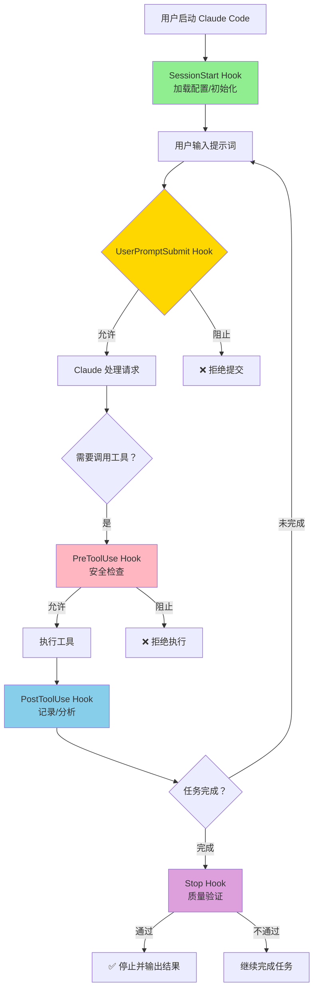
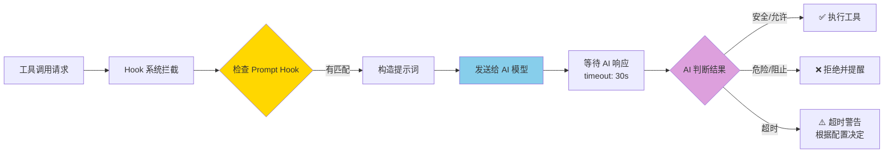
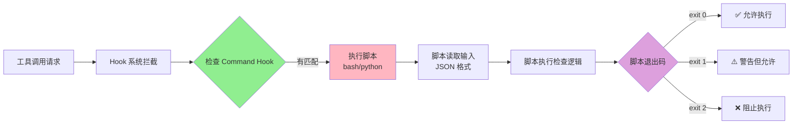
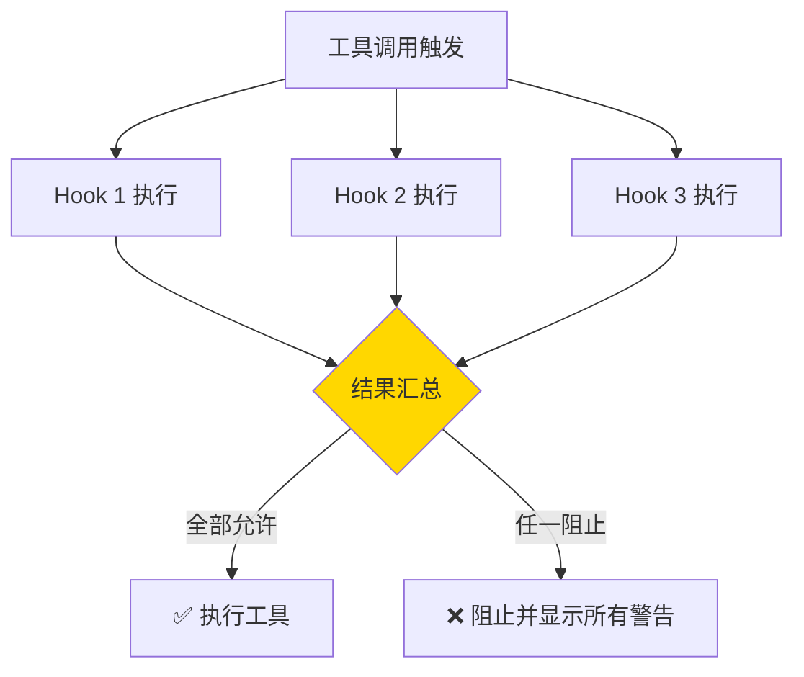
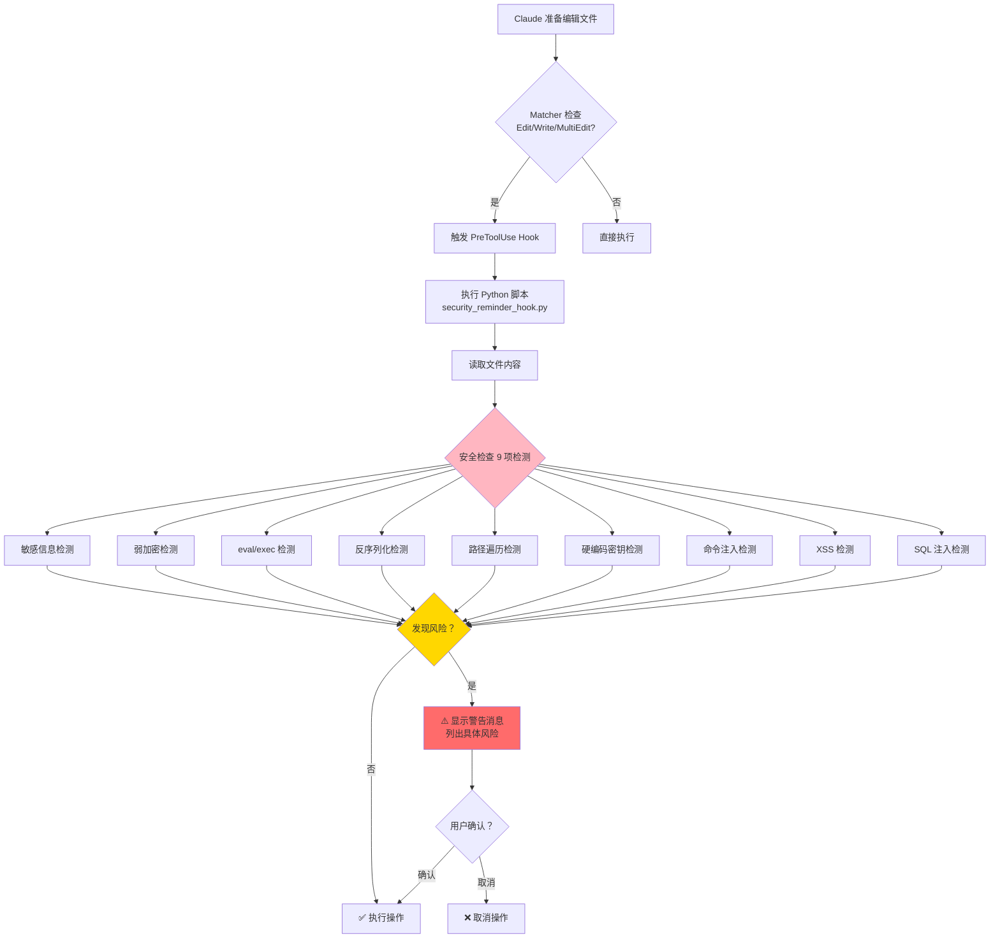
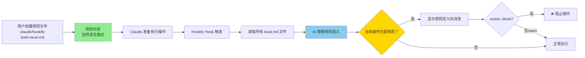

# Hook 系统详解

## 一、什么是 Hook 系统

### 1.1 基本概念

Hook（钩子）系统是一种**事件驱动的自动化机制**。想象一下，你有一个机器人助手，你可以在某些特定事情发生时让它自动做一些检查或处理。比如：
- 当你想要删除文件时，机器人会自动提醒你"真的要删除吗？"
- 当你想要提交代码时，机器人会自动检查代码是否符合规范

在 Claude Code 中，Hook 系统允许我们在特定的事件发生时自动执行一些检查或操作。

### 1.2 为什么需要 Hook 系统

**问题场景：**
假设你正在写代码，不小心写了一个危险的操作，比如删除整个文件夹。如果没有 Hook 系统，这个操作会直接执行，造成损失。但有了 Hook 系统，它会在执行前拦截并提醒你。

**Hook 系统的作用：**
- ✅ **安全检查**：阻止危险操作
- ✅ **质量保证**：确保代码符合规范
- ✅ **自动化**：自动添加上下文信息
- ✅ **策略执行**：强制执行团队规则

---

## 二、Hook 的类型（事件种类）

Claude Code 支持多种 Hook 事件，就像在不同的时间点可以设置不同的检查点：

### 2.1 Hook 类型对比总览

| Hook 类型 | 触发时机 | 主要用途 | 能否阻止操作 | 典型应用场景 |
|----------|---------|---------|-------------|-------------|
| **PreToolUse** | 工具使用**前** | 安全检查、权限验证 | ✅ 能阻止 | 危险命令拦截、敏感文件保护 |
| **PostToolUse** | 工具使用**后** | 记录日志、结果分析 | ❌ 不能阻止 | 操作审计、自动添加注释 |
| **Stop** | Claude 准备**停止**时 | 质量验证、完整性检查 | ✅ 能阻止停止 | 测试运行检查、任务完成度验证 |
| **SessionStart** | 会话**开始**时 | 初始化配置、加载上下文 | ❌ 不能阻止 | 加载项目规范、显示欢迎信息 |
| **UserPromptSubmit** | 用户提示**提交**时 | 意图分析、提示词优化 | ✅ 能阻止提交 | 过滤不当请求、添加上下文 |

### 2.2 Hook 触发时机流程图



### 2.3 各类型 Hook 详解

### 2.4 PreToolUse（工具使用前）

**触发时机：** 在 Claude 准备使用某个工具（如读文件、写文件、执行命令）**之前**触发。

**用途：** 
- 验证工具调用是否安全
- 检查参数是否正确
- 阻止危险操作

**示例场景：**
```
你想删除一个文件 → PreToolUse Hook 触发 → 检查是否真的是安全的删除操作 → 如果安全则允许，否则阻止
```

### 2.5 PostToolUse（工具使用后）

**触发时机：** 在工具使用**之后**触发。

**用途：**
- 记录工具使用情况
- 根据工具结果执行后续操作
- 添加额外的上下文信息

### 2.6 Stop（停止时）

**触发时机：** 当 Claude 准备停止（完成任务）时触发。

**用途：**
- 检查任务是否真正完成
- 确保没有遗漏重要步骤
- 验证输出质量

### 2.7 SessionStart（会话开始）

**触发时机：** 当你启动一个新的 Claude Code 会话时触发。

**用途：**
- 加载项目特定的配置
- 显示欢迎信息
- 设置环境变量

### 2.8 UserPromptSubmit（用户提示提交）

**触发时机：** 当你提交一个提示词给 Claude 时触发。

**用途：**
- 分析用户意图
- 添加额外的上下文
- 过滤不当请求

---

## 三、Hook 的实现方式

Claude Code 提供两种实现 Hook 的方式，各有优劣：

### 3.1 Prompt-based vs Command-based 对比

| 特性维度 | Prompt-based Hook | Command-based Hook |
|----------|------------------|-------------------|
| **原理** | 使用 AI 大模型智能判断 | 执行预设的脚本代码 |
| **配置复杂度** | ⭐⭐ 简单，用自然语言描述规则 | ⭐⭐⭐ 中等，需要编写脚本 |
| **灵活性** | ⭐⭐⭐⭐⭐ 极高，AI 理解上下文 | ⭐⭐⭐ 有限，只能处理预设逻辑 |
| **执行速度** | ⭐⭐⭐ 较慢（5-30 秒） | ⭐⭐⭐⭐⭐ 快速（1-5 秒） |
| **准确性** | ⭐⭐⭐⭐ 高，但有误判可能 | ⭐⭐⭐⭐⭐ 确定性高 |
| **维护成本** | ⭐⭐⭐⭐⭐ 低，修改文字即可 | ⭐⭐⭐ 较高，需要改代码 |
| **适用场景** | 复杂判断、边界情况 | 简单检查、性能敏感 |
| **成本** | 可能需要 API 费用 | 无额外成本 |

### 3.2 选择决策树

```
应该使用哪种 Hook 实现方式？
│
├─ 是否需要理解复杂的上下文？
│   ├─ 是 → 使用 Prompt-based
│   └─ 否 → 继续判断
│
├─ 是否是简单的确定性检查？
│   ├─ 是 → 使用 Command-based
│   └─ 否 → 继续判断
│
├─ 是否对性能要求很高？
│   ├─ 是 → 使用 Command-based
│   └─ 否 → 继续判断
│
├─ 规则是否频繁变化？
│   ├─ 是 → 使用 Prompt-based（易修改）
│   └─ 否 → 继续判断
│
└─ 是否有现成的脚本可用？
    ├─ 是 → 使用 Command-based
    └─ 否 → 使用 Prompt-based（开发快）
```

### 3.3 Prompt-based Hook 工作流程图



### 3.4 Command-based Hook 工作流程图



### 3.5 两种方式的详细对比示例

#### 场景：检查删除命令的安全性

**Prompt-based 实现：**
```json
{
  "type": "prompt",
  "prompt": "检查这个删除命令是否安全。考虑以下因素：\n1. 路径是否在 /tmp 或用户目录\n2. 是否包含 -rf 强制递归删除\n3. 是否可能删除重要文件\n\n命令：$TOOL_INPUT",
  "timeout": 30
}
```

**优点：**
- ✅ AI 可以理解"重要文件"的概念（如 package.json, .env）
- ✅ 能处理意想不到的情况
- ✅ 修改规则只需改提示词

**缺点：**
- ⚠️ 需要等待 AI 响应（约 5-10 秒）
- ⚠️ 可能有误判（过于保守或激进）

**Command-based 实现：**
```bash
#!/bin/bash
# check-rm-safety.sh

input=$(cat)
command=$(echo "$input" | jq -r '.tool_input.command // ""')

# 检查是否包含 -rf
if [[ "$command" == *"rm -rf"* ]] || [[ "$command" == *"rm -Rf"* ]]; then
  # 检查路径
  if [[ "$command" == *"/home/"* ]] || [[ "$command" == *"/etc/"* ]]; then
    echo "❌ 危险：禁止删除系统或用户目录！" >&2
    exit 2
  fi
fi

exit 0
```

**优点：**
- ✅ 执行快速（< 1 秒）
- ✅ 规则确定，不会误判
- ✅ 无需外部依赖

**缺点：**
- ❌ 只能检查预设的模式
- ❌ 难以理解语义（如"重要文件"）
- ❌ 修改需要改代码

### 3.6 实现方式对比总结表

| 实际需求 | 推荐方案 | 理由 |
|---------|---------|------|
| SQL 注入检测 | Prompt-based | 需要理解代码上下文 |
| 文件扩展名检查 | Command-based | 简单的字符串匹配 |
| XSS 漏洞检测 | Prompt-based | 需要理解 HTML/JS 语义 |
| 路径白名单验证 | Command-based | 确定性规则 |
| 代码质量评估 | Prompt-based | AI 擅长代码审查 |
| 敏感文件名保护 | Command-based | 精确匹配即可 |
| 任务完成度验证 | Prompt-based | 需要综合判断 |
| 环境变量检查 | Command-based | 简单的存在性检查 |

### 3.1 基于提示词的 Hook（推荐）⭐

**原理：** 使用 AI（大语言模型）来判断某个操作是否应该执行。

**配置示例：**
```json
{
  "type": "prompt",
  "prompt": "评估这个工具调用是否安全：$TOOL_INPUT",
  "timeout": 30
}
```

**工作流程：**
```
1. 用户想要执行某个操作（如删除文件）
   ↓
2. Hook 系统捕获这个请求
   ↓
3. 将请求发送给 AI 进行分析
   ↓
4. AI 判断："这个操作有风险，因为..."
   ↓
5. Hook 系统根据 AI 的判断决定是否允许
```

**优点：**
- ✅ **智能判断**：可以理解复杂的上下文
- ✅ **灵活**：不需要写复杂的判断逻辑
- ✅ **易维护**：用自然语言描述规则即可
- ✅ **处理边界情况**：AI 可以处理意想不到的情况

**缺点：**
- ⚠️ **速度较慢**：需要等待 AI 响应
- ⚠️ **可能有成本**：使用 AI 服务可能需要付费

**适用场景：**
- 需要理解上下文的复杂判断
- 规则不容易用代码表达的场合
- 需要灵活处理的场景

### 3.2 命令式 Hook

**原理：** 执行一个 bash 脚本来进行确定性检查。

**配置示例：**
```json
{
  "type": "command",
  "command": "bash ${CLAUDE_PLUGIN_ROOT}/scripts/validate.sh",
  "timeout": 60
}
```

**工作流程：**
```
1. 用户想要执行某个操作
   ↓
2. Hook 系统捕获这个请求
   ↓
3. 执行预先写好的脚本
   ↓
4. 脚本返回：允许 或 阻止
   ↓
5. Hook 系统根据脚本结果决定
```

**优点：**
- ✅ **快速**：直接执行脚本，不需要等 AI
- ✅ **确定性强**：逻辑完全由代码控制
- ✅ **无成本**：不需要调用 AI 服务

**缺点：**
- ❌ **不够灵活**：只能处理预设的情况
- ❌ **维护成本高**：需要写代码
- ❌ **无法处理复杂判断**：难以理解上下文

**适用场景：**
- 简单的确定性检查（如文件是否存在）
- 性能敏感的场合
- 已经有现成脚本的检查

---

## 四、Hook 的配置方法

### 4.1 插件中的 Hook 配置

在插件中，Hook 配置放在 `hooks/hooks.json` 文件中。

### 4.2 Hook 配置字段详解

| 字段名 | 类型 | 必填 | 说明 | 示例值 |
|--------|------|------|------|--------|
| `description` | String | 可选 | 描述这些 Hook 的作用 | "安全提醒 Hook" |
| `hooks` | Object | ✅ | 包含所有 Hook 事件的配置 | `{"PreToolUse": [...]}` |
| `type` | String | ✅ | Hook 实现类型 | `"prompt"` 或 `"command"` |
| `prompt` | String | 条件必填 | 发送给 AI 的提示词（type=prompt 时） | "检查是否安全..." |
| `command` | String | 条件必填 | 要执行的命令（type=command 时） | "bash script.sh" |
| `timeout` | Number | 推荐 | 超时时间（秒） | `30` |
| `matcher` | String | 可选 | 匹配的工具名称正则 | `"Write\|Edit"` |

### 4.3 基本结构：
```json
{
  "description": "这里描述这些 Hook 的作用（可选）",
  "hooks": {
    "PreToolUse": [
      // PreToolUse 类型的 Hook 列表
    ],
    "Stop": [
      // Stop 类型的 Hook 列表
    ],
    "SessionStart": [
      // SessionStart 类型的 Hook 列表
    ]
  }
}
```

### 4.4 完整的配置示例：

这是一个来自 security-guidance 插件的真实示例：

```json
{
  "description": "安全提醒 Hook，在执行危险操作前警告用户",
  "hooks": {
    "PreToolUse": [
      {
        "type": "prompt",
        "prompt": "检查这个工具调用是否有安全风险。特别关注：\n- 是否会删除重要文件\n- 是否会暴露敏感信息\n- 是否会造成数据丢失\n\n工具调用：$TOOL_INPUT",
        "timeout": 30
      }
    ]
  }
}
```

### 4.6 配置文件结构可视化

```
hooks/
└── hooks.json                 # 主配置文件
    │
    ├── description            # 插件描述（可选）
    │
    └── hooks                  # Hook 集合
        │
        ├── PreToolUse[]       # PreToolUse 事件列表
        │   ├── [0] 第一个 Hook
        │   │   ├── type: "prompt"
        │   │   ├── prompt: "..."
        │   │   └── timeout: 30
        │   └── [1] 第二个 Hook
        │       ├── type: "command"
        │       ├── command: "bash ..."
        │       └── matcher: "Write|Edit"
        │
        ├── PostToolUse[]      # PostToolUse 事件列表
        │   └── [...]
        │
        ├── Stop[]             # Stop 事件列表
        │   └── [...]
        │
        └── SessionStart[]     # SessionStart 事件列表
            └── [...]
```

### 4.7 多个 Hook 的执行顺序

如果配置了多个同类型的 Hook，它们会**并行执行**：



**重要：** 只要有一个 Hook 阻止，操作就会被阻止。所有 Hook 的警告信息都会显示给用户。
- `description`: 描述这些 Hook 的作用（可选字段）
- `hooks`: 包含所有 Hook 事件的配置
- `PreToolUse`: 在工具使用前触发的 Hook 列表
- `type: prompt`: 使用基于提示词的 Hook
- `prompt`: 发送给 AI 的提示词，用于判断
- `timeout: 30`: 超时时间（秒），防止 AI 响应太慢

### 4.5 环境变量占位符：

在配置中可以使用特殊的环境变量占位符：

| 占位符 | 含义 | 示例 |
|--------|------|------|
| `${CLAUDE_PLUGIN_ROOT}` | 插件根目录 | 用于引用插件内的文件 |
| `${TOOL_INPUT}` | 工具输入 | 用户想要执行的操作内容 |
| `${MY_API_KEY}` | 用户的环境变量 | 从用户系统读取 |

**使用示例：**
```json
{
  "command": "bash ${CLAUDE_PLUGIN_ROOT}/scripts/check.sh ${TOOL_INPUT}"
}
```

---

## 五、实战案例详解

### 5.1 真实插件案例分析

#### 案例 1：Security Guidance（安全门机制）

这是项目中的一个真实插件，用于在执行危险操作前提醒用户。

**插件位置：** `plugins/security-guidance/`

**配置文件：**
```json
{
  "name": "security-guidance",
  "description": "安全提醒 Hook，警告潜在的安全问题"
}
```

**Hook 配置：** `hooks/hooks.json`
```json
{
  "description": "Security reminder hook that warns about potential security issues when editing files",
  "hooks": {
    "PreToolUse": [
      {
        "hooks": [
          {
            "type": "command",
            "command": "python3 ${CLAUDE_PLUGIN_ROOT}/hooks/security_reminder_hook.py"
          }
        ],
        "matcher": "Edit|Write|MultiEdit"
      }
    ]
  }
}
```

**工作原理流程图：**



**检测规则示例：**

| 检测项 | 检测模式 | 风险等级 | 示例 |
|--------|---------|---------|------|
| SQL 注入 | 字符串拼接 SQL | 🔴 高 | `"SELECT * FROM users WHERE id=" + userId` |
| XSS 攻击 | 未转义的用户输入 | 🔴 高 | `<div>${userInput}</div>` |
| 命令注入 | shell 命令拼接 | 🔴 高 | `exec("ping " + userInput)` |
| 硬编码密钥 | API_KEY/SECRET 等 | 🟡 中 | `const API_KEY = "sk-12345"` |
| eval/exec | 动态代码执行 | 🟡 中 | `eval(userInput)` |

### 5.2 Hookify 本地规则系统

这是一个专门帮助创建自定义 Hook 的插件。

**插件位置：** `plugins/hookify/`

**核心功能：**
- 提供创建 Hook 的命令
- 分析对话模式，预防不良行为
- 提供 Hook 开发的最佳实践

**Hookify vs Security Guidance 对比：**

| 特性 | Security Guidance | Hookify |
|------|------------------|--------|
| **实现方式** | Python 脚本（Command-based） | Python + 自然语言规则 |
| **配置位置** | 插件内的 hooks.json | 项目的 .claude/*.local.md |
| **灵活性** | 固定规则，需改代码 | 灵活配置，改文字即可 |
| **适用对象** | 通用安全检查 | 个人/团队自定义规则 |
| **启用方式** | 安装插件 | 安装插件 + 创建规则文件 |

**Hookify 工作流程图：**



**使用 Hookify 创建 Hook 的步骤：**

**步骤 1：定义要预防的行为**
```
例如：防止 Claude 写过于简化的代码
```

**步骤 2：使用 Hookify 命令**
```bash
/hookify
```

**步骤 3：按照指引配置 Hook**
- 选择 Hook 类型（PreToolUse、Stop 等）
- 定义触发条件
- 编写检查逻辑

---

## 六、Hook 的开发最佳实践

### 6.1 Hook 类型选择决策矩阵

| 需求场景 | 推荐类型 | 理由 | 性能影响 | 实现难度 |
|----------|----------|------|---------|----------|
| **安全检查类** | | | | |
| SQL 注入检测 | Prompt-based | 需要理解代码语义 | 中（5-10 秒） | ⭐⭐ |
| XSS 漏洞检测 | Prompt-based | 需要理解 HTML/JS | 中（5-10 秒） | ⭐⭐ |
| 命令注入检测 | Prompt-based | 上下文相关 | 中（5-10 秒） | ⭐⭐ |
| 敏感文件保护 | Command-based | 路径匹配即可 | 低（<1 秒） | ⭐ |
| 危险命令拦截 | Command-based | 关键词匹配 | 低（<1 秒） | ⭐ |
| **质量验证类** | | | | |
| 代码风格检查 | Prompt-based | AI 擅长代码审查 | 中高（10-15 秒） | ⭐⭐ |
| 测试覆盖率验证 | Command-based | 运行测试命令 | 高（30-60 秒） | ⭐⭐ |
| 注释完整性 | Prompt-based | 理解代码意图 | 中（5-10 秒） | ⭐⭐ |
| 构建成功验证 | Command-based | 执行构建命令 | 高（30-60 秒） | ⭐ |
| **自动化类** | | | | |
| 添加文件头注释 | Command-based | 固定格式 | 低（<1 秒） | ⭐ |
| 记录操作日志 | Command-based | 写入文件 | 低（<1 秒） | ⭐ |
| 更新文档 | Prompt-based | 理解变更内容 | 中（5-10 秒） | ⭐⭐ |

### 6.2 Prompt 编写质量对比

#### ❌ 糟糕的 Prompt 示例

```json
{
  "prompt": "检查这个是否安全"
}
```

**问题分析：**
- ❌ 太模糊，AI 不知道具体检查什么
- ❌ 没有明确的判断标准
- ❌ 容易产生误判或漏判
- ❌ 输出格式不统一

**可能导致的问题：**
```
用户：帮我删除 build 目录
Claude: 好的
Hook: （无响应或随机响应）
结果：不可预测
```

#### ⚠️ 一般的 Prompt 示例

```json
{
  "prompt": "检查这个删除命令是否有风险。如果有风险就阻止。\n\n命令：$TOOL_INPUT"
}
```

**问题分析：**
- ⚠️ 比上面好，但仍然不够具体
- ⚠️ "有风险"的定义不明确
- ⚠️ AI 可能过度保守或激进

**可能的结果：**
```
情况 1（过度保守）：
rm -rf /tmp/build → 被阻止（实际是安全的）

情况 2（过于激进）：
rm -rf /home/user/important → 被允许（实际很危险）
```

#### ✅ 优秀的 Prompt 示例

```json
{
  "prompt": "请检查以下删除命令的安全性，按照以下规则判断：\n\n【高风险 - 必须阻止】\n1. 路径包含 /etc/, /usr/, /var/ 等系统目录\n2. 路径包含 /home/[用户名]/ 且不是临时文件\n3. 使用 -rf 强制递归删除重要目录\n\n【中风险 - 警告但允许】\n1. 删除 node_modules、build、dist 等构建目录\n2. 删除 .git 目录\n\n【低风险 - 直接允许】\n1. 路径在 /tmp/ 下\n2. 文件名包含 test、temp、tmp 等临时文件\n\n【输出格式要求】\n如果高风险：返回 \"BLOCK: [原因]\"\n如果中风险：返回 \"WARN: [原因]\"\n如果低风险：返回 \"ALLOW\"\n\n命令：$TOOL_INPUT"
}
```

**优点分析：**
- ✅ 规则明确具体，AI 容易判断
- ✅ 分层次的风险等级
- ✅ 定义了清晰的输出格式
- ✅ 提供了具体的示例

**预期结果：**
```
rm -rf /etc/nginx        → BLOCK: 系统目录
rm -rf /home/user/docs   → BLOCK: 用户重要目录  
rm -rf node_modules      → WARN: 构建目录可重建
rm -rf /tmp/test.txt     → ALLOW: 临时文件
```

### 6.3 Prompt 编写检查清单

在发布你的 Prompt Hook 前，逐项检查：

- [ ] **目标明确**：清楚说明要检查什么
- [ ] **规则具体**：列出明确的判断标准
- [ ] **层次分明**：区分不同风险等级
- [ ] **示例充分**：提供正反两面的例子
- [ ] **格式统一**：定义输出的格式
- [ ] **边界清晰**：说明什么情况允许，什么阻止
- [ ] **超时合理**：设置合适的 timeout（30-60 秒）

### 6.4 超时时间设置参考表

| Hook 类型 | 最小推荐 | 标准设置 | 最大容忍 | 说明 |
|----------|---------|---------|---------|------|
| **Command Hook** | | | | |
| 简单检查（路径、扩展名） | 3 秒 | 5 秒 | 10 秒 | 快速确定性检查 |
| 中等检查（代码分析） | 10 秒 | 15 秒 | 30 秒 | 需要解析文件 |
| 复杂检查（外部 API） | 30 秒 | 60 秒 | 120 秒 | 调用外部服务 |
| **Prompt Hook** | | | | |
| 简单判断（是/否问题） | 10 秒 | 15 秒 | 20 秒 | 简单的安全性判断 |
| 中等分析（代码审查） | 20 秒 | 30 秒 | 45 秒 | 代码质量评估 |
| 深度分析（架构评估） | 30 秒 | 45 秒 | 60 秒 | 复杂的语义理解 |
| **Stop Hook** | 30 秒 | 45 秒 | 60 秒 | 需要分析完整对话历史 |

**设置原则：**
1. 宁可稍长，不可过短（避免超时无效）
2. 根据实际测试数据调整
3. 考虑网络延迟和 AI 负载
4. 提供友好的超时提示消息

### 6.5 选择合适的 Hook 类型决策树

```
开始设计 Hook
    │
    ├─ 问题 1: 需要理解复杂的上下文吗？
    │   │
    │   ├─ 是 → 选择 Prompt-based
    │   │       理由：AI 擅长理解语义和上下文
    │   │       示例：检测 SQL 注入、代码质量评估
    │   │
    │   └─ 否 → 继续问题 2
    │           │
    │           ├─ 问题 2: 是简单的确定性检查吗？
    │           │   │
    │           │   ├─ 是 → 选择 Command-based
    │           │   │       理由：快速、可靠、无成本
    │           │   │       示例：文件扩展名检查、路径验证
    │           │   │
    │           │   └─ 否 → 继续问题 3
    │           │           │
    │           │           ├─ 问题 3: 对性能要求高吗？
    │           │           │   │
    │           │           │   ├─ 是 → 选择 Command-based
    │           │           │   │       理由：脚本执行快（<1 秒）
    │           │           │   │       示例：高频调用的检查
    │           │           │   │
    │           │           │   └─ 否 → 继续问题 4
    │           │           │           │
    │           │           │           ├─ 问题 4: 规则频繁变化吗？
    │           │           │           │   │
    │           │           │           │   ├─ 是 → 选择 Prompt-based
    │           │           │           │   │       理由：修改文字即可，无需改代码
    │           │           │           │   │       示例：快速迭代的原型阶段
    │           │           │           │   │
    │           │           │           │   └─ 否 → 继续问题 5
    │           │           │           │           │
    │           │           │           │           ├─ 问题 5: 有现成脚本可用吗？
    │           │           │           │               │
    │           │           │           │               ├─ 是 → 选择 Command-based
    │           │           │           │               │       理由：直接复用，开发成本低
    │           │           │           │               │
    │           │           │           │               └─ 否 → 选择 Prompt-based
    │           │           │           │                       理由：开发速度快，用自然语言描述
```

### 6.6 Hook 配置决策速查表
| 需要理解上下文 | Prompt-based | AI 可以智能判断 |
| 简单确定性检查 | Command | 快速、可靠 |
| 性能敏感 | Command | 无 AI 延迟 |
| 规则复杂多变 | Prompt-based | 易于调整 |

### 6.2 编写有效的 Prompt

**不好的例子：**
```json
{
  "prompt": "检查这个是否安全"
}
```
❌ 太模糊，AI 不知道具体检查什么

**好的例子：**
```json
{
  "prompt": "检查以下安全风险：\n1. 是否包含 SQL 注入（查找字符串拼接 SQL）\n2. 是否包含 XSS（查找未转义的用户输入）\n3. 是否硬编码了密钥或密码\n\n操作内容：$TOOL_INPUT"
}
```
✅ 具体明确，AI 知道要检查什么

### 6.3 设置合理的超时时间

- **Prompt Hook**: 建议 30-60 秒
- **Command Hook**: 建议 5-30 秒

太短可能导致检查不完整，太长会影响用户体验。

### 6.4 错误处理

始终考虑 Hook 失败时的情况：
- Hook 超时怎么办？
- AI 服务不可用怎么办？
- 脚本执行失败怎么办？

**建议策略：**
```json
{
  "onTimeout": "warn",  // 超时时只警告，不阻止
  "onError": "allow"    // 出错时允许继续（或根据需求决定）
}
```

---

## 七、调试 Hook

### 7.1 启用调试模式

使用 `--debug` 参数运行 Claude Code：
```bash
claude --debug
```

可以看到：
- Hook 触发日志
- AI 响应内容
- 脚本执行输出

### 7.2 测试 Hook

**手动测试步骤：**

1. **配置 Hook**：编辑 `hooks/hooks.json`
2. **触发事件**：执行会触发该 Hook 的操作
3. **查看日志**：检查调试输出
4. **验证行为**：确认 Hook 按预期工作

**示例测试：**
```bash
# 1. 配置一个 PreToolUse Hook 检查删除操作
# 2. 尝试删除文件
rm test.txt
# 3. 查看 Claude 是否拦截并检查
# 4. 验证检查结果是否符合预期
```

---

## 八、Hook 系统架构

### 8.1 整体架构图

```
┌─────────────────────────────────────┐
│           用户请求                   │
│  (如：删除文件、执行命令、写代码)     │
└──────────────┬──────────────────────┘
               │
               ▼
┌─────────────────────────────────────┐
│      Hook 系统拦截器                 │
│  (检查是否有匹配的 Hook 事件)         │
└──────────────┬──────────────────────┘
               │
       ┌───────┴────────┐
       │                │
       ▼                ▼
┌─────────────┐  ┌─────────────┐
│ Prompt Hook │  │ Command Hook│
│   (AI 分析)   │  │  (脚本执行)  │
└──────┬──────┘  └──────┬──────┘
       │                │
       └────────┬───────┘
                │
                ▼
       ┌────────────────┐
       │   决策引擎      │
       │ (允许/阻止/警告)│
       └────────┬───────┘
                │
                ▼
       ┌────────────────┐
       │   执行操作      │
       │ (或阻止并提醒)  │
       └────────────────┘
```

### 8.2 Hook 执行流程

以 PreToolUse 为例：

```
开始
  │
  ├─→ 用户发起工具调用（如 Write 工具写文件）
  │
  ├─→ Hook 系统检查：是否有 PreToolUse Hook？
  │     │
  │     ├─→ 否 → 直接执行工具
  │     │
  │     └─→ 是 → 进入下一步
  │
  ├─→ 执行 Hook（Prompt 或 Command）
  │     │
  │     ├─→ Prompt Hook: 发送 AI 分析
  │     │     │
  │     │     └─→ 等待 AI 响应（最多 timeout 秒）
  │     │
  │     └─→ Command Hook: 执行脚本
  │           │
  │           └─→ 获取脚本返回值
  │
  ├─→ 解析 Hook 结果
  │     │
  │     ├─→ 允许 → 执行工具
  │     ├─→ 阻止 → 返回错误给用户
  │     └─→ 警告 → 提醒用户但仍执行
  │
  └─→ 结束
```

---

## 九、常见问题解答

### Q1: Hook 和 Plugin 有什么区别？

**Hook（钩子）：**
- 事件驱动，在特定时机自动触发
- 主要用于检查、验证、拦截
- 配置在 `hooks/hooks.json`

**Plugin（插件）：**
- 功能扩展包，可以包含命令、Agent、技能等
- 提供新的功能和工具
- 可能包含 Hook，但不止于 Hook

**关系：** 插件可以包含 Hook，Hook 是插件的一种功能。

### Q2: Hook 会影响性能吗？

**会有影响，但可以接受：**
- Prompt Hook: 增加 5-30 秒延迟（等 AI 响应）
- Command Hook: 增加 1-5 秒延迟（执行脚本）

**优化建议：**
- 只在必要时使用 Hook
- 为不重要的检查设置较短的 timeout
- 优先使用 Command Hook 做简单检查

### Q3: 如何禁用某个 Hook？

**方法 1：临时禁用插件**
```bash
/plugins disable plugin-name
```

**方法 2：修改配置**
编辑 `hooks/hooks.json`，删除或注释掉对应的 Hook 配置。

### Q4: Hook 可以访问哪些信息？

取决于 Hook 类型：

**PreToolUse Hook 可以访问：**
- 工具名称（Read, Write, Bash 等）
- 工具参数
- 当前对话上下文

**Stop Hook 可以访问：**
- 完整对话历史
- 已完成的任务
- 最终输出内容

---

## 十、高级特性：Hookify 本地规则系统

### 10.1 什么是 Hookify？

**Hookify** 是项目中一个非常独特的插件，它允许你**无需编写代码**，仅通过自然语言描述即可定义 Hook 规则！

**传统 Hook 开发：**
```python
# 需要写 Python 脚本
#!/usr/bin/env python3
import json
import sys

input_data = json.load(sys.stdin)
# ... 复杂的逻辑判断 ...
```

**Hookify 方式：**
```markdown
// .claude/hookify-bash.local.md
当执行包含 "rm" 或 "delete" 的命令时，要求用户确认
```

看到了吗？就像写便签一样简单！

---

### 10.2 Hookify 的工作原理

**文件位置：** `plugins/hookify/`

**核心思想：**
1. 用户在 `.claude/` 目录下创建 `.local.md` 规则文件
2. Hookify 的 Hook 脚本读取这些文件
3. 使用 AI 理解自然语言规则并执行检查

**支持的事件类型：**
- `hookify-bash.local.md` - 监听 Bash 命令执行
- `hookify-file.local.md` - 监听文件编辑操作
- `hookify-stop.local.md` - 监听任务停止前
- `hookify-prompt.local.md` - 监听用户提示提交

---

### 10.3 创建你的第一个本地规则

#### 示例 1：Bash 命令安全检查

**步骤 1：创建规则文件**

在项目根目录创建 `.claude/hookify-bash.local.md`：

```markdown
# Bash 命令安全规则

## 危险命令确认
当执行包含以下关键词的命令时，必须要求用户确认：
- rm（删除文件）
- delete（删除操作）
- drop（数据库删除）
- kill（终止进程）

## 确认提示模板
检测到危险命令时，显示：
⚠️ 警告：检测到危险操作 `{command}`
此操作可能导致数据丢失，确定要继续吗？
```

**效果：**
```
用户：帮我删除 build 目录
Claude: 好的，我准备执行 rm -rf build
安全门：⚠️ 警告：检测到危险操作 rm -rf build
       此操作可能导致数据丢失，确定要继续吗？
用户：确认
```

---

#### 示例 2：文件编辑规范

**步骤 1：创建规则文件**

创建 `.claude/hookify-file.local.md`：

```markdown
# 文件编辑规范

## 重要文件保护
禁止修改以下文件：
- .env（环境变量配置）
- package-lock.json（依赖锁定）
- yarn.lock（依赖锁定）

## 代码风格要求
写入 JavaScript/TypeScript 代码时，必须：
1. 使用分号结尾
2. 使用双引号而非单引号
3. 函数使用箭头语法

## 注释要求
所有公共函数必须包含 JSDoc 注释
```

**效果：**
```
Claude 准备写入 .env 文件
安全门：⚠️ 禁止修改 .env 文件！
       这是环境变量配置文件，包含敏感信息。
       建议使用其他方式管理配置。
```

---

#### 示例 3：任务完成度验证

**步骤 1：创建规则文件**

创建 `.claude/hookify-stop.local.md`：

```markdown
# 任务完成度验证规则

## 代码修改后必须运行测试
如果对话中修改了代码（使用 Edit 或 Write 工具），
在任务结束前必须运行测试并确认通过。

## 构建验证
对于 Node.js 项目，修改代码后必须运行：
npm run build

## 问题回答完整性
检查是否回答了用户提出的所有问题，
如果有未回答的问题，阻止停止并提醒。
```

**效果：**
```
Claude 完成了代码修改，准备停止
安全门：⚠️ 检测到代码已修改但未运行测试！
       请先运行：npm test
       确保修改没有引入回归错误。
```

---

### 10.4 规则语法详解

#### 基本结构

```markdown
# 规则标题（可选）

## 分类标题（可选）

规则描述：使用自然语言描述要检查的内容

### 触发条件（可选）
指定规则触发的具体条件

### 检查方法（可选）
说明如何进行检查

### 违规处理（可选）
说明违规时如何处理
```

#### 关键词匹配模式

```markdown
# 简单关键词
当命令包含 "rm" 时提醒

# 多个关键词（OR 关系）
当包含 "rm" 或 "delete" 或 "remove" 时确认

# 正则表达式（高级）
当匹配正则 `/rm\s+-rf/` 时严重警告
```

#### 条件判断

```markdown
# 基于文件类型
如果编辑的是 JavaScript 文件（.js 或 .ts），检查是否使用分号

# 基于项目类型
如果是 Node.js 项目（存在 package.json），要求运行 npm install

# 基于时间
如果是周五下午 5 点后，提醒不要部署到生产环境
```

---

### 10.5 Hookify vs 传统 Hook

| 特性 | Hookify（自然语言） | 传统 Hook（编程） |
|------|-------------------|------------------|
| **上手难度** | ⭐⭐⭐⭐⭐ 零门槛 | ⭐⭐ 需要编程基础 |
| **灵活性** | ⭐⭐⭐⭐ AI 理解语义 | ⭐⭐⭐⭐⭐ 完全可控 |
| **性能** | ⭐⭐⭐ 依赖 AI 响应 | ⭐⭐⭐⭐⭐ 脚本执行 |
| **维护成本** | ⭐⭐⭐⭐⭐ 修改文字即可 | ⭐⭐⭐ 需要改代码 |
| **适合场景** | 个人规则、快速原型 | 复杂逻辑、生产环境 |

**建议：**
- ✅ 个人使用 → Hookify
- ✅ 团队共享 → 传统 Hook（更稳定）
- ✅ 快速验证想法 → Hookify
- ✅ 正式发布插件 → 传统 Hook

---

### 10.6 实战案例

#### 案例 1：防止周末部署

```markdown
// .claude/hookify-bash.local.md

# 周末部署警告

## 规则
如果在周五 17:00 后或周六、周日执行部署命令，发出警告。

## 部署命令特征
包含以下关键词：
- deploy
- publish
- release
- push.*production

## 警告消息
⚠️ 周末部署警告！
现在是 {当前时间}，不建议在此时部署到生产环境。

原因：
1. 周末团队响应慢
2. 出现问题难以及时修复

如果确实需要部署，请确认有值班人员待命。
```

---

#### 案例 2：数据库操作双人复核

```markdown
// .claude/hookify-bash.local.md

# 数据库操作双人复核制度

## 适用场景
执行 SQL 迁移或数据库结构变更时

## 检测特征
- 运行 migrate 命令
- 执行 ALTER TABLE、DROP TABLE 等 DDL 语句
- 批量更新超过 1000 条记录

## 复核要求
必须满足以下条件之一：
1. 有第二位团队成员审批
2. 在备份完成后执行
3. 在测试环境已验证

## 检查清单
执行前确认：
- [ ] 已通知相关人员
- [ ] 已完成数据库备份
- [ ] 已准备回滚方案
- [ ] 在低峰期执行
```

---

#### 案例 3：代码审查自动化

```markdown
// .claude/hookify-file.local.md

# 自动代码审查规则

## 函数长度检查
任何函数不应超过 50 行

## 嵌套深度检查
代码嵌套不应超过 4 层

## 变量命名规范
- 变量名必须有意义，避免 a、b、c 等单字母命名
- 布尔变量应以 is、has、can 等开头
- 常量应使用大写 + 下划线格式

## 注释覆盖率
关键算法和复杂逻辑必须包含注释

## TODO 标记管理
新增 TODO 注释必须包含：
1. 负责人（@姓名）
2. 截止日期
3. 关联 issue 编号（如有）
```

---

### 10.7 Hookify 的配置和使用

#### 启用 Hookify

**步骤 1：安装插件**
```bash
cd plugins/hookify
claude plugins install .
```

**步骤 2：创建规则文件**
```bash
# 在项目根目录创建 .claude 文件夹
mkdir -p .claude

# 创建规则文件
touch .claude/hookify-bash.local.md
touch .claude/hookify-file.local.md
```

**步骤 3：编写规则**
编辑规则文件，添加你的自然语言规则。

**步骤 4：重启 Claude Code**
```bash
# 退出当前会话
exit

# 重新启动
claude
```

---

### 10.8 调试技巧

#### 查看 Hookify 日志

Hookify 会记录规则匹配过程：

```bash
# 查看日志（如果启用了调试模式）
cat /tmp/hookify-debug.log
```

#### 测试规则

**方法 1：故意触发规则**
```bash
# 尝试执行会被规则阻止的命令
rm -rf test.txt
# 观察是否触发警告
```

**方法 2：临时简化规则**
```markdown
# 先写简单规则测试
当包含 "test" 时提醒

# 验证有效后再完善
```

---

### 10.9 最佳实践

#### ✅ 推荐做法

1. **从简单开始**
   ```markdown
   # 好的：简单明确
   当执行 rm 命令时提醒
   
   # 不好的：过于复杂
   当执行包含 rm 且路径不在 /tmp 下且不是 root 用户...
   ```

2. **一条规则一个主题**
   ```markdown
   # 好的：分离关注点
   ## 删除操作
   rm 命令需要确认
   
   ## 部署操作
   deploy 命令需要备份
   
   # 不好的：混为一谈
   rm 和 deploy 都要小心注意各种事项...
   ```

3. **提供明确的行动指引**
   ```markdown
   # 好的：告诉用户怎么做
   ⚠️ 检测到删除操作
   建议：
   1. 先确认文件列表：ls {path}
   2. 再执行删除：rm {path}
   
   # 不好的：只警告不指导
   ⚠️ 危险操作！
   ```

#### ❌ 避免的错误

1. **规则过于模糊**
   ```markdown
   # 不好：什么叫"小心"？
   执行危险命令时要小心
   
   # 好：具体明确要求
   执行 rm 命令前必须列出文件清单
   ```

2. **规则相互冲突**
   ```markdown
   # 规则 A：必须运行测试
   # 规则 B：不能运行测试（太慢）
   # 结果：Claude 无所适从
   ```

3. **规则过多过细**
   - 建议每个项目 5-10 条核心规则
   - 优先保障最重要的规范
   - 逐步增加，不要一步到位

---

### 10.10 与其他 Hook 的配合

Hookify 可以与传统 Hook 并存：

```json
// hooks/hooks.json
{
  "PreToolUse": [
    {
      // 传统 Hook：复杂的安全检查
      "type": "command",
      "command": "python3 ${CLAUDE_PLUGIN_ROOT}/security_check.py"
    },
    {
      // Hookify：简单的规则匹配
      "type": "prompt",
      "prompt": "检查是否符合 .claude/hookify-bash.local.md 中的规则"
    }
  ]
}
```

**分工建议：**
- Hookify → 个人偏好、团队约定
- 传统 Hook → 安全红线、质量底线

---

## 十一、动手练习

### 练习 1：创建一个简单的安全 Hook

**目标：** 创建一个 Hook，在 Claude 准备执行 rm 命令时提醒用户。

**步骤：**

1. **创建插件目录**
```bash
mkdir -p my-security-plugin/hooks
```

2. **创建插件配置文件** `.claude-plugin/plugin.json`
```json
{
  "name": "my-security-plugin",
  "version": "1.0.0",
  "description": "我的第一个安全 Hook 插件"
}
```

3. **创建 Hook 配置** `hooks/hooks.json`
```json
{
  "hooks": {
    "PreToolUse": [
      {
        "type": "prompt",
        "prompt": "检查这个操作是否包含删除文件的命令（rm）。如果是，提醒用户确认。\n\n操作：$TOOL_INPUT",
        "timeout": 30
      }
    ]
  }
}
```

4. **安装插件**
```bash
cd my-security-plugin
claude plugins install .
```

5. **测试 Hook**
```bash
claude
# 然后让 Claude 删除一个文件
```

### 练习 2：创建命令式 Hook

**目标：** 用脚本检查文件扩展名。

**步骤：**

1. **创建检查脚本** `scripts/check-extension.sh`
```bash
#!/bin/bash
# 检查文件扩展名是否允许

FILE_PATH="$1"
ALLOWED_EXTENSIONS=".txt .md .js .ts"

EXTENSION="${FILE_PATH##*.}"

if [[ "$ALLOWED_EXTENSIONS" == *".$EXTENSION"* ]]; then
    echo "允许"
    exit 0
else
    echo "不允许的文件类型：.$EXTENSION"
    exit 1
fi
```

2. **配置 Hook**
```json
{
  "hooks": {
    "PreToolUse": [
      {
        "type": "command",
        "command": "bash ${CLAUDE_PLUGIN_ROOT}/scripts/check-extension.sh",
        "timeout": 10
      }
    ]
  }
}
```

---

## 十、完整脚本实现示例

### 10.1 SessionStart Hook - load-context.sh

**作用：** 在会话开始时自动检测项目类型并设置环境变量。

**完整代码：**
```bash
#!/bin/bash
# SessionStart Hook 示例：加载项目上下文
# 位置：plugins/plugin-dev/skills/hook-development/examples/load-context.sh

set -euo pipefail

# 导航到项目目录
cd "$CLAUDE_PROJECT_DIR" || exit 1

echo "正在加载项目上下文..."

# 检测项目类型并设置环境变量
if [ -f "package.json" ]; then
  echo "📦 检测到 Node.js 项目"
  echo "export PROJECT_TYPE=nodejs" >> "$CLAUDE_ENV_FILE"
  
  # 检查是否使用 TypeScript
  if [ -f "tsconfig.json" ]; then
    echo "export USES_TYPESCRIPT=true" >> "$CLAUDE_ENV_FILE"
    echo "   └─ TypeScript 支持已启用"
  fi
  
  # 检查是否有锁文件
  if [ -f "package-lock.json" ]; then
    echo "export NPM_LOCKFILE=package-lock.json" >> "$CLAUDE_ENV_FILE"
  elif [ -f "yarn.lock" ]; then
    echo "export YARN_LOCKFILE=yarn.lock" >> "$CLAUDE_ENV_FILE"
  elif [ -f "pnpm-lock.yaml" ]; then
    echo "export PNPM_LOCKFILE=pnpm-lock.yaml" >> "$CLAUDE_ENV_FILE"
  fi

elif [ -f "Cargo.toml" ]; then
  echo "🦀 检测到 Rust 项目"
  echo "export PROJECT_TYPE=rust" >> "$CLAUDE_ENV_FILE"

elif [ -f "go.mod" ]; then
  echo "🐹 检测到 Go 项目"
  echo "export PROJECT_TYPE=go" >> "$CLAUDE_ENV_FILE"

elif [ -f "pyproject.toml" ] || [ -f "setup.py" ]; then
  echo "🐍 检测到 Python 项目"
  echo "export PROJECT_TYPE=python" >> "$CLAUDE_ENV_FILE"
  
  # 检查虚拟环境
  if [ -d ".venv" ] || [ -d "venv" ]; then
    echo "export VIRTUAL_ENV=true" >> "$CLAUDE_ENV_FILE"
  fi

elif [ -f "pom.xml" ]; then
  echo "☕ 检测到 Java (Maven) 项目"
  echo "export PROJECT_TYPE=java" >> "$CLAUDE_ENV_FILE"
  echo "export BUILD_SYSTEM=maven" >> "$CLAUDE_ENV_FILE"

elif [ -f "build.gradle" ] || [ -f "build.gradle.kts" ]; then
  echo "☕ 检测到 Java/Kotlin (Gradle) 项目"
  echo "export PROJECT_TYPE=java" >> "$CLAUDE_ENV_FILE"
  echo "export BUILD_SYSTEM=gradle" >> "$CLAUDE_ENV_FILE"

else
  echo "❓ 未识别的项目类型"
  echo "export PROJECT_TYPE=unknown" >> "$CLAUDE_ENV_FILE"
fi

# 检查 CI/CD 配置
if [ -d ".github/workflows" ] || [ -f ".gitlab-ci.yml" ] || [ -f ".circleci/config.yml" ]; then
  echo "export HAS_CI=true" >> "$CLAUDE_ENV_FILE"
  echo "✅ CI/CD 配置已检测"
fi

# 检查 Docker 配置
if [ -f "Dockerfile" ] || [ -f "docker-compose.yml" ]; then
  echo "export HAS_DOCKER=true" >> "$CLAUDE_ENV_FILE"
  echo "🐳 Docker 配置已检测"
fi

echo "项目上下文加载完成！"
exit 0
```

**使用方法：**
```json
{
  "SessionStart": [
    {
      "matcher": "*",
      "hooks": [
        {
          "type": "command",
          "command": "bash ${CLAUDE_PLUGIN_ROOT}/scripts/load-context.sh",
          "timeout": 10
        }
      ]
    }
  ]
}
```

**运行效果示例：**
```
[SessionStart] 正在加载项目上下文...
📦 检测到 Node.js 项目
   └─ TypeScript 支持已启用
✅ CI/CD 配置已检测
🐳 Docker 配置已检测
项目上下文加载完成！
```

---

### 10.2 PostToolUse Hook - posttooluse.py

**作用：** 在工具执行后分析结果并提供反馈。

**简化版完整代码（基于 hookify/hooks/posttooluse.py）：**
```python
#!/usr/bin/env python3
"""PostToolUse Hook 示例：工具使用后分析"""

import json
import sys

def main():
    """主函数"""
    try:
        # 从标准输入读取数据
        input_data = json.load(sys.stdin)
        
        # 提取工具信息
        tool_name = input_data.get('tool_name', '')
        tool_result = input_data.get('tool_result', '')
        
        # 根据工具类型进行分析
        if tool_name == 'Bash':
            analyze_bash_result(tool_result)
        elif tool_name in ['Edit', 'Write', 'MultiEdit']:
            analyze_file_modification(input_data)
        
        # 默认允许继续
        print(json.dumps({"continue": True}))
        sys.exit(0)
        
    except Exception as e:
        # 出错时仍然允许继续，但记录错误
        error_msg = {"systemMessage": f"PostToolUse Hook 错误：{str(e)}"}
        print(json.dumps(error_msg))
        sys.exit(0)

def analyze_bash_result(result):
    """分析 Bash 命令执行结果"""
    # 检查命令是否成功
    if 'error' in result.lower() or 'failed' in result.lower():
        msg = {"systemMessage": "⚠️ 检测到命令执行失败，请检查结果。"}
        print(json.dumps(msg))
    
    # 检查测试运行
    if 'test' in result.lower():
        if 'passed' in result.lower() or '✓' in result:
            msg = {"systemMessage": "✅ 测试通过！"}
            print(json.dumps(msg))
        elif 'failed' in result.lower() or '✗' in result:
            msg = {"systemMessage": "❌ 测试失败！请修复失败的测试。"}
            print(json.dumps(msg))

def analyze_file_modification(data):
    """分析文件修改"""
    tool_input = data.get('tool_input', {})
    file_path = tool_input.get('file_path', '')
    
    # 检查是否修改了配置文件
    config_keywords = ['config', 'setting', '.env', 'yaml', 'json']
    if any(keyword in file_path.lower() for keyword in config_keywords):
        msg = {"systemMessage": f"📝 检测到配置文件修改：{file_path}\n请确保提交了变更说明。"}
        print(json.dumps(msg))

if __name__ == "__main__":
    main()
```

**使用方法：**
```json
{
  "PostToolUse": [
    {
      "matcher": "Bash|Edit|Write",
      "hooks": [
        {
          "type": "command",
          "command": "python3 ${CLAUDE_PLUGIN_ROOT}/hooks/posttooluse.py",
          "timeout": 10
        }
      ]
    }
  ]
}
```

**运行效果示例：**
```
[Bash 命令执行后]
✅ 测试通过！

[文件编辑后]
📝 检测到配置文件修改：src/config/settings.json
请确保提交了变更说明。
```

---

### 10.3 Stop Hook - completion-verifier.sh

**作用：** 在任务完成前验证所有必需步骤已完成。

**完整代码：**
```bash
#!/bin/bash
# Stop Hook 示例：任务完成度验证器

set -euo pipefail

# 读取输入
input=$(cat)
reason=$(echo "$input" | jq -r '.reason // ""')

echo "🔍 正在验证任务完成度..."

# 检查清单
declare -a issues=()

# 检查 1：是否运行了测试
check_tests_run() {
  # 检查 transcript 中是否有测试命令
  transcript_path=$(echo "$input" | jq -r '.transcript_path // ""')
  
  if [ -f "$transcript_path" ]; then
    if ! grep -q "npm test\|yarn test\|pytest\|cargo test" "$transcript_path"; then
      issues+=("❌ 未运行测试 - 请运行适当的测试命令")
    else
      echo "✅ 测试已运行"
    fi
  fi
}

# 检查 2：是否构建了项目（针对编译型语言）
check_build_run() {
  cd "$CLAUDE_PROJECT_DIR" || return 0
  
  # 检查是否有编译产物
  if [ -f "package.json" ] && [ -f "tsconfig.json" ]; then
    if [ ! -d "dist" ] && [ ! -d "build" ]; then
      issues+=("⚠️ TypeScript 项目但未生成构建产物 - 考虑运行 npm run build")
    else
      echo "✅ 构建已完成"
    fi
  fi
  
  if [ -f "Cargo.toml" ]; then
    if [ ! -d "target" ]; then
      issues+=("⚠️ Rust 项目但未编译 - 考虑运行 cargo build")
    else
      echo "✅ Rust 项目已编译"
    fi
  fi
}

# 检查 3：是否有未回答的问题
check_questions_answered() {
  # 简单检查：用户是否在对话中提出了问题
  if [ -f "$transcript_path" ]; then
    # 查找问号但没有后续回答的情况（简化检查）
    question_count=$(grep -c "?" "$transcript_path" || echo "0")
    if [ "$question_count" -gt 5 ]; then
      issues+=("⚠️ 检测到多个问题 - 请确保所有问题都已回答")
    fi
  fi
}

# 执行所有检查
check_tests_run
check_build_run
check_questions_answered

# 输出结果
if [ ${#issues[@]} -eq 0 ]; then
  echo "✅ 所有检查通过！任务可以完成。"
  echo '{"decision": "approve", "systemMessage": "任务完成度验证通过"}'
  exit 0
else
  echo ""
  echo "❌ 发现以下问题："
  for issue in "${issues[@]}"; do
    echo "  $issue"
  done
  echo ""
  echo "请在完成任务前解决上述问题。"
  
  # 构造 JSON 响应
  issues_json=$(printf '%s\n' "${issues[@]}" | jq -R . | jq -s .)
  cat <<EOF
{
  "decision": "block",
  "reason": "任务完成度验证失败",
  "systemMessage": "发现 ${#issues[@]} 个问题需要解决",
  "issues": $issues_json
}
EOF
  exit 2
fi
```

**使用方法：**
```json
{
  "Stop": [
    {
      "matcher": "*",
      "hooks": [
        {
          "type": "command",
          "command": "bash ${CLAUDE_PLUGIN_ROOT}/scripts/completion-verifier.sh",
          "timeout": 30
        }
      ]
    }
  ]
}
```

**运行效果示例：**
```
🔍 正在验证任务完成度...
✅ 测试已运行
✅ 构建已完成
✅ 所有检查通过！任务可以完成。

或者（当有问题时）：
🔍 正在验证任务完成度...
❌ 发现以下问题：
  ❌ 未运行测试 - 请运行适当的测试命令
  ⚠️ TypeScript 项目但未生成构建产物

请在完成任务前解决上述问题。
```

---

## 十一、总结

### 核心要点回顾

1. **Hook 是什么？**
   - 事件驱动的自动化机制
   - 在特定时机执行检查或操作

2. **有哪些类型？**
   - PreToolUse、PostToolUse、Stop、SessionStart 等

3. **如何实现？**
   - Prompt-based（推荐）：智能、灵活
   - Command-based：快速、确定

4. **如何配置？**
   - 在 `hooks/hooks.json` 中配置
   - 使用 JSON 格式定义 Hook 行为

5. **最佳实践？**
   - 根据场景选择合适的 Hook 类型
   - 编写具体明确的 Prompt
   - 设置合理的超时时间
   - 充分测试和调试

### 下一步学习

学完 Hook 系统后，建议继续学习：
- 📚 **安全门机制**：Hook 在安全领域的实际应用
- 📚 **插件系统**：如何打包和发布包含 Hook 的插件
- 📚 **Agent 协作**：Hook 如何与 Agent 配合工作

---

## 附录：参考资源

### 官方文档
- Hook API 文档：`plugins/plugin-dev/skills/hook-development/SKILL.md`
- 示例代码：`plugins/hookify/examples/`

### 项目中的 Hook 示例
- Security Guidance: `plugins/security-guidance/hooks/hooks.json`
- Hookify: `plugins/hookify/hooks/hooks.json`
- Learning Output Style: `plugins/learning-output-style/hooks/hooks.json`

### 工具脚本
- Hook 验证：`plugins/plugin-dev/scripts/validate-hook-schema.sh`
- Hook 测试：`plugins/plugin-dev/scripts/test-hook.sh`
- Hook 检查：`plugins/plugin-dev/scripts/hook-linter.sh`
