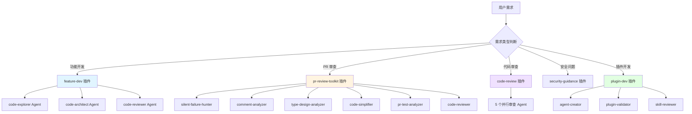
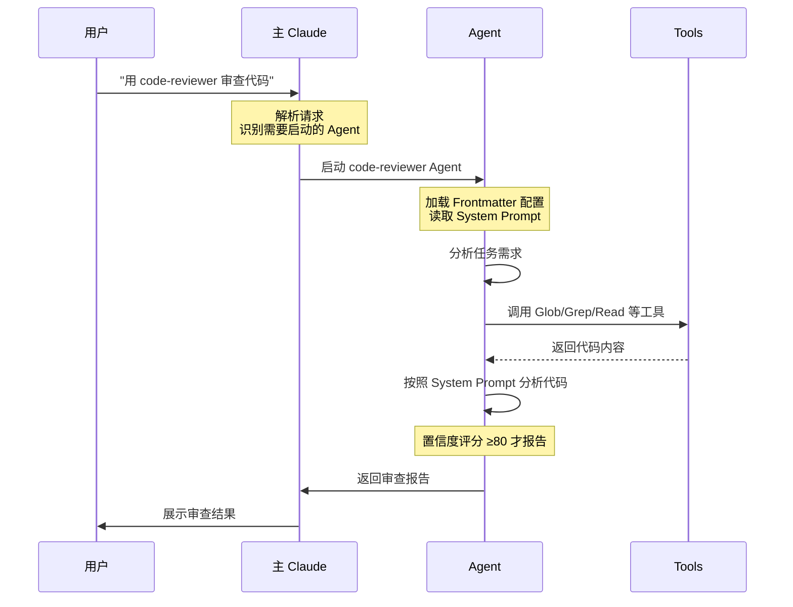
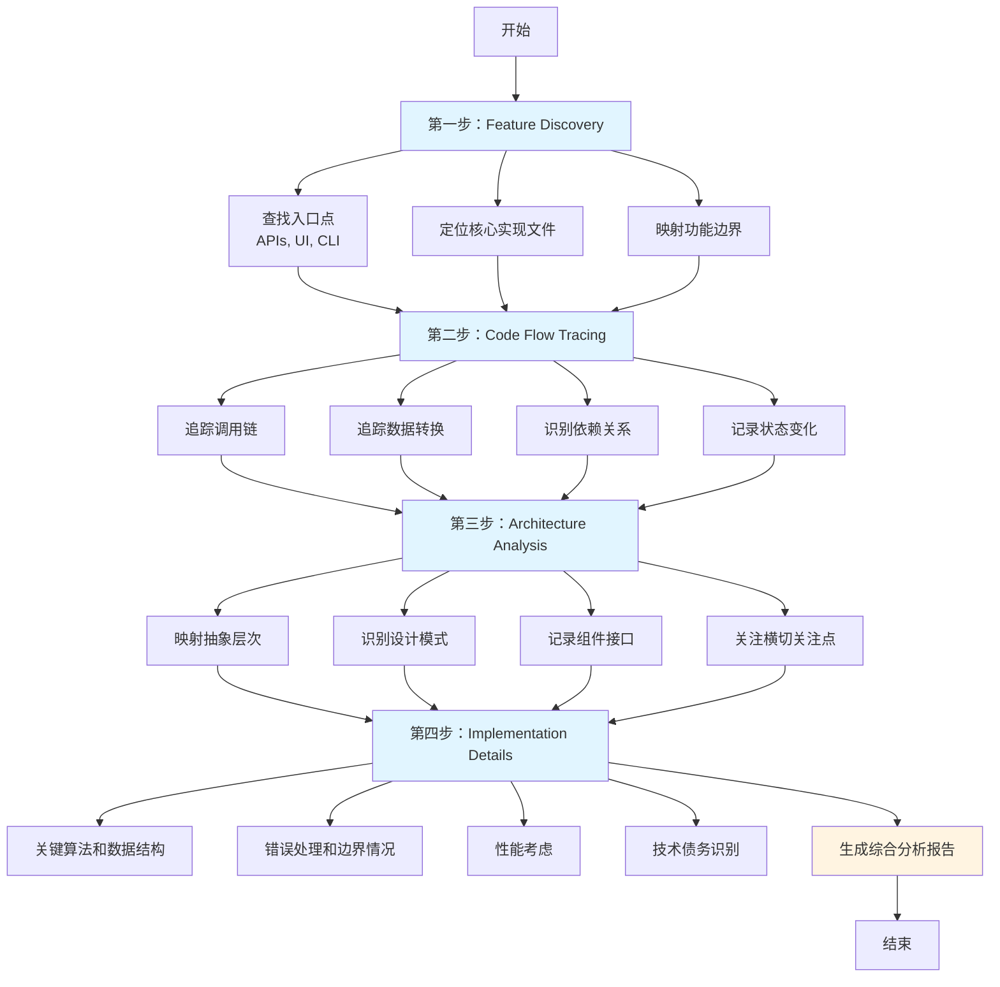
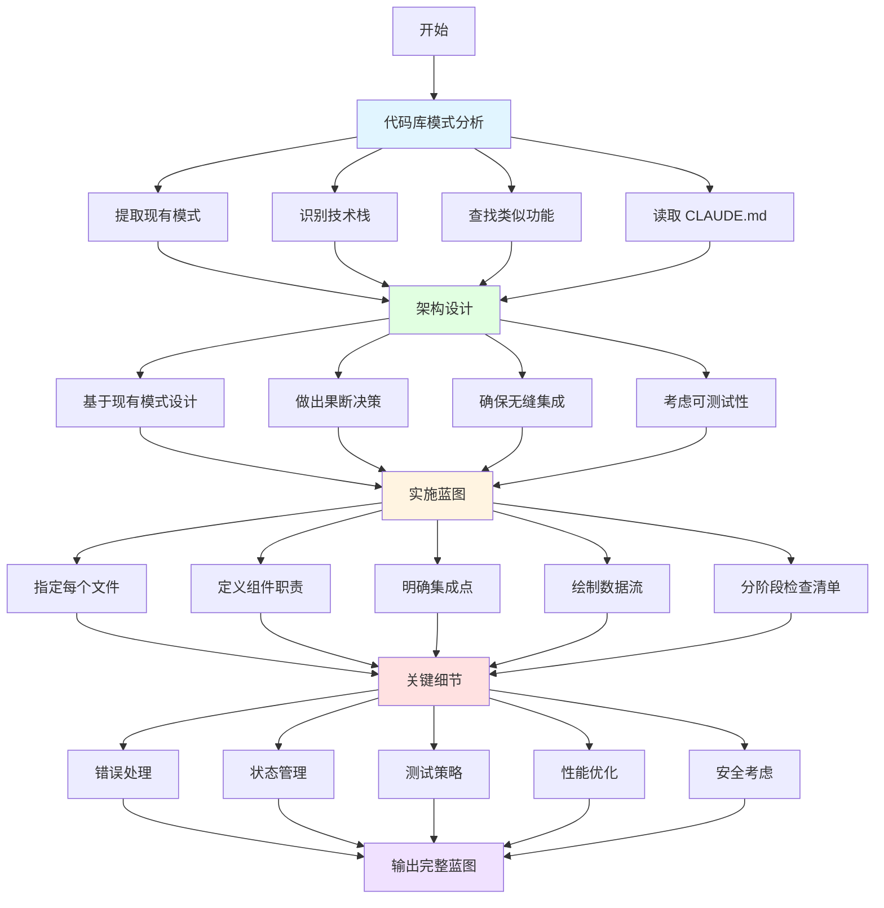
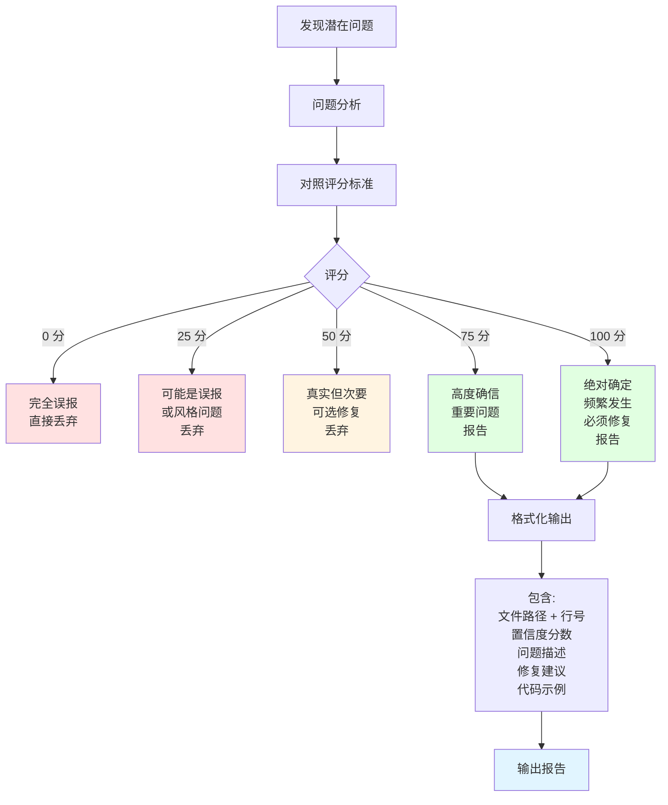
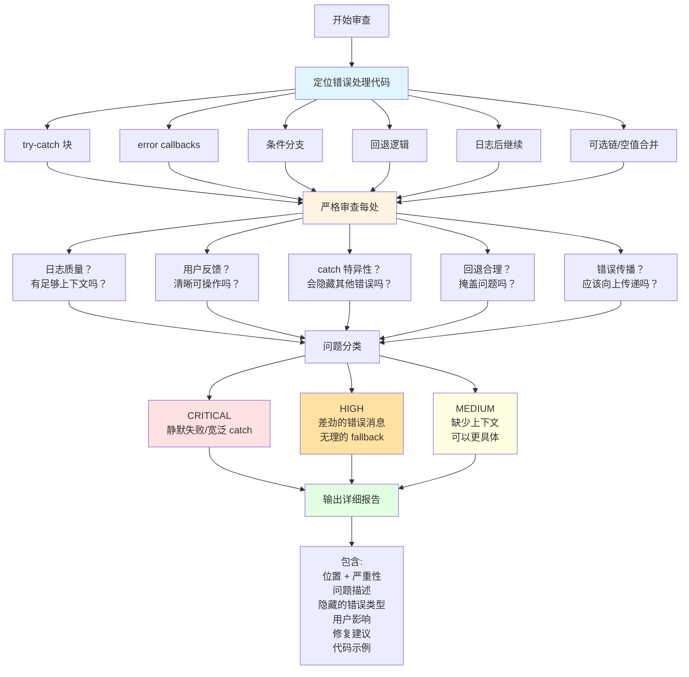
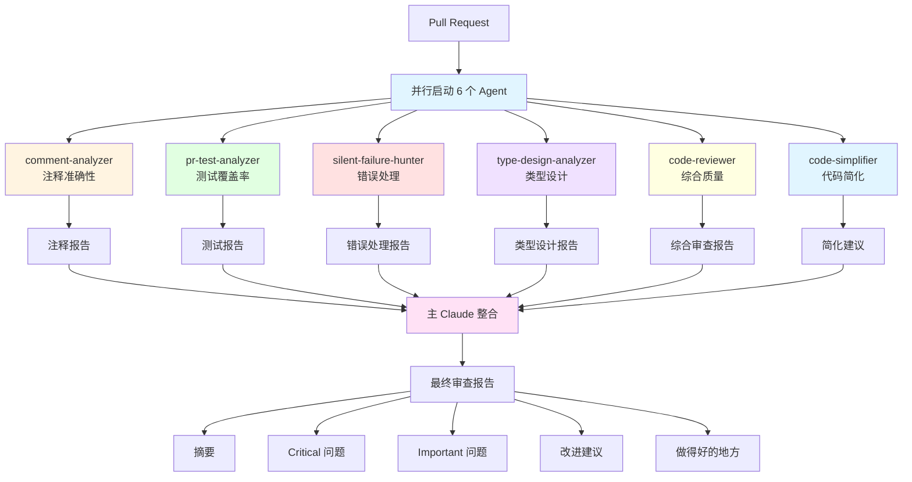

# Agent 协作流程图集

本章节包含多个流程图，帮助你直观理解 Agent 系统的工作机制。

---

## 图 1: Agent 系统总览



**说明：**
- 不同的需求触发不同的插件
- 每个插件包含一组专门的 Agent
- Agent 之间可以并行工作

---

## 图 2: 单个 Agent 的执行流程



**关键步骤：**
1. **触发识别**：Claude 判断是否需要启动 Agent
2. **配置加载**：读取 Agent 的 Frontmatter 和 System Prompt
3. **工具调用**：使用授予的工具权限收集信息
4. **分析处理**：按照 System Prompt 的指导进行分析
5. **结果输出**：返回格式化的报告

---

## 图 3: feature-dev 七阶段流程中的 Agent 协作

```mermaid
graph LR
    P1[Phase 1: Discovery<br/>需求发现] --> P2
    
    P2[Phase 2: Exploration<br/>代码库探索] --> P2A[启动 2-3 个<br/>code-explorer Agents]
    P2A --> P2B[并行分析不同方面]
    P2B --> P2C[整合分析报告]
    P2C --> P3
    
    P3[Phase 3: Clarification<br/>需求澄清] --> P4
    
    P4[Phase 4: Architecture<br/>架构设计] --> P4A[启动 2-3 个<br/>code-architect Agents]
    P4A --> P4B[并行设计方案]
    P4B --> P4C[整合并推荐方案]
    P4C --> P5
    
    P5[Phase 5: Implementation<br/>实现] --> P6
    
    P6[Phase 6: Review<br/>质量审查] --> P6A[启动 3 个<br/>code-reviewer Agents]
    P6A --> P6B[并行审查不同维度]
    P6B --> P6C[整合审查结果]
    P6C --> P7
    
    P7[Phase 7: Summary<br/>总结交付]
    
    style P2A fill:#fff4e1
    style P4A fill:#e1ffe1
    style P6A fill:#ffe1e1
```



**关键点：**
- Phase 2、4、6 都使用了多个 Agent 并行工作
- 主 Claude 负责整合各 Agent 的输出
- 并行处理大幅缩短时间（从 30 分钟降至 10-15 分钟）

---

## 图 4: code-explorer Agent 详细工作流程



**输出要求：**
- 入口点必须包含文件路径和行号（如 `src/auth/login.ts:15`）
- 执行流程必须包含数据转换说明
- 架构分析必须指出设计模式和层次
- 必须列出 essential files 清单

---

## 图 5: code-architect Agent 决策流程



**设计原则：**
- **基于现有模式**：不是凭空设计，而是复用已有模式
- **果断决策**：选择一个方案并坚持，不模棱两可
- **完整蓝图**：具体到每个文件、每个函数、每个集成点

---

## 图 6: code-reviewer Agent 置信度评分机制



**评分标准详解：**

| 分数 | 含义 | 是否报告 | 示例 |
|------|------|---------|------|
| **0** | 完全误报 | ❌ | 预存在的问题或误解 |
| **25** | 可能误报 | ❌ | 风格问题，未违反规范 |
| **50** | 真实但次要 | ❌ | 小问题，不常发生 |
| **75** | 高度确信 | ✅ | 影响功能，违反规范 |
| **100** | 绝对确定 | ✅ | 频繁发生，证据确凿 |

**阈值设置：** 只报告 confidence ≥ 80 的问题（即 75 分和 100 分）

---

## 图 7: silent-failure-hunter Agent 审查流程



**审查深度：**
- 不仅检查有没有 catch 块
- 还要检查 catch 块的质量
- 更要检查错误是否真正被处理而非隐藏

---

## 图 8: Agent 与 Hook 的配合机制

```mermaid
sequenceDiagram
    participant U as 用户
    participant C as 主 Claude
    participant A as Agent
    participant H as Hook
    participant S as Stop Hook
    
    U->>C: "开发积分系统"
    
    C->>A: 启动 code-explorer
    
    Note over H: PreToolUse Hook<br/>检查工具使用合法性
    
    A->>H: 请求使用 Read 工具
    
    H-->>A: ✓ 允许
    
    A->>C: 返回分析报告
    
    C->>A: 启动 code-architect
    
    A->>C: 返回架构方案
    
    C->>A: 开始实现代码
    
    Note over H: security-guidance Hook<br/>实时监控安全风险
    
    A->>H: 准备写入代码
    
    H-->>A: ⚠️ 发现精度问题<br/>float vs decimal
    
    A->>A: 修正问题
    
    A->>C: 实现完成
    
    C->>A: 启动 code-reviewer
    
    A->>C: 返回审查报告<br/>发现 3 个问题
    
    C->>S: 准备完成任务
    
    Note over S: Stop Hook<br/>七阶段完整性检查
    
    S->>S: 检查清单:<br/>✓ Phase 1-2 完成<br/>✓ Phase 3 完成<br/>✓ Phase 4 完成<br/>✓ Phase 5 完成<br/>✓ Phase 6 完成 (3 个问题已修复)<br/>✓ Phase 7 完成
    
    S-->>C: ✓ 批准完成
    
    C->>U: 任务完成!
    
    style H fill:#fff4e1
    style S fill:#ffe1e1
```

**配合要点：**
- **Hook 是防御机制**：检查、验证、阻止
- **Agent 是进攻机制**：分析、设计、实现
- **各司其职**：Hook 不做创造性工作，Agent 不做规范性检查
- **协同工作**：在关键节点配合，确保质量和安全

---

## 图 9: pr-review-toolkit 六 Agent 并行审查



**并行优势：**
- **专业分工**：每个 Agent 只关注一个维度
- **同时执行**：6 个 Agent 同时工作，而非串行
- **全面覆盖**：注释、测试、错误处理、类型、质量、简洁性，无一遗漏
- **减少时间**：从 60 分钟降至 10-15 分钟

---

## 图 10: Agent 创建流程（agent-creator）

```mermaid
flowchart TD
    UserReq[用户需求] --> Describe["描述:\n\"创建一个帮我 XXX 的 Agent\""]
    
    Describe --> Extract[提取核心意图]
    
    Extract --> E1[根本目的]
    Extract --> E2[关键职责]
    Extract --> E3[成功标准]
    
    E1 & E2 & E3 --> Persona[设计专家角色]
    
    Persona --> P1[体现领域知识]
    P1 --> P2[引导决策方式]
    
    Persona --> Instructions[编写 System Prompt]
    
    Instructions --> I1[行为边界]
    Instructions --> I2[方法论和最佳实践]
    Instructions --> I3[边缘情况处理]
    Instructions --> I4[输出格式要求]
    
    I1 & I2 & I3 & I4 --> Optimize[性能优化]
    
    Optimize --> O1[决策框架]
    Optimize --> O2[质量控制]
    Optimize --> O3[工作流模式]
    Optimize --> O4[降级策略]
    
    O1 & O2 & O3 & O4 --> Identifier[创建标识符]
    
    Identifier --> ID[小写 + 连字符<br/>2-4 个词<br/>3-50 字符<br/>避免通用词]
    
    Identifier --> Examples[编写触发示例]
    
    Examples --> Ex1[2-4 个<example>块]
    Ex1 --> Sh1[显式触发]
    Ex1 --> Sh2[隐式触发]
    Ex1 --> Sh3[主动触发]
    
    ID & Examples --> Generate[生成 Agent 文件]
    
    Generate --> Write[写入 agents/[name].md]
    
    Write --> Validate[建议验证]
    
    Validate --> Test[测试触发]
    
    style UserReq fill:#e1f5ff
    style Extract fill:#fff4e1
    style Persona fill:#e1ffe1
    style Instructions fill:#ffe1e1
    style Optimize fill:#f0e1ff
    style Generate fill:#ffffe1
    style Write fill:#ffe1f5
```

**自动化程度：**
- 用户只需一句话描述需求
- agent-creator 自动生成完整配置
- 包括 Frontmatter、System Prompt、触发示例
- 生成的文件立即可用

---

## 总结

这些流程图展示了 Agent 系统的各个层面：

1. **图 1**：整体架构 - 不同插件包含不同 Agent
2. **图 2**：单个 Agent 执行 - 从触发到输出的完整流程
3. **图 3**：七阶段协作 - Agent 如何在流程中配合
4. **图 4**：code-explorer - 四步分析法
5. **图 5**：code-architect - 基于现有模式的决策流程
6. **图 6**：code-reviewer - 置信度评分过滤机制
7. **图 7**：silent-failure-hunter - 深度错误处理审查
8. **图 8**：Agent-Hook 配合 - 攻防结合
9. **图 9**：PR 审查矩阵 - 6 个 Agent 并行工作
10. **图 10**：agent-creator - 自动化创建 Agent

建议结合文字内容一起学习，效果更佳！
