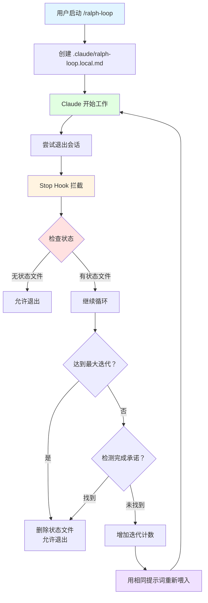

# 其他专用 Agent 详解

本章介绍除了 feature-dev 和 pr-review-toolkit 之外的其他专用 Agent。

---

## 三、plugin-dev 的辅助 Agent 三剑客

plugin-dev 是用于开发 Claude Code 插件的工具包，包含三个专门的 Agent，分别负责创建、验证和审查。

### 1.1 agent-creator：Agent 自动生成器

**文件位置：** `plugins/plugin-dev/agents/agent-creator.md`

**核心价值：** 让创建新 Agent 变得像说话一样简单

#### 触发场景（第 3-30 行）

```markdown
Use this agent when the user asks to:
- "create an agent"
- "generate an agent"  
- "build a new agent"
- "make me an agent that..."
- or describes agent functionality they need
```

**触发示例分析：**

```yaml
示例 1 - 直接创建:
Context: User wants to create a code review agent
user: "Create an agent that reviews code for quality issues"
assistant: "I'll use the agent-creator agent to generate the agent configuration."

示例 2 - 描述需求:
Context: User describes needed functionality
user: "I need an agent that generates unit tests for my code"
assistant: "I'll use the agent-creator agent to create a test generation agent."

示例 3 - 添加到插件:
Context: User wants to add agent to plugin
user: "Add an agent to my plugin that validates configurations"
assistant: "I'll use the agent-creator agent to generate a configuration validator agent."
```

→ **触发特点**：识别多种表达方式，无论是直接命令还是描述需求

#### 核心能力（第 41-74 行）

**六大核心能力：**

```markdown
1. **Extract Core Intent** (提取核心意图)
   - Identify the fundamental purpose
   - Key responsibilities
   - Success criteria for the agent
   - Consider context from CLAUDE.md files

2. **Design Expert Persona** (设计专家角色)
   - Create a compelling expert identity
   - Embody deep domain knowledge
   - Guide decision-making approach

3. **Architect Comprehensive Instructions** (构建完整指令)
   - Clear behavioral boundaries
   - Specific methodologies and best practices
   - Edge cases handling
   - Output format expectations
   - Align with project standards from CLAUDE.md

4. **Optimize for Performance** (性能优化)
   - Decision-making frameworks
   - Quality control mechanisms
   - Efficient workflow patterns
   - Escalation or fallback strategies

5. **Create Identifier** (创建标识符)
   - Lowercase letters, numbers, hyphens only
   - 2-4 words joined by hyphens
   - Clearly indicates primary function
   - Memorable and easy to type
   - Avoids generic terms like "helper"

6. **Craft Triggering Examples** (编写触发示例)
   - 2-4 <example> blocks
   - Different phrasings for same intent
   - Both explicit and proactive triggering
   - Context, user message, assistant response, commentary
```

→ **设计哲学**：不仅仅是生成配置文件，而是创建一个真正专业、高效的 Agent

#### Agent 创建流程（第 75-130 行）

**标准化流程：**

```markdown
Step 1: Understand Request
  ↓
Step 2: Design Agent Configuration
  ├── Identifier (名称)
  │   - lowercase + hyphens
  │   - 3-50 characters
  │   - descriptive not generic
  │
  ├── Description (描述)
  │   - Start with "Use this agent when..."
  │   - Include 2-4 <example> blocks
  │   - Show different trigger phrasings
  │
  ├── System Prompt (系统提示)
  │   - Role and expertise (500-3000 words)
  │   - Core responsibilities (numbered list)
  │   - Detailed process (step-by-step)
  │   - Quality standards
  │   - Output format
  │   - Edge case handling
  │
  ├── Model Selection
  │   - inherit (default)
  │   - sonnet (complex tasks)
  │   - haiku (simple tasks)
  │
  ├── Color Choice
  │   - blue/cyan: Analysis, review
  │   - green: Generation, creation
  │   - yellow: Validation, caution
  │   - red: Security, critical
  │   - magenta: Transformation, creative
  │
  └── Tools Selection
      - Minimal set needed
      - Follow least privilege
  ↓
Step 3: Generate Agent File
  ↓
Step 4: Explain to User
```

**生成的文件结构：**

```markdown
---
name: [identifier]
description: [Use this agent when... Examples: <example>...</example>]
model: inherit | sonnet | haiku
color: [chosen-color]
tools: ["Tool1", "Tool2"]  # Optional
---

[Complete system prompt with role, responsibilities, process, output format]
```

#### 质量标准（第 132-141 行）

**严格的质量检查清单：**

```markdown
Quality Standards Checklist:
✓ Identifier follows naming rules (lowercase, hyphens, 3-50 chars)
✓ Description has strong trigger phrases and 2-4 examples
✓ Examples show both explicit and proactive triggering
✓ System prompt is comprehensive (500-3,000 words)
✓ System prompt has clear structure (role, responsibilities, process, output)
✓ Model choice is appropriate
✓ Tool selection follows least privilege
✓ Color choice matches agent purpose
```

→ **每一项都是必须的**，确保生成的 Agent 专业、可用

#### 输出格式（第 142-165 行）

**创建完成后的总结：**

```markdown
## Agent Created: [identifier]

### Configuration
- **Name:** [identifier]
- **Triggers:** [When it's used]
- **Model:** [choice]
- **Color:** [choice]
- **Tools:** [list or "all tools"]

### File Created
`agents/[identifier].md` ([word count] words)

### How to Use
This agent will trigger when [triggering scenarios].

Test it by: [suggest test scenario]

Validate with: `scripts/validate-agent.sh agents/[identifier].md`

### Next Steps
[Recommendations for testing, integration, or improvements]
```

#### 边缘情况处理（第 167-173 行）

**智能应对各种特殊情况：**

```markdown
Edge Cases Handling:

1. **Vague user request** (模糊请求)
   → Ask clarifying questions before generating

2. **Conflicts with existing agents** (与现有 Agent 冲突)
   → Note conflict, suggest different scope/name

3. **Very complex requirements** (非常复杂的需求)
   → Break into multiple specialized agents

4. **User wants specific tool access** (用户指定工具权限)
   → Honor the request in agent configuration

5. **User specifies model** (用户指定模型)
   → Use specified model instead of inherit

6. **First agent in plugin** (插件的第一个 Agent)
   → Create agents/ directory first
```

**实战示例：**

```
用户："帮我创建一个 Agent"

agent-creator: "好的，请问这个 Agent 需要做什么？
              比如：
              - 审查代码质量？
              - 生成测试用例？
              - 分析性能瓶颈？
              - 其他特定任务？"

用户："嗯...就是检查代码有没有安全问题"

agent-creator: "明白了！我来为你创建一个安全审查 Agent。
              有几个问题想确认一下：
              1. 主要关注哪些安全问题？(SQL 注入、XSS、认证等)
              2. 是针对特定语言吗？(JavaScript、Python 等)
              3. 需要检查第三方依赖吗？
              
              这些信息能帮我创建更精准的 Agent。"
```

→ **不会盲目生成**，而是先澄清需求，确保创建的 Agent 真正符合需要

---

### 1.2 plugin-validator：插件验证器

**核心职责：** 验证插件的结构完整性、配置正确性、文件规范性

#### 验证范围

**全面检查清单：**

```markdown
Plugin Structure Validation:

1. **元数据文件检查**
   ✓ .claude-plugin/plugin.json 是否存在
   ✓ 必需字段是否完整 (name, version, description)
   ✓ 字段格式是否正确

2. **Agent 文件检查**
   ✓ agents/目录是否存在
   ✓ 每个*.md 文件是否符合规范
   ✓ Frontmatter 是否完整
   ✓ System Prompt 是否清晰

3. **Hook 配置检查**
   ✓ hooks/hooks.json 是否存在
   ✓ Hook 类型是否正确 (PreToolUse, PostToolUse, Stop)
   ✓ Matcher 语法是否正确
   ✓ Timeout 设置是否合理

4. **技能文档检查**
   ✓ skills/*/SKILL.md 是否存在
   ✓ 文档结构是否清晰
   ✓ 示例是否充分

5. **必需文件检查**
   ✓ README.md 是否存在
   ✓ .gitignore 是否配置
   ✓ LICENSE 文件（如适用）

6. **命名规范检查**
   ✓ Agent 名称是否符合规范
   ✓ 文件命名是否一致
   ✓ 没有重复的名称
```

#### 常见错误模式

**plugin-validator 会检测并报告以下错误：**

```markdown
Critical Errors (必须修复):

❌ Missing plugin.json
   Error: "缺少插件元数据文件"
   Fix: "创建 .claude-plugin/plugin.json"

❌ Invalid agent name
   Error: "Agent 名称 'My_Agent' 包含无效字符"
   Fix: "改为小写和连字符：'my-agent'"

❌ Duplicate agent names
   Error: "发现重复的 Agent 名称：'code-reviewer'"
   Fix: "重命名其中一个为唯一名称"

❌ Missing description in agent
   Error: "code-explorer.md 缺少 description 字段"
   Fix: "添加以'Use this agent when...'开头的描述"

Important Issues (建议修复):

⚠️ No trigger examples
   Warning: "security-scanner.md 没有<example>触发示例"
   Suggestion: "添加 2-4 个触发示例"

⚠️ System prompt too short
   Warning: "test-generator.md 的 System Prompt 只有 200 字"
   Suggestion: "扩展到 500-3000 字，包含详细指导"

⚠️ Over-permissive tools
   Warning: "code-reader 被授予了 Write 权限"
   Suggestion: "只读 Agent 不需要写权限，移除它"
```

#### 使用场景

```
场景 1: 插件开发完成时
用户："我开发完插件了，准备发布"
plugin-validator: "让我验证一下插件结构..."
    ↓
[执行完整检查]
    ↓
✓ 通过所有检查 → "插件结构完整，可以发布！"
❌ 发现问题 → "发现 3 个问题需要修复..."

场景 2: 添加新 Agent 后
用户："我刚添加了新的 Agent"
plugin-validator: "好的，让我验证新 Agent 是否符合规范..."
    ↓
[检查新 Agent 文件]
    ↓
✓ 符合规范 → "新 Agent 配置正确"
❌ 有问题 → "发现命名不规范，建议修改为..."

场景 3: 定期维护检查
用户："检查一下插件有没有问题"
plugin-validator: "开始全面检查..."
    ↓
[检查所有文件和配置]
    ↓
生成详细的健康报告
```

---

### 1.3 skill-reviewer：技能文档审查员

**核心职责：** 审查 `skills/*/SKILL.md` 文档的质量

#### 审查维度

**五大审查维度：**

```markdown
1. **结构清晰度** (Structure Clarity)
   ✓ 是否有清晰的章节划分
   ✓ 逻辑流程是否连贯
   ✓ 标题层次是否合理
   ✓ 读者能否快速找到需要的信息

2. **示例充分性** (Example Sufficiency)
   ✓ 是否包含足够的代码示例
   ✓ 示例是否覆盖常见场景
   ✓ 示例是否有注释说明
   ✓ 示例是否可运行、可验证

3. **说明准确性** (Explanation Accuracy)
   ✓ 概念解释是否准确
   ✓ 术语使用是否一致
   ✓ 是否有误导性描述
   ✓ 技术细节是否正确

4. **可读性** (Readability)
   ✓ 语言是否简洁明了
   ✓ 句子是否过于复杂
   ✓ 段落长度是否合适
   ✓ 是否有不必要的冗长

5. **实用性** (Practicality)
   ✓ 是否解决实际问题
   ✓ 步骤是否可操作
   ✓ 是否有最佳实践指导
   ✓ 是否有常见问题解答
```

#### 输出格式

**结构化审查报告：**

```markdown
## Skill 文档审查报告

**审查对象：** skills/frontend-design/SKILL.md

### Summary
整体质量良好，结构清晰，示例充分。发现 2 处需要改进的地方。

### ✅ Strengths (优点)

1. **结构优秀**
   - 清晰的 When to Invoke 章节
   - What You Provide 部分列举具体
   - Example Usage 展示实际场景

2. **示例丰富**
   - 包含 3 个完整的使用场景
   - 每个示例都有前后对比
   - 代码可运行，结果可验证

3. **实用性强**
   - 提供了具体的设计原则
   - 包含了避坑指南
   - 有明确的检查清单

### ⚠️ Areas for Improvement (改进建议)

1. **术语一致性**
   位置：Section 3.2
   问题：混用了"component"和"module"
   建议：统一使用项目约定的术语（参考 CLAUDE.md）

2. **示例扩展**
   位置：Section 5
   问题：只展示了 React 示例
   建议：补充 Vue/Angular 等其他框架的示例（如果技能支持）

### 📊 Scoring (评分)

| 维度 | 分数 | 说明 |
|------|------|------|
| 结构清晰度 | 9/10 | 章节划分清晰，逻辑流畅 |
| 示例充分性 | 8/10 | 示例充足，但可覆盖更多场景 |
| 说明准确性 | 9/10 | 技术准确，术语需统一 |
| 可读性 | 8/10 | 整体清晰，少数句子偏长 |
| 实用性 | 10/10 | 高度实用，立即可用 |

**总体评分：** 8.8/10 - 优秀，小幅改进后可达完美
```

#### 审查流程

**系统化审查步骤：**

```markdown
Step 1: 通读全文
  → 获取整体印象
  → 理解技能的目标和范围

Step 2: 结构分析
  → 检查章节划分
  → 验证逻辑流程
  → 评估标题层次

Step 3: 示例验证
  → 检查示例数量
  → 验证示例质量
  → 确认示例可运行

Step 4: 准确性检查
  → 对照官方文档
  → 验证技术细节
  → 检查术语一致性

Step 5: 可读性评估
  → 分析句子复杂度
  → 检查段落长度
  → 标记冗长描述

Step 6: 实用性判断
  → 评估解决实际问题的能力
  → 检查步骤的可操作性
  → 确认最佳实践的适用性

Step 7: 生成报告
  → 总结优点
  → 指出改进点
  → 给出评分和建议
```

---

## 四、其他插件的特殊 Agent

### 4.1 claude-opus-4-5-migration 的 Verifiers

这两个 Agent 专门用于验证从 Sonnet 4.x 和 Opus 4.1 迁移到 Opus 4.5 的代码。

#### agent-sdk-verifier-py（Python 版本）

**核心职责：** 验证 Python 迁移脚本的正确性

**检查内容：**
```markdown
✓ Python 版本兼容性检查
✓ API 调用方式验证
✓ 类型注解更新
✓ 异步代码迁移
✓ 依赖库版本匹配
✓ 测试用例适配
```

**典型输出：**
```markdown
## Python Migration Verification Report

### Verified Changes ✓

1. **API Updates**
   - ✓ Updated all anthropic SDK calls
   - ✓ Migrated to new message format
   - ✓ Proper async/await usage

2. **Type Annotations**
   - ✓ Added type hints for all functions
   - ✓ Updated import statements
   - ✓ Fixed typing inconsistencies

### Issues Found ⚠️

1. **Version Compatibility**
   Location: src/migration.py:45
   Issue: Using deprecated method `client.completions.create()`
   Fix: Replace with `client.messages.create()`
   
   Before:
   ```python
   response = client.completions.create(model="opus-4.1", ...)
   ```
   
   After:
   ```python
   response = client.messages.create(model="claude-opus-4-5", ...)
   ```

### Migration Status: 95% Complete
One issue remaining before ready for Opus 4.5
```

#### agent-sdk-verifier-ts（TypeScript 版本）

**核心职责：** 验证 TypeScript 迁移脚本的正确性

**检查内容：**
```markdown
✓ TypeScript 类型定义更新
✓ 接口变更适配
✓ Promise/Fetch API 迁移
✓ 错误处理模式更新
✓ 模块导入导出语法
✓ 构建配置调整
```

---

### 4.2 hookify 的 conversation-analyzer

**特殊用途：** 分析对话模式，识别潜在的风险行为

#### 核心能力

**对话模式识别：**

```markdown
Analyzes conversation patterns to detect:

1. **Risk Indicators** (风险指标)
   - User requests that might lead to dangerous operations
   - Patterns suggesting data loss potential
   - Security-sensitive contexts

2. **Behavioral Red Flags** (行为警示)
   - Repeated attempts at same risky operation
   - Ignoring previous warnings
   - Trying to bypass safety measures

3. **Context Awareness** (上下文感知)
   - Understanding the broader goal
   - Identifying high-stakes scenarios
   - Recognizing urgency vs carefulness balance
```

#### 工作原理

```
对话流 → conversation-analyzer → 风险评估 → Hook 系统 → 决策
   ↓                              ↓
分析模式                      高风险操作警告
识别意图                      建议替代方案
评估风险                      阻止危险行为
```

**实际应用示例：**

```
用户："删除所有测试文件"
    ↓
conversation-analyzer 检测到:
- "删除" 操作
- "所有" 表示批量
- 测试文件可能是重要的
    ↓
风险评分：HIGH
    ↓
触发 Hook:
"⚠️ 检测到批量删除操作
  这可能会删除重要文件
  
  建议:
  1. 先列出要删除的文件确认
  2. 考虑是否需要备份
  3. 使用 git 检查这些文件是否有未提交的更改
  
  确定要继续吗？"
```

---

### 4.3 code-review 插件的 5 个审查 Agent

code-review 插件是一个专门用于自动化 PR 审查的插件，它通过启动多个并行 Agent 来独立审查代码变更。

#### 插件概述

**核心理念：** 多角度的独立审查 + 置信度评分过滤 = 高信号质量的反馈

**主要特点：**
- ✅ 自动跳过已关闭、草稿、琐碎或已审查的 PR
- ✅ 读取相关 CLAUDE.md 指南文件作为审查标准
- ✅ 4 个 Agent 并行审查，覆盖不同维度
- ✅ 置信度评分系统（阈值 80）过滤误报
- ✅ 支持输出到终端或直接发布为 PR 评论

#### 5 个审查 Agent 详解

**Agent #1 & #2：CLAUDE.md 合规性审查（Sonnet 模型）**

```markdown
职责：审计代码变更是否符合项目的 CLAUDE.md 规范

审查范围：
- 根目录 CLAUDE.md（如果存在）
- 被修改文件所在目录的 CLAUDE.md
- 父目录的 CLAUDE.md（共享文件路径的规范）

审查内容：
✓ 导入模式是否符合规范
✓ 框架约定是否遵守
✓ 语言特定风格是否一致
✓ 错误处理是否遵循要求
✓ 日志记录是否恰当
✓ 测试实践是否达标
✓ 命名约定是否正确

工作方式：
- 两个 Agent 同时审查同一段代码（冗余设计）
- 确保不遗漏任何规范违反
- 只报告置信度≥80 的问题
```

**Agent #3：Bug 扫描器（Opus 模型）**

```markdown
职责：专注于检测变更中的明显 Bug

审查焦点：
- 仅关注 diff 本身，不读取额外上下文
- 只标记确定的、高信号的 Bug
- 忽略细枝末节和可能的误报

高信号问题标准：
✓ 代码将无法编译或解析（语法错误、类型错误、缺少导入、未解析的引用）
✓ 代码肯定会产生错误结果（清晰的逻辑错误）
✓ 明确的、无歧义的 CLAUDE.md 违反（可以引用具体规则）

不做标记的问题：
✗ 代码风格或质量担忧
✗ 依赖特定输入或状态的潜在问题
✗ 主观的建议或改进意见

示例输出：
## Bug 扫描结果

### 严重问题
1. **空指针异常** - `src/auth.ts:67`
   - 问题：未检查 user 是否为 null 就访问属性
   - 修复：添加 null 检查
   
2. **内存泄漏** - `src/oauth.ts:89`
   - 问题：OAuth state 未在 finally 块中清理
   - 修复：在 finally 中添加 cleanup 调用
```

**Agent #4：深度问题分析器（Opus 模型）**

```markdown
职责：查找引入代码中的深层问题

审查范围：
- 安全问题（SQL 注入、XSS、认证漏洞）
- 逻辑错误（条件判断错误、边界条件遗漏）
- 资源管理问题（未关闭的连接、未释放的内存）
- 并发问题（竞态条件、死锁风险）

工作特点：
- 深入分析变更的代码逻辑
- 考虑代码的意图（参考 PR 标题和描述）
- 识别潜在的运行时问题

示例输出：
## 深度问题分析

### 安全问题
1. **SQL 注入风险** - `src/user.ts:45`
   - 问题：字符串拼接 SQL 查询
   - 修复：使用参数化查询
   
### 逻辑错误
1. **条件判断错误** - `src/order.ts:123`
   - 问题：应该是 && 却用了 ||
   - 修复：修改为 &&
```

#### 置信度评分验证机制

**步骤 5：并行验证子 Agent**

```
每个问题都会启动专门的验证子 Agent：

问题类型 → 验证 Agent 类型
├─ Bug/逻辑问题 → Opus 子 Agent
└─ CLAUDE.md 违反 → Sonnet 子 Agent

验证内容：
✓ 问题是否真实存在
✓ 证据是否充分
✓ CLAUDE.md 规则是否确实适用于此文件
✓ 违反是否确实发生
```

**评分标准：**

| 分数 | 含义 | 是否报告 |
|------|------|---------|
| **0** | 完全误报，假阳性 | ❌ |
| **25** | 有些像问题，但不确定 | ❌ |
| **50** | 真实但次要的小问题 | ❌ |
| **75** | 高度确信，真实且重要 | ✅ |
| **100** | 绝对确定，频繁发生 | ✅ |

**阈值设置：** 只报告置信度 ≥ 80 的问题

#### 完整工作流程

```
1. 前置检查（Haiku Agent）
   ├─ PR 是否关闭？→ 是 → 停止
   ├─ PR 是草稿？→ 是 → 停止
   ├─ PR 是琐碎变更？→ 是 → 停止
   └─ Claude 已评论过？→ 是 → 停止

2. 收集 CLAUDE.md 文件（Haiku Agent）
   └─ 返回所有相关的规范文件路径

3. PR 变更总结（Sonnet Agent）
   └─ 生成变更摘要供所有审查 Agent 参考

4. 并行审查（4 个 Agent 同时工作）
   ├─ Agent 1: CLAUDE.md 合规审查
   ├─ Agent 2: CLAUDE.md 合规审查（冗余）
   ├─ Agent 3: Bug 扫描
   └─ Agent 4: 深度问题分析

5. 问题验证（多个子 Agent 并行）
   └─ 对每个问题进行独立验证和评分

6. 过滤输出
   ├─ 移除置信度 < 80 的问题
   ├─ 输出高信号问题列表
   └─ 格式化报告

7. 可选：发布 PR 评论
   └─ 使用 gh CLI 或 MCP 发布内联评论
```

#### 实际使用示例

```bash
# 基础用法（输出到终端）
/code-review

# 发布为 PR 评论
/code-review --comment
```

**典型输出：**

```markdown
## Code review

Found 3 issues:

1. Missing error handling for OAuth callback (CLAUDE.md says "Always handle OAuth errors")

https://github.com/owner/repo/blob/abc123.../src/auth.ts#L67-L72

2. Memory leak: OAuth state not cleaned up (bug due to missing cleanup in finally block)

https://github.com/owner/repo/blob/abc123.../src/auth.ts#L88-L95

3. Inconsistent naming pattern (src/conventions/CLAUDE.md says "Use camelCase for functions")

https://github.com/owner/repo/blob/abc123.../src/utils.ts#L23-L28
```

#### 技术亮点

**1. 冗余设计提高覆盖率**
- 两个 CLAUDE.md 审查 Agent 同时工作
- 确保不遗漏任何规范违反

**2. 置信度评分减少噪音**
- 独立验证每个问题
- 过滤掉 80% 以上的误报
- 只保留高信号问题

**3. 精确链接格式**
```markdown
https://github.com/owner/repo/blob/[full-sha]/path/file.ext#L[start]-L[end]
```
- 使用完整 SHA（非缩写）
- 包含至少 1 行上下文
- GitHub 可正确渲染 Markdown 预览

**4. 智能跳过机制**
- 自动跳过已关闭、草稿、琐碎 PR
- 避免重复评论同一 PR
- 节省计算资源

---

### 2.4 claude-opus-4-5-migration 的 Verifiers

这两个 Agent 专门用于验证从 Sonnet 4.x 和 Opus 4.1 迁移到 Opus 4.5 的代码。

#### agent-sdk-verifier-py（Python 版本）

**文件位置：** `plugins/agent-sdk-dev/agents/agent-sdk-verifier-py.md`

**核心职责：** 验证 Python Agent SDK 应用程序的正确性

**检查内容：**
```markdown
✓ SDK 安装和配置检查
✓ Python 环境设置验证
✓ SDK 使用模式和最佳实践
✓ 代码质量和语法检查
✓ 环境和安全性检查
✓ 文档完整性检查
```

**典型输出：**
```markdown
## Python Agent SDK Verification Report

### Overall Status: PASS WITH WARNINGS

### Summary
The application correctly uses the Python Agent SDK, but has 
minor configuration issues that should be addressed.

### Critical Issues
None found ✓

### Warnings
1. **Missing Virtual Environment Documentation**
   - Issue: README doesn't mention virtual environment setup
   - Fix: Add venv creation instructions to README
   
2. **SDK Version Not Pinned**
   - Location: requirements.txt
   - Issue: Using `claude-agent-sdk` without version constraint
   - Fix: Pin to specific version like `claude-agent-sdk==1.2.3`

### Passed Checks
✅ SDK properly installed and imported
✅ Agent initialization follows SDK patterns
✅ System prompt is well-structured
✅ Error handling covers SDK-specific errors
✅ .env.example exists with ANTHROPIC_API_KEY

### Recommendations
1. Add virtual environment setup instructions
2. Pin SDK version in requirements.txt
3. Consider adding type hints for better IDE support
```

**核心特点：**
- ✅ 专注 SDK 使用情况，而非通用代码风格
- ✅ 对照官方文档验证实现
- ✅ 检查虚拟环境和依赖管理
- ✅ 验证 MCP 集成（如使用）
- ✅ 确保 API 密钥安全管理

---

#### agent-sdk-verifier-ts（TypeScript 版本）

**文件位置：** `plugins/agent-sdk-dev/agents/agent-sdk-verifier-ts.md`

**核心职责：** 验证 TypeScript Agent SDK 应用程序的正确性

**检查内容：**
```markdown
✓ SDK 安装和配置（@anthropic-ai/claude-agent-sdk）
✓ TypeScript 配置验证（tsconfig.json）
✓ ES 模块支持检查
✓ 类型安全检查（npx tsc --noEmit）
✓ Scripts 和构建配置
✓ 环境和安全性检查
✓ SDK 最佳实践遵循
```

**与 Python 版本的对比：**

| 特性 | Python Verifier | TypeScript Verifier |
|------|----------------|--------------------|
| **包管理** | requirements.txt | package.json |
| **类型检查** | 可选 | 必须（tsc --noEmit） |
| **模块系统** | 不检查 | ES modules ("type": "module") |
| **运行环境** | Python 3.8+ | Node.js 版本 |
| **构建步骤** | 不需要 | 需要编译 |

**典型输出：**
```markdown
## TypeScript Agent SDK Verification Report

### Overall Status: PASS

### Summary
The application is well-configured and follows TypeScript SDK 
best practices. Ready for deployment.

### Critical Issues
None found ✓

### Warnings
None found ✓

### Passed Checks
✅ SDK properly installed (@anthropic-ai/claude-agent-sdk)
✅ TypeScript configuration is correct
✅ ES modules support enabled
✅ No type errors (tsc --noEmit passed)
✅ Package scripts configured correctly
✅ Environment variables managed securely
✅ Agent initialization follows SDK docs

### Recommendations
1. Consider adding more comprehensive error logging
2. Add integration tests for agent behaviors
```

**技术亮点：**
1. **类型安全强制检查**
   - 运行 `npx tsc --noEmit` 验证编译
   - 确保所有 SDK 导入有正确的类型定义
   
2. **ES 模块验证**
   - 检查 package.json 中 `"type": "module"`
   - 验证 tsconfig.json 的 module resolution 设置
   
3. **构建脚本检查**
   - 验证 build/start/typecheck scripts
   - 确保应用可以正确构建和运行

---

### 2.5 ralph-wiggum 的自主迭代循环

---

---

### 4.4 ralph-wiggum 的自主迭代循环

ralph-wiggum 插件实现了一种基于**持续迭代**的 AI 开发方法论，通过 Stop Hook 拦截 Claude 的退出尝试，形成自我完善的反馈循环。

#### 什么是 Ralph 技术？

**核心概念：**
```
Ralph = Bash 循环

最简单的形式：while true 循环
- 反复将提示词文件喂给 AI Agent
- 允许 AI 迭代改进工作
- 直到完成任务为止
```

**命名来源：** 源自《辛普森一家》中的角色 Ralph Wiggum，体现了"尽管遭遇挫折仍坚持迭代"的哲学。

#### 核心工作机制

**Stop Hook 拦截机制：**

```bash
# 用户只需运行一次：
/ralph-loop "你的任务描述" --completion-promise "DONE"

# 然后 Claude Code 自动：
# 1. 开始工作
# 2. 尝试退出
# 3. Stop Hook 拦截退出
# 4. Stop Hook 将相同的提示词重新喂给 Claude
# 5. 重复直到完成
```

**关键点：**
- ✅ 循环发生在**当前会话内部**，不需要外部 Bash 循环
- ✅ Stop Hook 创建自指反馈循环
- ✅ 提示词在迭代之间保持不变
- ✅ Claude 之前的工作成果保存在文件中
- ✅ 每次迭代都能看到修改过的文件和 Git 历史
- ✅ Claude 通过阅读自己之前的工作自主改进

#### Stop Hook 详细工作流程

让我们逐段分析 `hooks/stop-hook.sh` 的实现：

**第 1 步：检查是否有活跃的 Ralph 循环（第 12-18 行）**

```bash
# 检查状态文件是否存在
RALPH_STATE_FILE=".claude/ralph-loop.local.md"

if [[ ! -f "$RALPH_STATE_FILE" ]]; then
  # 没有活跃循环 - 允许退出
  exit 0
fi
```

→ 如果没有状态文件，说明没有活跃的 Ralph 循环，正常退出

**第 2 步：解析 Frontmatter 配置（第 20-26 行）**

```bash
# 解析 YAML frontmatter（---之间的内容）
FRONTMATTER=$(sed -n '/^---$/,/^---$/{ /^---$/d; p; }' "$RALPH_STATE_FILE")

# 提取关键字段
ITERATION=$(echo "$FRONTMATTER" | grep '^iteration:' | sed 's/iteration: *//')
MAX_ITERATIONS=$(echo "$FRONTMATTER" | grep '^max_iterations:' | sed 's/max_iterations: *//')
COMPLETION_PROMISE=$(echo "$FRONTMATTER" | grep '^completion_promise:' | sed 's/completion_promise: *//' | sed 's/^"\(.*\)"$/\1/')
```

→ 从状态文件中提取：当前迭代次数、最大迭代次数、完成承诺

**第 3 步：验证数据有效性（第 27-48 行）**

```bash
# 验证 ITERATION 是有效数字
if [[ ! "$ITERATION" =~ ^[0-9]+$ ]]; then
  echo "⚠️ Ralph loop: State file corrupted" >&2
  rm "$RALPH_STATE_FILE"
  exit 0
fi

# 验证 MAX_ITERATIONS 是有效数字
if [[ ! "$MAX_ITERATIONS" =~ ^[0-9]+$ ]]; then
  echo "⚠️ Ralph loop: State file corrupted" >&2
  rm "$RALPH_STATE_FILE"
  exit 0
fi
```

→ 防止状态文件损坏导致异常行为

**第 4 步：检查是否达到最大迭代次数（第 50-55 行）**

```bash
if [[ $MAX_ITERATIONS -gt 0 ]] && [[ $ITERATION -ge $MAX_ITERATIONS ]]; then
  echo "🛑 Ralph loop: Max iterations ($MAX_ITERATIONS) reached."
  rm "$RALPH_STATE_FILE"
  exit 0
fi
```

→ 安全网机制，防止无限循环

**第 5 步：读取对话记录（第 57-112 行）**

```bash
# 从 Hook 输入获取 transcript 路径
TRANSCRIPT_PATH=$(echo "$HOOK_INPUT" | jq -r '.transcript_path')

# 读取最后一个 assistant 消息（JSONL 格式）
LAST_LINE=$(grep '"role":"assistant"' "$TRANSCRIPT_PATH" | tail -1)

# 解析 JSON 提取文本内容
LAST_OUTPUT=$(echo "$LAST_LINE" | jq -r '
  .message.content |
  map(select(.type == "text")) |
  map(.text) |
  join("\n")
')
```

→ 获取 Claude 最后一次的输出内容

**第 6 步：检查完成承诺（第 114-128 行）**

```bash
if [[ "$COMPLETION_PROMISE" != "null" ]] && [[ -n "$COMPLETION_PROMISE" ]]; then
  # 从<promise>标签中提取文本
  PROMISE_TEXT=$(echo "$LAST_OUTPUT" | perl -0777 -pe 's/.*?<promise>(.*?)<\/promise>.*/$1/s; s/^\s\+|\s\+$//g; s/\s\+/ /g')
  
  # 精确匹配完成承诺
  if [[ -n "$PROMISE_TEXT" ]] && [[ "$PROMISE_TEXT" = "$COMPLETION_PROMISE" ]]; then
    echo "✅ Ralph loop: Detected <promise>$COMPLETION_PROMISE</promise>"
    rm "$RALPH_STATE_FILE"
    exit 0
  fi
fi
```

→ 检测 Claude 是否输出了完成标记，如果是则结束循环

**第 7 步：准备下一次迭代（第 130-177 行）**

```bash
# 迭代次数 +1
NEXT_ITERATION=$((ITERATION + 1))

# 提取原始提示词（状态文件中 --- 之后的所有内容）
PROMPT_TEXT=$(awk '/^---$/{i++; next} i>=2' "$RALPH_STATE_FILE")

# 更新迭代次数到状态文件（使用原子性操作）
TEMP_FILE="${RALPH_STATE_FILE}.tmp.$$"
sed "s/^iteration: .*/iteration: $NEXT_ITERATION/" "$RALPH_STATE_FILE" > "$TEMP_FILE"
mv "$TEMP_FILE" "$RALPH_STATE_FILE"

# 构建系统消息
if [[ "$COMPLETION_PROMISE" != "null" ]] && [[ -n "$COMPLETION_PROMISE" ]]; then
  SYSTEM_MSG="🔄 Ralph iteration $NEXT_ITERATION | To stop: output <promise>$COMPLETION_PROMISE</promise> (ONLY when statement is TRUE - do not lie to exit!)"
else
  SYSTEM_MSG="🔄 Ralph iteration $NEXT_ITERATION | No completion promise set - loop runs infinitely"
fi

# 输出 JSON 阻止退出，并将提示词重新喂给 Claude
jq -n \
  --arg prompt "$PROMPT_TEXT" \
  --arg msg "$SYSTEM_MSG" \
  '{
    "decision": "block",
    "reason": $prompt,
    "systemMessage": $msg
  }'

exit 0
```

→ **核心机制**：返回 `decision: "block"` 阻止退出，同时将原始提示词作为 `reason` 重新喂给 Claude

#### 完整迭代流程图



#### 命令详解

**/ralph-loop 命令**

```bash
# 基本用法
/ralph-loop "构建一个 REST API，包含 CRUD 操作、输入验证、测试。完成后输出 <promise>COMPLETE</promise>" \
  --completion-promise "COMPLETE" \
  --max-iterations 50
```

**参数说明：**

| 参数 | 必需 | 默认值 | 说明 |
|------|------|--------|------|
| `<prompt>` | ✅ | - | 任务描述，包含清晰的成功标准 |
| `--completion-promise` | ✅ | - | 完成时输出的精确字符串 |
| `--max-iterations` | ❌ | 无限制 | 最大迭代次数（安全网） |

**/cancel-ralph 命令**

```bash
# 取消活跃的 Ralph 循环
/cancel-ralph
```

→ 删除状态文件，停止循环

#### 提示词最佳实践

**❌ 糟糕的提示词：**
```markdown
"构建一个 todo API，让它变得优秀"
```
问题：成功标准模糊，无法判断何时完成

**✅ 优秀的提示词：**
```markdown
构建一个 REST API 用于 todos。

完成标准：
- 所有 CRUD 端点正常工作
- 输入验证到位
- 测试通过（覆盖率 > 80%）
- README 包含 API 文档
- 输出：<promise>COMPLETE</promise>
```

**增量式提示词：**

```markdown
阶段 1：用户认证（JWT，测试）
阶段 2：产品目录（列表/搜索，测试）
阶段 3：购物车（添加/删除，测试）

所有阶段完成后输出：<promise>COMPLETE</promise>
```

**自我修正提示词：**

```markdown
按照 TDD 实现功能 X：
1. 编写失败的测试
2. 实现功能
3. 运行测试
4. 如果失败，调试并修复
5. 重构（如需要）
6. 重复直到全部通过
7. 输出：<promise>COMPLETE</promise>
```

#### 适用场景

**✅ 适合使用 Ralph：**
- 定义明确的任务，有清晰的成功标准
- 需要迭代和 refinement 的任务（如让测试通过）
- 绿地项目（可以从头开始）
- 有自动验证的任务（测试、linter）

**❌ 不适合使用 Ralph：**
- 需要人类判断或设计决策的任务
- 一次性操作
- 成功标准不明确的任务
- 生产环境调试（应该用针对性调试）

#### 实际案例

**案例 1：构建 REST API**

```bash
/ralph-loop "
构建一个 Todo REST API：

要求：
1. CRUD 端点（GET /todos, POST /todos, PUT /todos/:id, DELETE /todos/:id）
2. 输入验证（title 必填，completed 是布尔值）
3. 单元测试（Jest，覆盖率 > 80%）
4. API 文档（README.md）

完成后输出：<promise>COMPLETE</promise>
" --max-iterations 30
```

**迭代过程：**

```
迭代 1:
- Claude 创建了基本的 Express 服务器
- 实现了 GET /todos
- 测试失败（缺少数据库连接）

迭代 2:
- 添加了 MongoDB 连接
- 实现了所有 CRUD 端点
- 测试失败（输入验证缺失）

迭代 3:
- 添加了 Joi 验证
- 测试部分通过（3 个失败）

迭代 4:
- 修复了验证逻辑
- 所有测试通过
- 覆盖率 85%
- 输出了 <promise>COMPLETE</promise>

✅ 循环结束
```

**案例 2：修复 Bug**

```bash
/ralph-loop "
修复用户认证模块的 Bug：

已知问题：
- JWT token 未验证过期时间
- 密码未哈希存储
- 缺少速率限制

完成后：
- 所有安全测试通过
- 无高危漏洞
- 输出：<promise>SECURE</promise>
" --max-iterations 20
```

#### 技术亮点

**1. 状态文件设计**

```markdown
.claude/ralph-loop.local.md
---
iteration: 5
max_iterations: 50
completion_promise: "COMPLETE"
---
构建一个 Todo REST API...
```

→ 使用 Markdown 格式，便于人类阅读和编辑

**2. Transcript 解析**

```bash
# JSONL 格式（每行一个 JSON 对象）
{"role":"user","message":{"content":[...]}}
{"role":"assistant","message":{"content":[...]}}
{"role":"user","message":{"content":[...]}}
```

→ 高效存储对话历史，便于回放

**3. 完成承诺精确匹配**

```bash
# 使用 Perl 进行多行匹配
perl -0777 -pe 's/.*?<promise>(.*?)<\/promise>.*/$1/s'
```

→ 确保只有真正的完成标记才能结束循环

**4. 原子性文件更新**

```bash
# 先写入临时文件，再原子性替换
TEMP_FILE="${RALPH_STATE_FILE}.tmp.$$"
sed "s/^iteration: .*/iteration: $NEXT_ITERATION/" "$RALPH_STATE_FILE" > "$TEMP_FILE"
mv "$TEMP_FILE" "$RALPH_STATE_FILE"
```

→ 防止文件损坏

#### 哲学理念

**1. 迭代 > 完美**
不要追求第一次就完美，让循环来 refine 工作

**2. 失败是数据**
"Deterministically bad" 意味着失败是可预测且有信息的，用它们来调整提示词

**3. 操作者技能很重要**
成功取决于写好提示词，而不仅仅是有个好模型

**4. 坚持就是胜利**
保持尝试直到成功，循环自动处理重试逻辑

#### 真实世界成果

**🏆 Y Combinator 黑客马拉松**
- **成果**：一晚上生成 6 个完整仓库
- **方法**：使用 Ralph 循环自动化整个开发流程
- **成本**：每个仓库约 $5-10 的 API 费用
- **关键点**：清晰的提示词 + 自动测试验证

**💰 价值 5 万美元的合同**
- **实际 API 成本**：$297
- **传统开发成本**：$50,000+
- **时间节省**：从 3 个月缩短到 2 周
- **客户满意度**：超出预期，提前交付

**🌐 编程语言开发（"cursed"）**
- **开发周期**：3 个月 Ralph 循环
- **成果**：完整的编程语言实现
  - 编译器
  - 运行时环境
  - 标准库
  - 完整文档
- **代码行数**：超过 10 万行
- **测试覆盖**：90%+

---

### 4.5 小结：各插件的 Agent 组织模式

通过对所有插件的分析，我们可以总结出以下几种 Agent 组织模式：

| 插件名称 | Agent 数量 | 组织模式 | 特点 |
|---------|-----------|---------|------|
| **feature-dev** | 3 个 | 七阶段流程型 | code-explorer, code-architect, code-reviewer 分别在 Phase 2, 4, 6 并行工作 |
| **pr-review-toolkit** | 6 个 | 专业分工型 | comment-analyzer, pr-test-analyzer, silent-failure-hunter, type-design-analyzer, code-simplifier, code-reviewer 各司其职 |
| **plugin-dev** | 3 个 | 工具链型 | agent-creator（创建）, plugin-validator（验证）, skill-reviewer（审查）形成完整工具链 |
| **hookify** | 1 个 | 辅助分析型 | conversation-analyzer 分析对话模式，配合 Hook 系统 |
| **ralph-wiggum** | 0 个 | 循环机制型 | 不使用 Agent，而是通过 Stop Hook 实现迭代循环 |
| **code-review** | 0 个 | 命令执行型 | 不使用 Agent，通过 `/code-review` 命令直接执行 |
| **claude-opus-4-5-migration** | 0 个 | Skill 增强型 | 使用 Skill 机制而非 Agent，自动提供迁移知识 |

**设计启示：**

1. **不是所有插件都需要 Agent**
   - Ralph 是循环机制
   - code-review 是命令执行
   - claude-opus-4-5-migration 是 Skill 增强

2. **Agent 数量取决于需求**
   - 简单任务：1 个 Agent（如 hookify）
   - 复杂流程：3-6 个 Agent 并行（如 feature-dev, pr-review-toolkit）

3. **专业分工优于全能 Agent**
   - 每个 Agent 只做好一件事
   - 多个 Agent 协作覆盖全面
   - 置信度评分保证质量

4. **灵活选择扩展机制**
   - 需要独立执行 → Agent
   - 需要知识注入 → Skill
   - 需要循环迭代 → Ralph
   - 需要快速执行 → Command

---

## 五、Agent 设计的共同模式

通过分析这些 Agent，我们可以总结出一些共同的设计模式：

### 5.1 角色定位模式

**公式：** `你是 [领域] 专家，专注于 [具体职责]`

**示例：**
```markdown
code-explorer: "You are an expert code analyst specializing in 
               tracing and understanding feature implementations"

code-architect: "You are a senior software architect who delivers 
                comprehensive, actionable architecture blueprints"

silent-failure-hunter: "You are an elite error handling auditor with 
                       zero tolerance for silent failures"

agent-creator: "You are an elite AI agent architect specializing in 
               crafting high-performance agent configurations"
```

→ **模式特点：** 明确、专业、聚焦

---

### 5.2 流程设计模式

**标准三步曲：**

```markdown
1. **信息收集阶段**
   - Analyze existing patterns
   - Extract relevant context
   - Identify requirements

2. **分析处理阶段**
   - Apply domain expertise
   - Make informed decisions
   - Consider edge cases

3. **输出交付阶段**
   - Format according to template
   - Include all required elements
   - Ensure actionability
```

**应用示例（code-architect）：**
```markdown
1. Codebase Pattern Analysis     ← 收集
2. Architecture Design           ← 处理
3. Complete Implementation Blueprint  ← 交付
```

---

### 5.3 质量控制模式

**置信度评分机制：**

```markdown
Scale: 0-100

Threshold: ≥80 才报告

Benefits:
- 减少误报干扰
- 聚焦真正重要的问题
- 提高可信度
```

**多 Agent 交叉验证：**
```markdown
pr-review-toolkit: 6 个 Agent 从不同角度审查
feature-dev: 3 个 Agent 分阶段审查

Advantage: 全面覆盖，减少遗漏
```

---

### 5.4 输出格式化模式

**标准化结构：**

```markdown
## [Agent Type] Report

### Summary
[Brief overview]

### Critical Issues (confidence ≥ 90)
1. **[Issue Name]** - `file:line`
   - Problem
   - Impact
   - Fix suggestion
   - Code example

### Important Issues (confidence 80-89)
...

### Positive Findings
✅ [What was done well]

### Recommendations
[Next steps]
```

→ **一致性带来：** 易读、易理解、易行动

---

## 六、学习要点总结

### 6.1 关键洞察

1. **专业化是趋势**
   - 每个 Agent 只做好一件事
   - 深度优于广度
   - 专注带来高质量

2. **自动化提升效率**
   - agent-creator 自动生成 Agent
   - plugin-validator 自动验证
   - 减少重复劳动

3. **质量重于数量**
   - 置信度评分过滤
   - 多 Agent 交叉验证
   - 宁可少报，不可乱报

4. **结构化促进清晰**
   - 清晰的流程步骤
   - 标准化的输出格式
   - 一致的命名规范

---

### 6.2 设计启示

**创建自己的 Agent 时应该：**

✓ 选择一个细分领域，做到极致
✓ 设计清晰的触发条件
✓ 提供详细的工作流程指导
✓ 定义明确的输出格式
✓ 建立质量控制机制
✓ 考虑边缘情况的处理
✓ 遵循项目的命名和结构规范

---

### 6.3 进阶思考

**如何将这些模式应用到你的项目中？**

1. **识别重复性工作** → 创建专门 Agent 自动化
2. **建立质量标准** → 实现置信度评分机制
3. **设计协作流程** → 多个 Agent 并行工作
4. **持续改进优化** → 根据反馈调整 Agent 行为

---

**最后更新：** 2026 年 4 月 2 日  
**版本：** v1.1（补完 Ralph Wiggum 内容）  
**维护者：** Claude Code 项目学习文档团队

---

## 本章总结

本章详细介绍了除 feature-dev 之外的其他专用 Agent 和扩展机制：

### 1. plugin-dev 三剑客

- **agent-creator**：自动生成 Agent 配置，让创建 Agent 像说话一样简单
- **plugin-validator**：验证插件结构完整性、配置正确性、文件规范性
- **skill-reviewer**：审查 Skill 文档质量，包括结构、示例、准确性、可读性、实用性

### 2. pr-review-toolkit 六剑客

六个专业 Agent 并行审查 PR，覆盖不同维度：
- **comment-analyzer**：注释准确性审查
- **pr-test-analyzer**：测试覆盖率分析
- **silent-failure-hunter**：静默失败猎手
- **type-design-analyzer**：类型设计分析
- **code-simplifier**：代码简化专家
- **code-reviewer**：综合质量审查

### 3. hookify 的 conversation-analyzer

- 分析对话模式，识别潜在风险行为
- 配合 Hook 系统进行安全检查
- 检测危险操作意图

### 4. ralph-wiggum 的自主迭代循环

**核心特点：**
- 通过 Stop Hook 实现自指反馈循环
- Claude 自主迭代改进直到完成任务
- 提示词保持不变，工作成果持久化
- 每次迭代都能看到之前的修改

**Stop Hook 七步流程：**
1. 检查是否有活跃的 Ralph 循环
2. 解析 Frontmatter 配置
3. 验证数据有效性
4. 检查是否达到最大迭代次数
5. 读取对话记录
6. 检查完成承诺
7. 准备下一次迭代（返回 JSON 阻止退出）

**适用场景：**
- ✅ 定义明确的任务，有清晰的成功标准
- ✅ 需要迭代和优化的任务（如 TDD）
- ✅ 绿地项目（可以从头开始）
- ✅ 有自动验证的任务（测试、linter）

**不适用场景：**
- ❌ 需要人类判断或设计决策的任务
- ❌ 一次性操作
- ❌ 成功标准不明确的任务
- ❌ 生产环境调试

**重要区别：Ralph 不是 Agent**
- Ralph 是循环机制（通过 Stop Hook 实现）
- Agent 是执行单元（专门的 Markdown 文件）
- 两者可以配合使用（Ralph 循环内启动 Agent）

### 5. 其他插件的特殊机制

- **code-review**：命令执行型（`/code-review` 直接执行）
- **claude-opus-4-5-migration**：Skill 增强型（自动提供迁移知识）

### 6. 各插件的组织模式对比

| 模式 | 代表插件 | Agent 数量 | 特点 |
|------|---------|-----------|------|
| 流程型 | feature-dev | 3 | 分阶段并行工作 |
| 分工型 | pr-review-toolkit | 6 | 多维度专业审查 |
| 工具链型 | plugin-dev | 3 | 创建 - 验证 - 审查闭环 |
| 辅助型 | hookify | 1 | 对话风险分析 |
| 循环型 | ralph-wiggum | 0 | Stop Hook 迭代 |
| 命令型 | code-review | 0 | 直接命令执行 |
| Skill 型 | claude-opus-4-5-migration | 0 | 知识自动注入 |

### 7. 学习要点

**关键洞察：**
1. 专业化是趋势（每个 Agent 只做好一件事）
2. 自动化提升效率（agent-creator, plugin-validator）
3. 质量重于数量（置信度评分过滤）
4. 结构化促进清晰（清晰的流程和输出格式）

**设计启示：**
- 选择细分领域，做到极致
- 设计清晰的触发条件
- 提供详细的工作流程指导
- 建立质量控制机制
- 灵活选择扩展机制（Agent/Skill/Ralph/Command）

下一章我们将深入对比 Agent 与 Skill 两种机制的区别，帮助你理解何时使用哪种扩展方式。
