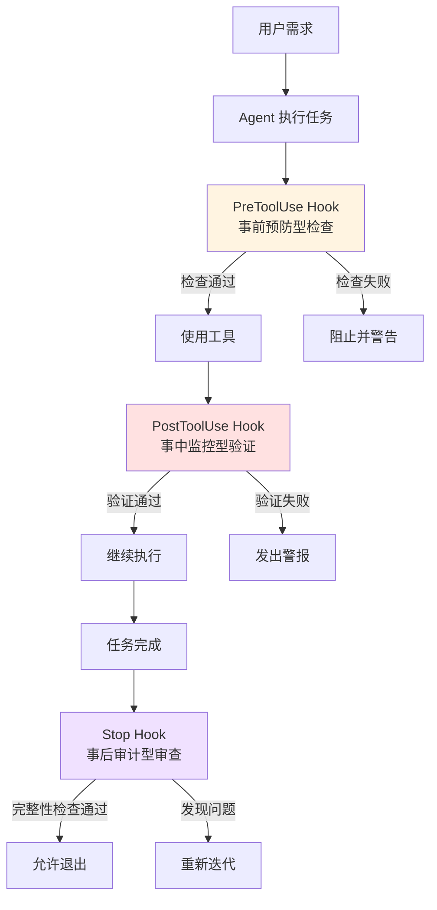
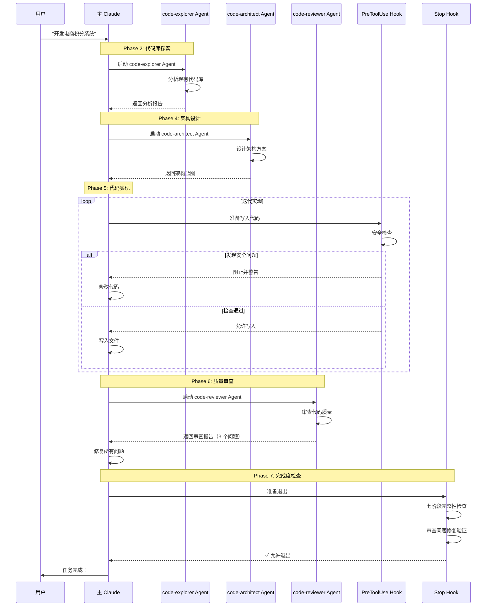

# Agent-Hook 配合实战

> Agent 是进攻机制（主动执行任务），Hook 是防御机制（检查、验证、阻止）。两者各司其职，协同工作，确保任务质量和安全性。

---

## 一、Agent-Hook 协作总览

### 1.1 核心设计理念

```
Agent（进攻） + Hook（防御） = 高质量交付

Agent 负责：
✓ 分析代码库
✓ 设计架构方案
✓ 实现功能
✓ 审查质量

Hook 负责：
✓ 安全检查（PreToolUse）
✓ 操作后验证（PostToolUse）
✓ 任务完成度验证（Stop）
```

### 1.2 三层防护架构



---

## 二、PreToolUse Hook + Agent 配合

### 2.1 security-guidance 的 PreToolUse Hook

**文件位置：** `plugins/security-guidance/hooks/security_reminder_hook.py`

**核心职责：** 在 Agent 使用写工具（Write/Edit/MultiEdit）前进行安全检查

#### 触发机制（hooks.json）

```json
{
  "description": "Security reminder hook that warns about potential security issues when editing files",
  "hooks": {
    "PreToolUse": [
      {
        "hooks": [
          {
            "type": "command",
            "command": "python3 ${CLAUDE_PLUGIN_ROOT}/hooks/security_reminder_hook.py"
          }
        ],
        "matcher": "Edit|Write|MultiEdit"
      }
    ]
  }
}
```

→ **matcher 解读：** 当 Agent 尝试使用 Edit、Write 或 MultiEdit 工具时触发

#### 安全检查流程（逐行解读）

**第 1 步：读取输入数据（第 230-242 行）**

```python
# Read input from stdin
try:
    raw_input = sys.stdin.read()
    input_data = json.loads(raw_input)
except json.JSONDecodeError as e:
    debug_log(f"JSON decode error: {e}")
    sys.exit(0)  # Allow tool to proceed if we can't parse input

# Extract session ID and tool information from the hook input
session_id = input_data.get("session_id", "default")
tool_name = input_data.get("tool_name", "")
tool_input = input_data.get("tool_input", {})
```

→ **输入数据结构：**
```json
{
  "session_id": "abc123",
  "tool_name": "Write",
  "tool_input": {
    "file_path": "/path/to/file.ts",
    "content": "..."
  }
}
```

---

**第 2 步：提取待检查内容（第 247-253 行）**

```python
# Extract file path from tool_input
file_path = tool_input.get("file_path", "")
if not file_path:
    sys.exit(0)  # Allow if no file path

# Extract content to check
content = extract_content_from_input(tool_name, tool_input)
```

**extract_content_from_input 函数（第 202-214 行）：**

```python
def extract_content_from_input(tool_name, tool_input):
    """Extract content to check from tool input based on tool type."""
    if tool_name == "Write":
        return tool_input.get("content", "")
    elif tool_name == "Edit":
        return tool_input.get("new_string", "")
    elif tool_name == "MultiEdit":
        edits = tool_input.get("edits", [])
        if edits:
            return " ".join(edit.get("new_string", "") for edit in edits)
        return ""
    return ""
```

→ **根据不同工具类型提取内容：**
- Write → 完整的文件内容
- Edit → 新的字符串片段
- MultiEdit → 所有编辑的新字符串拼接

---

**第 3 步：安全检查模式匹配（第 183-199 行）**

```python
def check_patterns(file_path, content):
    """Check if file path or content matches any security patterns."""
    # Normalize path by removing leading slashes
    normalized_path = file_path.lstrip("/")
    
    for pattern in SECURITY_PATTERNS:
        # Check path-based patterns
        if "path_check" in pattern and pattern["path_check"](normalized_path):
            return pattern["ruleName"], pattern["reminder"]
        
        # Check content-based patterns
        if "substrings" in pattern and content:
            for substring in pattern["substrings"]:
                if substring in content:
                    return pattern["ruleName"], pattern["reminder"]
    
    return None, None
```

→ **两种检测方式：**
1. **路径检测**：如 `.github/workflows/*.yml` → GitHub Actions 注入风险
2. **内容检测**：如 `exec(`、`eval(` → 代码注入风险

---

**第 4 步：会话级去重（第 258-273 行）**

```python
if rule_name and reminder:
    # Create unique warning key
    warning_key = f"{file_path}-{rule_name}"
    
    # Load existing warnings for this session
    shown_warnings = load_state(session_id)
    
    # Check if we've already shown this warning in this session
    if warning_key not in shown_warnings:
        # Add to shown warnings and save
        shown_warnings.add(warning_key)
        save_state(session_id, shown_warnings)
        
        # Output the warning to stderr and block execution
        print(reminder, file=sys.stderr)
        sys.exit(2)  # Block tool execution (exit code 2 for PreToolUse hooks)
```

→ **关键设计：**
- ✅ 同一会话中每个文件的每种风险只警告一次
- ✅ 使用 `exit(2)` 阻止工具执行（PreToolUse 专用）
- ✅ 警告输出到 stderr（Claude 会显示给用户）

---

#### 安全模式详解（SECURITY_PATTERNS）

**模式 1：GitHub Actions 工作流注入（第 32-68 行）**

```python
{
    "ruleName": "github_actions_workflow",
    "path_check": lambda path: ".github/workflows/" in path
        and (path.endswith(".yml") or path.endswith(".yaml")),
    "reminder": """You are editing a GitHub Actions workflow file. Be aware of these security risks:

1. **Command Injection**: Never use untrusted input in run: commands
2. **Use environment variables**: Instead of ${{ github.event.issue.title }}, use env:
3. **Review the guide**: https://github.blog/security/vulnerability-research/how-to-catch-github-actions-workflow-injections-before-attackers-do/

Example of UNSAFE pattern to avoid:
run: echo "${{ github.event.issue.title }}"

Example of SAFE pattern:
env:
  TITLE: ${{ github.event.issue.title }}
run: echo "$TITLE"
"""
}
```

**触发场景：**
```
Agent 正在实现 CI/CD 功能，准备写入 .github/workflows/ci.yml

PreToolUse Hook 检测到：
- 文件路径：`.github/workflows/ci.yml` ✓
- 文件类型：`.yml` ✓

→ 触发警告，提醒 Agent 注意命令注入风险
```

---

**模式 2：子进程命令注入（第 69-90 行）**

```python
{
    "ruleName": "child_process_exec",
    "substrings": ["child_process.exec", "exec(", "execSync("],
    "reminder": """⚠️ Security Warning: Using child_process.exec() can lead to command injection vulnerabilities.

This codebase provides a safer alternative: src/utils/execFileNoThrow.ts

Instead of:
  exec(`command ${userInput}`)

Use:
  import { execFileNoThrow } from '../utils/execFileNoThrow.js'
  await execFileNoThrow('command', [userInput])

The execFileNoThrow utility:
- Uses execFile instead of exec (prevents shell injection)
- Handles Windows compatibility automatically
- Provides proper error handling
"""
}
```

**触发场景：**
```
Agent 准备实现一个执行系统命令的功能：

const result = exec(`git log --oneline ${commitHash}`);

PreToolUse Hook 检测到：
- 内容包含：`exec(` ✓

→ 触发警告，推荐使用 execFileNoThrow 替代
```

---

**其他安全模式：**

| 模式名称 | 检测内容 | 风险类型 |
|---------|---------|---------|
| `new_function_injection` | `new Function` | 代码注入 |
| `eval_injection` | `eval(` | 代码注入 |
| `react_dangerously_set_html` | `dangerouslySetInnerHTML` | XSS 攻击 |
| `document_write_xss` | `document.write` | XSS 攻击 |
| `innerHTML_xss` | `.innerHTML =` | XSS 攻击 |
| `pickle_deserialization` | `pickle` | 任意代码执行 |
| `os_system_injection` | `os.system` | 命令注入 |

---

### 2.2 Agent 与 PreToolUse Hook 的配合案例

**场景：Agent 实现用户认证功能**

```
Phase 1: Agent 开始实现代码
    ↓
Agent 准备写入 auth.ts 文件
    ↓
┌─────────────────────────────────────┐
│ PreToolUse Hook 检查                 │
│                                     │
│ 1. 检测文件路径：auth.ts ✓          │
│ 2. 检测代码内容：                    │
│    - 发现 exec( 调用 ✗               │
│                                     │
│ → 触发安全警告                       │
│ → 阻止写入，返回警告信息             │
└─────────────────────────────────────┘
    ↓
Agent 收到警告
    ↓
Agent 阅读警告：建议使用 execFileNoThrow
    ↓
Agent 修改代码，使用安全的 API
    ↓
再次尝试写入
    ↓
┌─────────────────────────────────────┐
│ PreToolUse Hook 检查                 │
│                                     │
│ 1. 检测文件路径：auth.ts ✓          │
│ 2. 检测代码内容：                    │
│    - 没有 exec( 调用 ✓               │
│    - 使用 execFileNoThrow ✓          │
│                                     │
│ → 检查通过，允许写入                 │
└─────────────────────────────────────┘
    ↓
Agent 成功写入文件
    ↓
功能实现完成 ✅
```

---

## 三、PostToolUse Hook + Agent 配合

> PostToolUse Hook 在 Agent 使用工具后执行，用于验证操作结果是否符合预期。

### 3.1 PostToolUse Hook 的作用

**典型应用场景：**

1. **操作后验证**
   - Agent 写完文件后，验证文件格式是否正确
   - Agent 运行测试后，验证测试是否通过

2. **副作用检查**
   - 检查是否意外删除了重要文件
   - 检查是否引入了新的依赖

3. **质量保障**
   - 验证代码格式是否符合规范
   - 确认是否遵循了项目约定

---

### 3.2 实现示例（以验证 JSON 格式为例）

**文件位置：** `plugins/example/hooks/posttooluse.py`

```python
#!/usr/bin/env python3
"""PostToolUse Hook to validate JSON files after Agent writes them."""

import json
import sys

def main():
    # Read hook input from stdin
    try:
        raw_input = sys.stdin.read()
        input_data = json.loads(raw_input)
    except json.JSONDecodeError:
        sys.exit(0)
    
    tool_name = input_data.get("tool_name", "")
    tool_result = input_data.get("tool_result", {})
    
    # Only check Write operations on JSON files
    if tool_name != "Write":
        sys.exit(0)
    
    file_path = tool_result.get("file_path", "")
    if not file_path.endswith(".json"):
        sys.exit(0)
    
    # Validate JSON format
    try:
        with open(file_path, "r") as f:
            json.load(f)
        sys.exit(0)  # Valid JSON, allow to proceed
    except json.JSONDecodeError as e:
        print(f"❌ Invalid JSON in {file_path}: {e}", file=sys.stderr)
        sys.exit(1)  # Invalid JSON, report error

if __name__ == "__main__":
    main()
```

**配置（hooks.json）：**

```json
{
  "hooks": {
    "PostToolUse": [
      {
        "hooks": [
          {
            "type": "command",
            "command": "python3 ${CLAUDE_PLUGIN_ROOT}/hooks/validate_json.py"
          }
        ],
        "matcher": "Write"
      }
    ]
  }
}
```

---

## 四、Stop Hook + Agent 配合

### 4.1 feature-dev 的七阶段完整性检查

**Stop Hook 的核心职责：** 在 Agent 完成任务准备退出前，验证七阶段流程是否全部完成

#### 七阶段检查清单

```markdown
Phase 1: Discovery（发现）
✓ 需求是否理解清晰？
✓ 是否有模糊点需要澄清？

Phase 2: Codebase Exploration（代码库探索）
✓ 是否启动了 code-explorer Agent？
✓ 是否找到了相关代码和类似功能？

Phase 3: Clarifying Questions（澄清问题）
✓ 是否提出了所有必要的澄清问题？
✓ 用户是否已回答这些问题？

Phase 4: Architecture Design（架构设计）
✓ 是否启动了 code-architect Agent？
✓ 是否有多个方案对比？
✓ 是否选择了推荐方案？

Phase 5: Implementation（实现）
✓ 代码是否已实现？
✓ 是否遵循了架构设计？

Phase 6: Quality Review（质量审查）
✓ 是否启动了 code-reviewer Agent？
✓ 发现的问题是否已修复？

Phase 7: Summary（总结）
✓ 是否有完整的总结？
✓ 是否说明了后续优化方向？
```

---

### 4.2 Stop Hook 工作流程

```
Agent 完成所有工作，准备退出
    ↓
┌─────────────────────────────────────┐
│ Stop Hook 拦截                       │
│                                     │
│ 1. 读取对话历史                     │
│ 2. 检查七阶段完整性：               │
│    - Phase 1: Discovery ✓           │
│    - Phase 2: Exploration ✓         │
│    - Phase 3: Clarification ✓       │
│    - Phase 4: Architecture ✓        │
│    - Phase 5: Implementation ✓      │
│    - Phase 6: Review ✓              │
│    - Phase 7: Summary ✓             │
│                                     │
│ 3. 检查审查问题修复情况：           │
│    - code-reviewer 发现 3 个问题      │
│    - 检查是否已修复 ✓               │
│                                     │
│ → 决定：允许退出                     │
└─────────────────────────────────────┘
    ↓
Agent 正常退出，任务完成 ✅
```

---

## 五、完整实战案例：开发积分系统

### 5.1 场景概述

**任务目标：** 为电商平台开发积分系统

**需求：**
- 用户购物获得积分
- 积分可以兑换商品
- 积分有过期机制
- 需要完整的测试覆盖

---

### 5.2 完整协作流程



---

### 5.3 详细步骤解析

#### Step 1: PreToolUse Hook 拦截 exec 调用

```
Agent 准备实现积分过期定时任务：

// 错误的实现
const cron = require('node-cron');
cron.schedule('0 0 * * *', () => {
  exec(`node scripts/expire-points.js`);
});

PreToolUse Hook 检测到：
- 内容包含：`exec(` ✓
- 风险类型：命令注入

→ 触发警告：
"⚠️ Security Warning: Using child_process.exec() can lead to 
   command injection vulnerabilities.

   This codebase provides a safer alternative: 
   src/utils/execFileNoThrow.ts"

→ 阻止写入，Agent 必须修改代码
```

**Agent 修正后的代码：**

```javascript
// 正确的实现
const { execFileNoThrow } = require('../utils/execFileNoThrow');
const cron = require('node-cron');

cron.schedule('0 0 * * *', async () => {
  await execFileNoThrow('node', ['scripts/expire-points.js']);
});
```

→ PreToolUse Hook 检查通过，允许写入 ✅

---

#### Step 2: Stop Hook 七阶段完整性检查

```
Agent 完成所有工作，准备退出

Stop Hook 检查清单：

Phase 1: Discovery ✓
- 需求理解：积分获取、使用、过期机制 ✓

Phase 2: Exploration ✓
- code-explorer Agent 已启动 ✓
- 找到类似的优惠券系统 ✓

Phase 3: Clarification ✓
- 已提问：积分有效期多久？ ✓
- 用户已回答：12 个月 ✓

Phase 4: Architecture ✓
- code-architect Agent 已启动 ✓
- 提供了 3 个方案对比 ✓
- 选择了方案 2（基于事件驱动） ✓

Phase 5: Implementation ✓
- 代码已实现 ✓
- 包括：积分模型、获取逻辑、使用逻辑、过期逻辑 ✓

Phase 6: Review ✓
- code-reviewer Agent 已启动 ✓
- 发现 3 个问题：
  1. 缺少事务处理 → 已修复 ✓
  2. 未处理并发 → 已添加锁机制 ✓
  3. 测试不足 → 已补充测试用例 ✓

Phase 7: Summary ✓
- 已完成总结 ✓
- 说明了性能优化方向 ✓

→ Stop Hook 决定：允许退出 ✅
```

---

## 六、Agent-Hook 配合的设计原则

### 6.1 各司其职原则

```
✅ 正确分工：

Agent 负责创造性工作：
- 分析代码
- 设计方案
- 实现功能
- 审查质量

Hook 负责规范性检查：
- 安全检查（PreToolUse）
- 操作验证（PostToolUse）
- 完整性审查（Stop）

❌ 错误做法：

让 Agent 做规范性检查：
- Agent 不应该检查自己的安全问题
- Agent 不应该验证自己的完整性

让 Hook 做创造性工作：
- Hook 不应该设计方案
- Hook 不应该实现代码
```

---

### 6.2 最小权限原则

```yaml
# Agent 工具权限配置示例

# code-reader 只需要读权限
tools: ["Read", "Grep", "Glob"]
# ✓ 符合最小权限原则

# code-writer 需要写权限，但不需要 Bash
tools: ["Read", "Write", "Edit"]
# ✓ 符合最小权限原则

# ❌ 反例：给 code-reader 授予 Write 权限
tools: ["Read", "Write", "Bash"]
# ✗ 违反最小权限原则
```

---

### 6.3 置信度评分原则

```
Hook 发现的问题应该按置信度分级：

| 置信度 | 含义 | 处理方式 |
|--------|------|---------|
| 90-100 | 绝对确定 | 必须阻止并警告 |
| 70-89  | 高度确信 | 警告但允许继续 |
| 50-69  | 可能有问题 | 轻微提醒 |
| <50    | 不确定 | 不报告（避免噪音） |

示例：security-guidance 的置信度策略
- exec( 调用 → 95%（必须阻止）
- innerHTML 赋值 → 85%（警告但允许）
- 变量命名不规范 → 40%（不报告）
```

---

## 七、常见问题与解决方案

### Q1: Hook 频繁触发影响效率怎么办？

**问题：** 某些 Hook 过于敏感，频繁打断 Agent 工作

**解决方案：**

```python
# 使用会话级去重（如 security-guidance）
shown_warnings = load_state(session_id)
if warning_key not in shown_warnings:
    shown_warnings.add(warning_key)
    save_state(session_id, shown_warnings)
    print(reminder, file=sys.stderr)
    sys.exit(2)
```

→ 同一问题在同一会话中只警告一次

---

### Q2: Agent 如何正确处理 Hook 警告？

**错误做法：**

```
Agent 忽略警告，强行继续
→ Hook 持续阻止，陷入死循环
```

**正确做法：**

```
1. Agent 仔细阅读警告内容
2. 理解 Hook 担心的问题
3. 按照建议修改代码
4. 再次尝试

示例：
Hook 警告：使用 exec( 有注入风险
Agent 响应：
  1. 阅读警告
  2. 理解应该用 execFileNoThrow
  3. 修改代码
  4. 重新写入 → 成功
```

---

### Q3: Stop Hook 误判怎么办？

**场景：** Stop Hook 认为某阶段未完成，但 Agent 认为已完成

**解决方案：**

```markdown
1. Agent 重新检查该阶段的完成标准
2. 如果确实完成，在对话中标注清楚
3. Stop Hook 重新评估
4. 如果仍有分歧，记录问题供人工介入

示例：
Stop Hook: "Phase 6 Review 未完成"
Agent 检查：发现 code-reviewer 已启动，问题已修复
Agent 回应："Phase 6 已完成，详见消息 #42-#58"
Stop Hook 重新检查 → 确认完成 → 允许退出
```

---

## 八、技术亮点总结

### 8.1 security-guidance 的创新设计

**1. 会话级状态管理**
```python
# 使用 session_id 创建独立的状态文件
state_file = f"~/.claude/security_warnings_state_{session_id}.json"

# 优点：
# - 不同会话互不干扰
# - 自动清理（30 天过期）
# - 避免重复警告
```

**2. 路径 + 内容双重检测**
```python
# 路径检测：针对特定文件类型
if pattern["path_check"](normalized_path):
    return pattern["ruleName"], pattern["reminder"]

# 内容检测：针对代码特征
for substring in pattern["substrings"]:
    if substring in content:
        return pattern["ruleName"], pattern["reminder"]
```

**3. 建设性警告文案**
```
不只是说"不行"，而是提供替代方案：

❌ 坏例子："禁止使用 exec()"
✅ 好例子：
  "⚠️ Security Warning: Using exec() can lead to command injection.
   
   This codebase provides a safer alternative: 
   src/utils/execFileNoThrow.ts
   
   Instead of:
     exec(`command ${userInput}`)
   
   Use:
     import { execFileNoThrow } from '../utils/execFileNoThrow.js'
     await execFileNoThrow('command', [userInput])"
```

---

### 8.2 feature-dev 的七阶段检查

**核心创新：**

1. **结构化检查清单**
   - 每个阶段都有明确的完成标准
   - 可量化、可验证

2. **问题追踪机制**
   - code-reviewer 发现的问题会被记录
   - Stop Hook 验证每个问题是否修复

3. **人性化设计**
   - 不是机械地检查框框
   - 允许特殊情况说明
   - 支持人工介入裁决

---

## 九、本章总结

### 核心要点

**1. Agent-Hook 协作的本质**
- Agent = 进攻（创造性工作）
- Hook = 防御（规范性检查）
- 各司其职，缺一不可

**2. 三层防护架构**
- PreToolUse：事前预防（安全检查）
- PostToolUse：事中监控（操作验证）
- Stop：事后审计（完整性审查）

**3. 设计原则**
- 各司其职：Agent 不做检查，Hook 不做创造
- 最小权限：只授予必要的工具权限
- 置信度评分：只报告高确信度的问题

**4. security-guidance 的最佳实践**
- 会话级去重（避免重复警告）
- 路径 + 内容双重检测（全面覆盖）
- 建设性警告（提供替代方案）

**5. feature-dev 的七阶段检查**
- 结构化的检查清单
- 问题追踪和验证
- 人性化裁决机制

---

### 实战建议

**作为 Agent 使用者：**
1. 认真对待每个 Hook 警告
2. 按照建议修改代码
3. 不要试图绕过 Hook
4. 遇到误判时理性沟通

**作为 Hook 开发者：**
1. 明确 Hook 的职责边界
2. 使用置信度评分减少噪音
3. 提供建设性的改进建议
4. 实现去重机制避免打扰

**作为系统设计者：**
1. 平衡安全性和效率
2. 预留人工介入通道
3. 持续优化检测和体验
4. 文档化所有规则和行为

---

**最后更新：** 2026 年 4 月 2 日  
**版本：** v1.0  
**维护者：** Claude Code 项目学习文档团队
