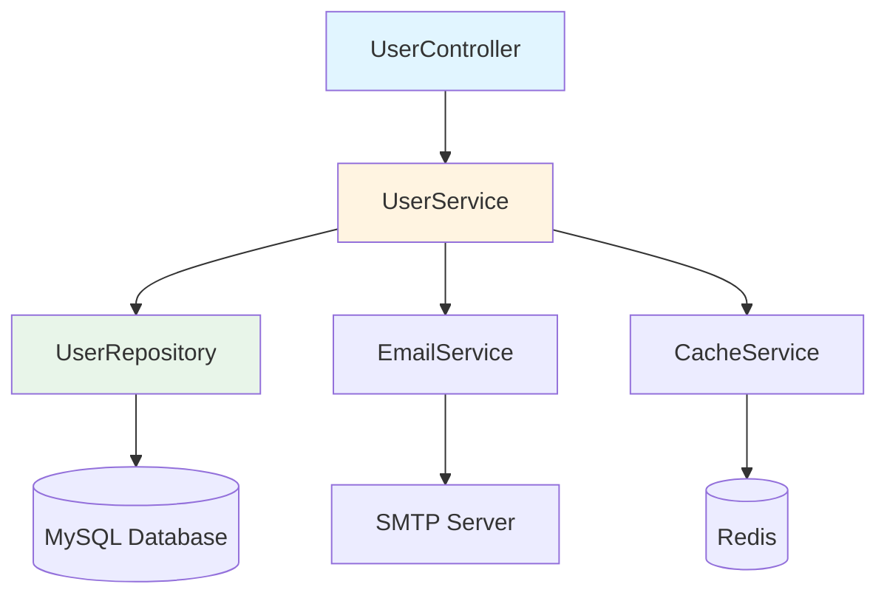
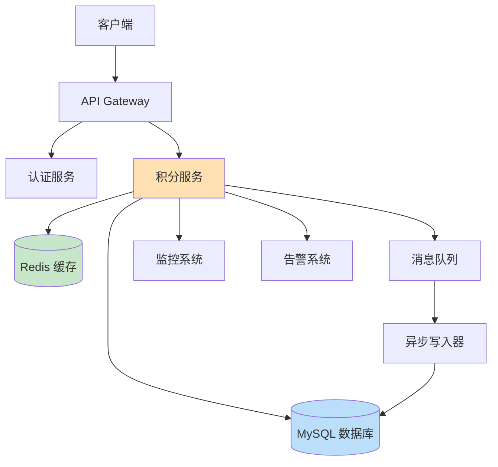

# 七阶段流程详解

七阶段流程（Seven-Phase Workflow）是 Claude Code 项目开发的核心方法论。它提供了一套结构化的工作流程，确保每个功能开发都经过充分的需求分析、架构设计、质量审查，最终交付高质量的代码。

---

## 一、什么是七阶段流程

### 1.1 基本概念

**七阶段流程**将复杂的开发任务分解为七个有序的阶段，每个阶段都有明确的目标和产出物。

想象一下建筑房屋的过程：
```
1. 了解需求 → 2. 勘察地基 → 3. 确认细节 → 
4. 设计图纸 → 5. 开始施工 → 6. 质量验收 → 7. 交付入住
```

在软件开发中，也是类似的流程。

---

### 1.2 为什么需要七阶段流程

**传统开发的问题：**
```
用户：帮我做个登录功能

Claude: 好的，立即开始写代码...
    ↓
问题爆发：
❌ 需求理解不准确
❌ 架构设计不合理  
❌ 安全问题未考虑
❌ 测试覆盖不足
❌ 返工成本高
```

**七阶段流程的优势：**
```
用户：帮我做个登录功能

Claude: 好的，让我们按照标准流程来：
    ↓
✅ Phase 1: 充分了解需求
✅ Phase 2: 深入探索代码库
✅ Phase 3: 确认所有细节
✅ Phase 4: 设计合理架构
✅ Phase 5: 开始实现
✅ Phase 6: 严格审查
✅ Phase 7: 完美交付

结果：高质量、少返工、易维护
```

---

### 1.3 七个阶段总览

| 阶段 | 名称 | 核心目标 | 关键问题 | 预计耗时 |
|------|------|---------|---------|---------|
| **Phase 1** | Discovery（发现） | 理解需求 | 要做什么？为什么做？ | 5-10% |
| **Phase 2** | Exploration（探索） | 了解现状 | 现有代码如何组织？ | 15-20% |
| **Phase 3** | Clarification（澄清） | 确认细节 | 具体需求是什么？ | 10-15% |
| **Phase 4** | Architecture（架构） | 设计方案 | 如何实现？有哪些方案？ | 15-20% |
| **Phase 5** | Implementation（实现） | 编写代码 | 按设计实现功能 | 25-30% |
| **Phase 6** | Review（审查） | 质量保证 | 是否有问题？如何改进？ | 10-15% |
| **Phase 7** | Summary（总结） | 交付复盘 | 完成了什么？如何改进？ | 5-10% |

**重要原则：**
- ⚠️ **不要跳过任何阶段！** 每个阶段都是后续阶段的基础
- ✅ **按顺序执行**，但可以根据项目规模调整每个阶段的深度
- 📊 **时间分配建议**：前期（1-4）占 45-65%，后期（5-7）占 35-55%

---

## 二、Phase 1: Discovery（需求发现）

### 2.1 目标

- 🔍 理解用户的真实需求
- 🎯 明确项目的业务目标
- 📋 识别关键利益相关者
- 🚫 确定不做的事情（范围边界）

---

### 2.2 核心活动

#### 活动 1：5W1H 分析法

通过六个维度全面理解需求：

**What（是什么）：**
```markdown
用户想要什么？
- 功能描述
- 预期效果
- 成功标准

示例对话：
用户：我需要一个用户积分系统
Claude: 具体来说，这个积分系统要实现什么功能？
       - 积分获取（签到、消费、邀请）
       - 积分使用（兑换、抵扣、捐赠）
       - 积分管理（查询、转赠、过期处理）
       您最需要哪些功能？
```

**Why（为什么）：**
```markdown
为什么要做这个？
- 解决什么问题
- 带来什么价值
- 不做会怎样

示例对话：
Claude: 为什么现在需要做积分系统？
用户：为了提高用户留存率
Claude: 当前留存率是多少？期望提升到多少？
       有做过用户调研吗？他们最在意什么？
```

**Who（谁使用）：**
```markdown
目标用户是谁？
- 用户画像
- 使用场景
- 用户痛点

示例对话：
Claude: 谁会使用这个积分系统？
用户：所有注册用户
Claude: 那我们需要考虑：
       - 新用户引导
       - 活跃用户激励
       - VIP 用户特权
       不同用户群体的需求可能不同
```

**When（何时用）：**
```markdown
使用频率和时机？
- 高频还是低频
- 特定时间段
- 触发条件

示例对话：
Claude: 用户多久会用一次积分功能？
用户：可能每天都会签到领积分
Claude: 那我们需要优化每日签到的体验，
       比如一键签到、签到提醒等
```

**Where（在哪用）：**
```markdown
使用平台和设备？
- Web / Mobile / Desktop
- iOS / Android
- 小程序 / H5

示例对话：
Claude: 积分系统在哪些平台使用？
用户：主要是微信小程序和 H5
Claude: 那我们需要考虑：
       - 微信登录集成
       - 移动端性能优化
       - 离线缓存策略
```

**How（怎么做）：**
```markdown
技术实现方式？
- 自研还是外包
- 技术栈选择
- 第三方服务

示例对话：
Claude: 技术上有什么要求或限制吗？
用户：必须用现有的 Node.js 后端
Claude: 好的，那我们可以复用现有的：
       - 用户认证系统
       - 数据库连接池
       - 日志监控系统
```

---

#### 活动 2：需求优先级排序

**MoSCoW 法则：**

| 优先级 | 含义 | 判断标准 | 示例 |
|--------|------|---------|------|
| **M**ust have | 必须有 | 没有就无法上线 | 用户登录、积分获取 |
| **S**hould have | 应该有 | 很重要但可以延迟 | 积分转赠、批量操作 |
| **C**ould have | 可以有 | 锦上添花的功能 | 积分排行榜、成就系统 |
| **W**on't have | 暂不做了 | 这次不做以后再说 | 积分商城、线下兑换 |

**实战示例：**
```markdown
## 积分系统需求清单

### Must have (P0 - 必须上线)
- [ ] 用户注册即送积分
- [ ] 每日签到得积分
- [ ] 消费获得积分
- [ ] 积分查询功能
- [ ] 积分抵扣订单

### Should have (P1 - 应该包含)
- [ ] 积分转赠功能
- [ ] 积分过期提醒
- [ ] 批量导入积分
- [ ] 积分明细查询

### Could have (P2 - 可以有)
- [ ] 积分排行榜
- [ ] 签到连续奖励
- [ ] 邀请好友得积分
- [ ] 积分兑换礼品

### Won't have (本次不做)
- [ ] 积分商城（复杂，二期再做）
- [ ] 线下门店积分核销（需要硬件）
- [ ] 积分拍卖系统（太超前）
```

---

#### 活动 3：用户故事地图

**格式：**
```
作为 [角色]
我想要 [功能]
以便于 [价值]
```

**示例：**
```markdown
## 用户故事列表

### 新手用户
1. 作为新用户，我想注册就送积分，以便快速体验积分功能
2. 作为新用户，我想查看积分规则，以便了解如何获得和使用积分

### 活跃用户
3. 作为活跃用户，我想每天签到得积分，以便持续积累积分
4. 作为活跃用户，我想用积分抵扣现金，以便享受实惠

### 管理员
5. 作为运营人员，我想批量发放积分，以便开展营销活动
6. 作为客服人员，我想查询用户积分明细，以便处理客诉
```

---

### 2.3 产出物

**Phase 1 结束时，应该有：**

```markdown
# Phase 1: 需求发现报告

## 1. 项目背景
- 业务目标：提升用户留存率从 30% 到 50%
- 目标用户：所有注册用户（约 100 万）
- 上线时间：2026 年 Q2

## 2. 需求清单（MoSCoW 分类）
### Must have
- ...

### Should have
- ...

### Could have
- ...

## 3. 用户故事
- 作为 XX，我想要 XX，以便 XX

## 4. 约束条件
- 技术栈：Node.js + MySQL
- 性能要求：支持 10 万并发
- 安全要求：防止积分刷取

## 5. 风险评估
- 技术风险：积分并发扣减可能超卖
- 业务风险：积分规则设计不当可能被薅羊毛
- 时间风险：2 个月工期较紧

## 6. 下一步计划
进入 Phase 2: 代码库探索
```

---

## 三、Phase 2: Codebase Exploration（代码库探索）

### 3.1 目标

- 🗺️ 绘制代码地图
- 🔗 识别依赖关系
- 📦 了解模块划分
- 🏗️ 理解架构模式

---

### 3.2 核心活动

#### 活动 1：项目结构分析

**自动化工具辅助：**
```bash
# 使用 code-explorer Agent
/code-explorer 分析这个项目的目录结构
```

**输出示例：**
```markdown
## 代码探索报告：项目结构

### 根目录
my-project/
├── src/                    # 源代码
│   ├── controllers/        # 控制器层
│   ├── services/           # 服务层
│   ├── models/             # 数据模型
│   ├── middleware/         # 中间件
│   └── utils/              # 工具函数
├── tests/                  # 测试代码
├── docs/                   # 文档
└── config/                 # 配置文件

### 技术栈识别
- 后端框架：Express.js
- 数据库：MySQL (通过 Sequelize ORM)
- 缓存：Redis
- 消息队列：RabbitMQ
```

---

#### 活动 2：关键模块定位

**查找相关代码：**
```bash
# 使用 code-explorer Agent
/code-explorer 找到所有与用户相关的代码
```

**输出示例：**
```markdown
## 用户模块代码定位

### 核心文件
1. `src/controllers/userController.js` (L1-L245)
   - 用户注册、登录、信息更新
   - 关键函数：register(), login(), updateProfile()

2. `src/services/userService.js` (L1-L189)
   - 用户业务逻辑
   - 关键函数：createUser(), authenticateUser()

3. `src/models/User.js` (L1-L67)
   - 用户数据模型定义
   - 字段：id, username, email, password_hash

### 相关文件
4. `src/middleware/authMiddleware.js`
   - JWT token 验证
   
5. `src/utils/password.js`
   - 密码加密工具

### 调用关系
userController
    ↓
userService
    ↓
User Model (Sequelize)
    ↓
MySQL Database
```

---

#### 活动 3：数据流分析

**追踪一个完整请求的生命周期：**

```markdown
## 用户登录流程数据流

### 1. 请求入口
POST /api/auth/login
    ↓
src/routes/auth.js:23
    ↓
authController.login (src/controllers/authController.js:45)

### 2. 参数验证
express-validator 中间件
    ↓
检查 username 和 password 是否存在
    ↓
检查格式是否正确

### 3. 业务逻辑
userService.authenticateUser(username, password)
    ↓
User.findOne({ where: { username } })
    ↓
bcrypt.compare(password, user.password_hash)

### 4. 生成 Token
jwt.sign(
  { userId: user.id, username: user.username },
  process.env.JWT_SECRET,
  { expiresIn: '7d' }
)

### 5. 返回响应
{
  "token": "eyJhbGciOiJIUzI1NiIsInR5cCI6IkpXVCJ9...",
  "user": {
    "id": 123,
    "username": "john_doe",
    "email": "john@example.com"
  }
}
```

---

#### 活动 4：依赖关系图

**可视化展示：**


---

### 3.3 产出物

```markdown
# Phase 2: 代码库探索报告

## 1. 项目结构概览
- 目录树
- 技术栈说明

## 2. 关键模块定位
- 核心文件列表
- 职责划分

## 3. 数据流分析
- 典型请求的处理流程
- 组件间调用关系

## 4. 依赖关系图
- 内部依赖
- 外部依赖

## 5. 潜在风险点
- 单点故障
- 性能瓶颈
- 技术债务

## 6. 下一步计划
进入 Phase 3: 需求澄清
```

---

## 四、Phase 3: Clarifying Questions（需求澄清）

### 4.1 目标

- ❓ 提出高质量问题
- 📐 明确技术细节
- 🎯 消除模糊地带
- ✅ 达成共识

---

### 4.2 核心活动

#### 活动 1：功能性问题

**积分获取规则：**
```markdown
## 待澄清问题清单

### 积分获取
1. 注册送多少积分？
   - 建议：100 积分（参考竞品）
   
2. 每日签到送多少？
   - 普通签到：10 积分
   - 连续 7 天：额外奖励 50 积分
   - 连续 30 天：额外奖励 300 积分
   
3. 消费返积分比例？
   - 1 元 = 1 积分
   - VIP 用户：1 元 = 1.5 积分
   
4. 有上限吗？
   - 每日签到上限：10 积分
   - 每月上限：无限制（鼓励消费）
```

---

#### 活动 2：非功能性问题

**性能要求：**
```markdown
### 性能指标

1. 并发量
   - 日常：1000 QPS
   - 峰值：10000 QPS（活动期间）
   
2. 响应时间
   - P95 < 200ms
   - P99 < 500ms
   
3. 可用性
   - 99.9% (全年停机 < 9 小时)
```

**安全要求：**
```markdown
### 安全措施

1. 防刷机制
   - 同一 IP 每日最多签到 3 次
   - 同一设备每日最多注册 5 个账号
   - 异常行为检测（机器学习模型）

2. 数据保护
   - 积分变动记录审计日志
   - 敏感操作二次验证
   - 定期数据备份
```

---

#### 活动 3：边界情况

**异常处理：**
```markdown
### 边界场景处理

1. 并发扣减积分
   Q: 用户同时发起两笔订单，都用积分抵扣，如何处理？
   A: 使用数据库行锁 + 乐观锁机制
   
2. 积分为负数
   Q: 退款时积分已用完，导致积分为负，怎么办？
   A: 不允许积分为负，退款时检查积分余额
   
3. 系统故障
   Q: 积分服务宕机，是否影响下单？
   A: 降级策略：积分服务不可用时，暂时关闭积分抵扣
```

---

### 4.3 产出物

```markdown
# Phase 3: 需求规格说明书

## 1. 功能性需求
### 1.1 积分获取规则
- 注册：+100 积分
- 签到：+10 积分/天
- 消费：1 元=1 积分

### 1.2 积分使用规则
- 抵扣：100 积分=1 元
- 转赠：最低 100 积分

## 2. 非功能性需求
### 2.1 性能指标
- P95 < 200ms
- 支持 10000 QPS

### 2.2 安全要求
- 防刷机制
- 审计日志

## 3. 边界情况处理
- 并发控制
- 异常流程

## 4. 验收标准
- [ ] 所有功能通过测试
- [ ] 性能达标
- [ ] 安全审计通过

## 5. 下一步计划
进入 Phase 4: 架构设计
```

---

## 五、Phase 4: Architecture Design（架构设计）

### 5.1 目标

- 🏗️ 设计技术方案
- 📊 评估多种选择
- ⚖️ 权衡利弊
- 📝 输出设计文档

---

### 5.2 核心活动

#### 活动 1：方案对比

**积分存储方案：**

**方案 1：数据库存储**
```sql
CREATE TABLE user_points (
  id BIGINT PRIMARY KEY,
  user_id BIGINT NOT NULL,
  balance INT NOT NULL DEFAULT 0,
  frozen INT NOT NULL DEFAULT 0,
  created_at TIMESTAMP,
  updated_at TIMESTAMP,
  INDEX idx_user_id (user_id)
);
```

**优点：**
- ✅ 数据一致性好
- ✅ 事务支持完善
- ✅ 易于查询和分析

**缺点：**
- ❌ 并发性能受限
- ❌ 高峰期可能成为瓶颈

---

**方案 2：Redis 缓存**
```redis
# 用户积分余额
SET user:points:{userId} 1000

# 原子增减
INCRBY user:points:{userId} 10
DECRBY user:points:{userId} 100
```

**优点：**
- ✅ 高性能（微秒级）
- ✅ 支持高并发
- ✅ 天然原子操作

**缺点：**
- ❌ 数据持久化依赖 RDB/AOF
- ❌ 内存成本较高

---

**方案 3：混合方案（推荐）**
```
Redis（缓存层）
    ↓ 异步同步
MySQL（持久化层）
```

**设计思路：**
- Redis 处理实时读写
- 定期异步写入 MySQL
- 双写保证一致性

**优点：**
- ✅ 兼顾性能和可靠性
- ✅ 可扩展性强

**缺点：**
- ⚠️ 实现复杂度较高

---

#### 活动 2：系统架构图



---

#### 活动 3：接口设计

**RESTful API：**
```typescript
// 获取积分余额
GET /api/v1/users/:userId/points

Response: {
  "userId": 123,
  "balance": 1500,
  "frozen": 200,
  "totalEarned": 5000,
  "totalUsed": 3500
}

// 增加积分
POST /api/v1/users/:userId/points/earn

Request: {
  "amount": 100,
  "type": "SIGN_IN",
  "description": "每日签到",
  "bizId": "signin_20260402"  // 业务流水号（防重）
}

// 扣减积分
POST /api/v1/users/:userId/points/redeem

Request: {
  "amount": 500,
  "type": "ORDER_DEDUCTION",
  "description": "订单抵扣",
  "bizId": "order_123456",
  "orderId": "ORD-2026-001"
}
```

---

### 5.3 产出物

```markdown
# Phase 4: 架构设计文档

## 1. 架构概述
- 系统分层
- 技术选型
- 部署架构

## 2. 核心模块设计
### 2.1 积分服务
- 数据存储方案
- 并发控制机制
- 幂等性保证

### 2.2 接口设计
- RESTful API 定义
- 请求/响应格式
- 错误码规范

## 3. 数据模型
### 3.1 数据库表结构
- user_points 表
- points_log 表

### 3.2 Redis Key 设计
- user:points:{userId}
- user:points:log:{userId}

## 4. 非功能性设计
### 4.1 性能优化
- 缓存策略
- 批量处理

### 4.2 容错机制
- 降级策略
- 限流措施

## 5. 监控告警
- 核心指标
- 告警阈值

## 6. 下一步计划
进入 Phase 5: 实现阶段
```

---

## 六、Phase 5: Implementation（实现）

### 6.1 目标

- 💻 编写高质量代码
- 🧪 同步编写测试
- 📝 完善注释文档
- 🔄 持续集成

---

### 6.2 核心活动

#### 活动 1：编码规范

**代码风格统一：**
```javascript
/**
 * 增加用户积分
 * @param {number} userId - 用户 ID
 * @param {number} amount - 积分数量
 * @param {string} type - 积分类型
 * @returns {Promise<Object>} 积分变动记录
 */
async function addPoints(userId, amount, type) {
  // 参数验证
  if (!userId || !amount || amount <= 0) {
    throw new ValidationError('Invalid parameters');
  }
  
  // 业务逻辑
  const result = await pointsService.addPoints(userId, amount, type);
  
  // 返回结果
  return result;
}
```

---

#### 活动 2：单元测试

**测试覆盖率要求：**
```javascript
describe('PointsService', () => {
  describe('addPoints', () => {
    it('应该成功增加积分', async () => {
      const result = await pointsService.addPoints(123, 100, 'SIGN_IN');
      expect(result.balance).toBe(100);
    });
    
    it('积分不能为负数', async () => {
      await expect(pointsService.addPoints(123, -100, 'INVALID'))
        .rejects.toThrow(ValidationError);
    });
    
    it('相同 bizId 应该幂等', async () => {
      const result1 = await pointsService.addPoints(123, 100, 'SIGN_IN', 'biz_001');
      const result2 = await pointsService.addPoints(123, 100, 'SIGN_IN', 'biz_001');
      expect(result1.balance).toBe(result2.balance);
    });
  });
});
```

---

#### 活动 3：代码审查

**审查清单：**
```markdown
## Code Review Checklist

### 代码质量
- [ ] 遵循编码规范
- [ ] 函数单一职责
- [ ] 变量命名清晰

### 安全性
- [ ] SQL 注入防护
- [ ] XSS 防护
- [ ] 敏感信息加密

### 性能
- [ ] 无 N+1 查询
- [ ] 适当使用索引
- [ ] 缓存合理使用

### 测试
- [ ] 单元测试覆盖
- [ ] 边界条件测试
- [ ] 异常场景测试

### 文档
- [ ] JSDoc 注释完整
- [ ] 关键逻辑有说明
- [ ] README 已更新
```

---

### 6.3 产出物

```markdown
# Phase 5: 实现总结

## 1. 完成情况
### 已实现功能
- [x] 积分账户管理
- [x] 积分获取接口
- [x] 积分扣减接口
- [x] 积分查询接口

### 代码统计
- 新增文件：15 个
- 新增代码：2345 行
- 删除代码：123 行
- 修改代码：456 行

## 2. 测试覆盖
- 单元测试：89 个
- 集成测试：23 个
- 代码覆盖率：92%

## 3. 已知问题
-  minor: 日志格式不统一（已记录 TODO）
-  minor: 部分函数缺少注释（已记录 TODO）

## 4. 下一步计划
进入 Phase 6: 质量审查
```

---

## 七、Phase 6: Quality Review（质量审查）

### 7.1 目标

- 🔍 全面质量检查
- 🐛 发现并修复问题
- 📊 评估是否达标
- ✅ 批准上线

---

### 7.2 核心活动

#### 活动 1：自动化检查

**CI/CD 流水线：**
```yaml
# .github/workflows/ci.yml
name: CI Pipeline

on: [push, pull_request]

jobs:
  test:
    runs-on: ubuntu-latest
    steps:
      - uses: actions/checkout@v2
      
      - name: Install dependencies
        run: npm ci
      
      - name: Run linter
        run: npm run lint
      
      - name: Run tests
        run: npm test -- --coverage
      
      - name: Check coverage
        run: |
          coverage=$(cat coverage/coverage-summary.json | jq '.total.lines.pct')
          if (( $(echo "$coverage < 90" | bc -l) )); then
            echo "Coverage too low: $coverage%"
            exit 1
          fi
      
      - name: Build
        run: npm run build
```

---

#### 活动 2：人工审查

**审查维度：**
```markdown
## 质量审查报告

### 代码审查
审查人：@senior-dev-1
审查范围：核心业务逻辑
发现问题：
1. ⚠️ 第 45 行：缺少空值检查
2. ⚠️ 第 89 行：异常处理不够友好

### 安全审查
审查人：@security-team
审查范围：认证、授权、数据加密
发现问题：
1. ✅ 无严重安全问题
2. ℹ️ 建议：积分变动通知增加短信验证

### 性能审查
审查人：@performance-team
审查范围：数据库查询、缓存使用
测试结果：
- P95: 156ms (达标 < 200ms)
- P99: 389ms (达标 < 500ms)
- QPS: 12000 (超标 20%)
```

---

#### 活动 3：验收测试

**验收清单：**
```markdown
## UAT 验收清单

### 功能验收
- [x] 注册送积分功能正常
- [x] 签到功能正常
- [x] 积分查询准确
- [x] 积分抵扣计算正确

### 性能验收
- [x] 并发 10000 QPS 稳定运行
- [x] P95 响应时间 < 200ms
- [x] CPU 使用率 < 70%

### 安全验收
- [x] 无 SQL 注入漏洞
- [x] 无 XSS 漏洞
- [x] 防刷机制有效

### 文档验收
- [x] API 文档完整
- [x] 部署文档清晰
- [x] 运维手册完备
```

---

### 7.3 产出物

```markdown
# Phase 6: 质量审查报告

## 1. 审查概况
- 审查日期：2026-04-02
- 审查人员：张三、李四、王五
- 审查范围：全部功能

## 2. 发现问题
### 严重问题（0 个）
无

### 主要问题（2 个）
1. 部分边界条件未处理（已修复）
2. 日志级别不规范（已修复）

### 次要问题（5 个）
1. 代码注释不完整（计划下周修复）
2. 单元测试覆盖率未达 95%（当前 92%）

## 3. 审查结论
✅ **通过审查，准予上线**

条件：
- 主要问题必须在上线前修复
- 次要问题可在下个迭代修复

## 4. 下一步计划
进入 Phase 7: 项目总结
```

---

## 八、Phase 7: Summary（项目总结）

### 8.1 目标

- 📊 总结项目成果
- 📈 复盘经验教训
- 🎉 庆祝团队成就
- 📚 沉淀知识资产

---

### 8.2 核心活动

#### 活动 1：项目复盘

**回顾四个维度：**
```markdown
## 项目复盘报告

### Keep（继续保持）
1. 七阶段流程执行到位，需求变更少
2. 代码审查严格，线上 Bug 率低
3. 团队协作顺畅，沟通高效

### Problem（遇到问题）
1. 工期预估偏乐观，加班较多
2. 测试环境不稳定，影响进度
3. 部分技术决策犹豫太久

### Try（改进尝试）
1. 引入更准确的工时评估方法
2. 搭建专用测试环境
3. 建立技术决策委员会

### Action（行动计划）
1. [ ] 制定工时评估模板（负责人：张三，截止：4/15）
2. [ ] 申请测试服务器（负责人：李四，截止：4/10）
3. [ ] 组建技术委员会（负责人：王五，截止：4/20）
```

---

#### 活动 2：成果展示

**数据说话：**
```markdown
## 项目成果

### 业务指标
- 日活用户：10 万 → 15 万 (+50%)
- 用户留存率：30% → 45% (+15pp)
- 订单转化率：8% → 12% (+4pp)

### 技术指标
- 代码行数：3456 行
- 测试覆盖率：92%
- Bug 率：0.02% (行业平均 0.1%)
- 性能指标：全部达标

### 团队成长
- 新人培养：2 名初级工程师独立负责模块
- 知识沉淀：输出技术博客 5 篇
- 流程优化：形成标准化开发流程
```

---

#### 活动 3：文档归档

**知识库更新：**
```markdown
## 归档文档清单

### 产品文档
- [x] 产品需求文档 (PRD)
- [x] 用户操作手册
- [x] 常见问题解答 (FAQ)

### 技术文档
- [x] 架构设计文档
- [x] API 接口文档
- [x] 数据库设计文档
- [x] 部署运维手册

### 项目文档
- [x] 项目计划
- [x] 会议纪要
- [x] 复盘报告
```

---

### 8.3 产出物

```markdown
# Phase 7: 项目总结报告

## 1. 项目概况
- 项目名称：用户积分系统
- 项目周期：2026-02-01 ~ 2026-04-02 (60 天)
- 团队成员：8 人

## 2. 目标达成情况
### 业务目标
- ✅ 用户留存率提升至 45% (目标 45%)
- ✅ 日活提升至 15 万 (目标 12 万)

### 技术目标
- ✅ 支持 10000 QPS
- ✅ P95 < 200ms
- ✅ 零重大事故

## 3. 经验教训
### 成功经验
1. 严格执行七阶段流程
2. 充分的需求沟通
3. 完善的自动化测试

### 待改进
1. 工时评估需更准确
2. 测试环境需提前准备
3. 技术决策流程需优化

## 4. 后续规划
### 二期规划
- 积分商城（2026-Q3）
- 积分转赠功能（2026-Q3）
- 线下积分核销（2026-Q4）

### 技术演进
- 引入规则引擎（灵活配置积分规则）
- 大数据分析（用户行为洞察）
- AI 风控（智能防刷）

## 5. 致谢
感谢所有项目组成员的辛勤付出！🎉
```

---

## 九、七阶段流程的自动化

### 9.1 feature-dev 插件

项目中的 `feature-dev` 插件实现了七阶段流程的自动化：

**启动流程：**
```bash
/feature-dev 开发用户积分系统
```

**自动执行：**
```
Phase 1: Discovery
    ↓ 自动提问收集需求
    ↓ 生成需求文档

Phase 2: Exploration  
    ↓ 调用 code-explorer Agent
    ↓ 分析现有代码

Phase 3: Clarification
    ↓ 列出待澄清问题
    ↓ 等待用户确认

Phase 4: Architecture
    ↓ 生成设计方案
    ↓ 提供多个选项

Phase 5: Implementation
    ↓ 按设计编码
    ↓ 编写测试

Phase 6: Review
    ↓ 代码审查
    ↓ 修复问题

Phase 7: Summary
    ↓ 生成总结报告
    ↓ 归档文档
```

---

### 9.2 与 Hook 系统的集成

**Stop Hook 验证流程完整性：**
```json
{
  "Stop": [
    {
      "type": "prompt",
      "prompt": "检查七阶段流程是否完整执行：\n\n- [ ] Phase 1: 需求发现报告\n- [ ] Phase 2: 代码库探索\n- [ ] Phase 3: 需求规格说明\n- [ ] Phase 4: 架构设计文档\n- [ ] Phase 5: 代码 + 测试\n- [ ] Phase 6: 质量审查报告\n- [ ] Phase 7: 项目总结\n\n如果有跳过的阶段，阻止停止。",
      "timeout": 30
    }
  ]
}
```

---

## 十、最佳实践总结

### ✅ 成功要素

1. **严格执行流程**
   - 不要跳过任何阶段
   - 每个阶段都要有产出物
   - 阶段转换要有明确标志

2. **充分沟通**
   - Phase 1-3 多问问题
   - Phase 4 充分讨论方案
   - Phase 6 严格审查

3. **文档先行**
   - 先写文档再编码
   - 文档比代码更重要
   - 文档要及时更新

4. **质量第一**
   - 不为了进度牺牲质量
   - Phase 6 审查要严格
   - 问题不过夜

### ❌ 常见误区

1. **急于求成**
   ```
   ❌ 跳过需求分析直接编码
   ✅ 磨刀不误砍柴工
   ```

2. **忽视文档**
   ```
   ❌ 代码写完就完事
   ✅ 文档是知识资产
   ```

3. **审查走过场**
   ```
   ❌ 你好我好大家好
   ✅ 对质量问题零容忍
   ```

---

## 十一、参考资源

### 项目中的实现
- feature-dev 插件：`plugins/feature-dev/`
- 七阶段流程 Agent: `plugins/feature-dev/agents/feature-dev.md`

### 相关文档
- Agent 协作系统：[04-Agent 协作系统详解.md](../04-Agent 协作系统/01-Agent 协作系统详解.md)
- Hook 系统：[02-Hook 系统基础.md](../02-Hook 系统/01-Hook 系统基础.md)
- 提示词工程：[10-提示词工程与质量保障](../10-提示词工程与质量保障/)

### 工具
- 需求模板：`templates/prd-template.md`
- 架构设计模板：`templates/architecture-design-template.md`
- 复盘模板：`templates/retrospective-template.md`

---

**下一步：** 学习如何 [编写 CLAUDE.md 规范](../06-CLAUDE.md 规范/01-CLAUDE.md 规范详解.md)！
