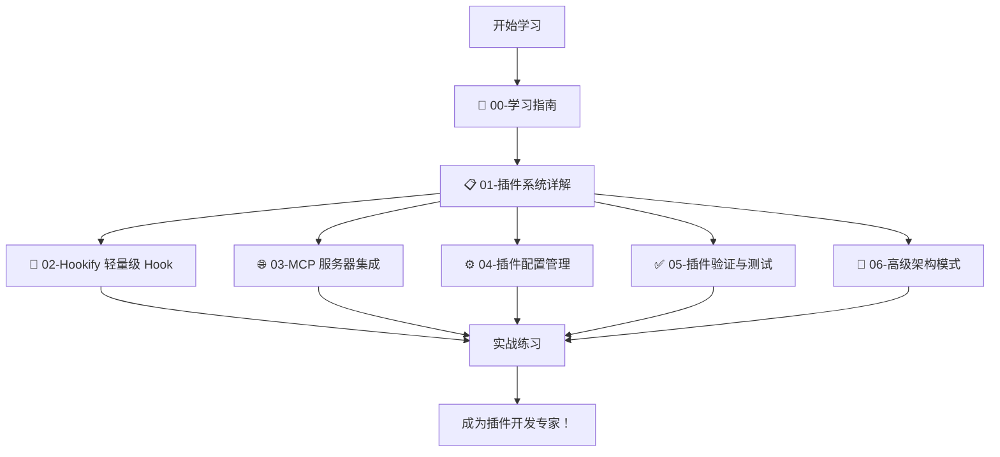

# 07-插件系统学习指南

## 📚 本章导航

欢迎来到 Claude Code 插件系统的世界！本章将带你从零开始，全面掌握插件开发的各项技能。



---

## 🗺️ 学习地图

### 前置知识

在开始本章学习之前，建议你先掌握：

- ✅ **Hook 系统基础** - 参考【02-Hook 系统】章节
  - 01-Hook 系统基础.md
  - 02-Hook 开发工具链.md
  
- ✅ **Agent 协作系统** - 参考【04-Agent 协作系统】章节
  - 01-Agent 协作系统详解.md
  - 04-Agent vs Skill 机制对比.md

---

## 📖 各章节详解

### 📋 01-插件系统详解（已有）

**内容概览**：
- 什么是插件系统
- 插件的基本结构
- 开发第一个插件（实战示例）
- 发布插件到 Marketplace
- 调试技巧与最佳实践

**学习目标**：
- 理解插件的概念和用途
- 掌握标准插件目录结构
- 能够开发简单的 Hook 插件
- 了解插件发布流程

**预计耗时**：2-3 小时

**核心代码文件**：
- `plugins/security-guidance/` - 安全检查插件实例
- `plugins/feature-dev/` - 功能开发插件实例

---

### 🔧 02-Hookify 轻量级 Hook 配置（新增）

**内容概览**：
- Hookify 的设计理念与优势
- `.local.md` 文件格式详解
- YAML frontmatter 配置字段
- 正则表达式 pattern 语法
- event 类型与触发条件
- action: warn vs block 区别
- 实战：创建 5 个常用规则

**学习目标**：
- 理解 Hookify 与传统 Hook 的区别
- 掌握 .local.md 文件的编写方法
- 能够创建自定义规则文件
- 熟悉正则表达式在 Hook 中的应用

**预计耗时**：1.5-2 小时

**核心代码文件**：
- `plugins/hookify/` - Hookify 插件源码
- `plugins/hookify/core/rule_engine.py` - 规则引擎
- `plugins/hookify/core/config_loader.py` - 配置加载器
- `plugins/hookify/hooks/hooks.json` - Hook 配置
- `plugins/hookify/README.md` - 使用文档

**实战练习**：
1. 创建危险命令拦截规则
2. 创建敏感文件保护规则
3. 创建代码规范检查规则
4. 创建调试代码提醒规则
5. 创建测试运行要求规则

---

### 🌐 03-MCP 服务器集成（新增）

**内容概览**：
- 什么是 MCP（Model Context Protocol）
- 为什么需要 MCP 集成
- `.mcp.json` 配置文件格式
- stdio 本地服务器配置
- SSE 远程服务器与 OAuth 认证
- HTTP REST API 集成
- WebSocket 实时通信
- 环境变量管理与安全

**学习目标**：
- 理解 MCP 的作用和工作原理
- 掌握 4 种 MCP 服务器类型的配置
- 能够集成外部 API 和服务
- 熟悉 OAuth 认证流程
- 了解安全最佳实践

**预计耗时**：2-2.5 小时

**核心代码文件**：
- `plugins/plugin-dev/skills/mcp-integration/` - MCP 集成技能
- `plugins/plugin-dev/skills/mcp-integration/SKILL.md` - 核心文档
- `plugins/plugin-dev/skills/mcp-integration/references/` - 参考资料

**实战练习**：
1. 配置本地 Node.js MCP 服务器
2. 集成 GitHub API（OAuth）
3. 连接数据库服务
4. 调用第三方 REST API

---

### ⚙️ 04-插件配置管理（新增）

**内容概览**：
- 插件配置的两种模式
- `.local.md` 配置文件结构
- YAML frontmatter 读取与解析
- 运行时配置动态调整
- 用户自定义设置存储
- 项目特定配置管理
- 配置继承与覆盖规则

**学习目标**：
- 理解插件配置的管理方式
- 掌握 .local.md 配置文件的编写
- 能够在代码中读取和使用配置
- 熟悉配置的优先级规则

**预计耗时**：1-1.5 小时

**核心代码文件**：
- `plugins/plugin-dev/skills/plugin-settings/` - 插件设置技能
- `plugins/plugin-dev/skills/plugin-settings/SKILL.md` - 核心文档
- `plugins/hookify/core/config_loader.py` - 配置加载实现

**实战练习**：
1. 创建插件配置文件
2. 读取 YAML frontmatter
3. 根据配置调整插件行为
4. 实现配置热更新

---

### ✅ 05-插件验证与测试（新增）

**内容概览**：
- 插件验证的重要性
- Hook schema 验证工具
- Agent 格式验证工具
- 功能测试方法与框架
- 调试工具使用技巧
- 常见问题排查流程
- 自动化测试策略

**学习目标**：
- 理解插件验证的必要性
- 掌握验证工具的使用方法
- 能够编写单元测试
- 熟悉调试技巧和日志分析

**预计耗时**：1.5-2 小时

**核心代码文件**：
- `plugins/plugin-dev/agents/plugin-validator.md` - 验证 Agent
- `plugins/plugin-dev/scripts/validate-hook-schema.sh` - Hook 验证
- `plugins/plugin-dev/scripts/test-hook.sh` - Hook 测试
- `plugins/plugin-dev/scripts/validate-agent.sh` - Agent 验证

**实战练习**：
1. 验证 Hook 配置合法性
2. 验证 Agent 文件格式
3. 测试 Hook 功能
4. 调试插件问题

---

### 🎯 06-高级架构模式（新增）

**内容概览**：
- 分层架构设计原则
- 模块化扩展模式
- 插件内插件（Plugin within Plugin）
- 跨组件协调机制
- 性能优化技巧
- 大型插件项目管理
- 插件协作与通信

**学习目标**：
- 理解复杂插件的架构设计
- 掌握分层和模块化方法
- 能够设计可扩展的插件结构
- 熟悉性能优化策略

**预计耗时**：2-2.5 小时

**核心代码文件**：
- `plugins/plugin-dev/skills/plugin-structure/` - 插件结构技能
- `plugins/plugin-dev/skills/plugin-structure/references/component-patterns.md` - 架构模式
- `plugins/plugin-dev/skills/plugin-structure/examples/advanced-plugin.md` - 高级示例

**实战练习**：
1. 设计分层插件架构
2. 实现模块化扩展
3. 优化插件性能
4. 设计插件间通信机制

---

## 🎓 学习路径建议

### 🚀 快速入门路径（适合新手）

```
00-学习指南 (30 分钟)
   ↓
01-插件系统详解 (2-3 小时)
   ↓
02-Hookify 实战 (1.5-2 小时)
   ↓
实战：创建一个简单的安全检查插件
```

**总耗时**：4-6 小时  
**目标**：能够开发简单的 Hook 插件

---

### 💼 就业导向路径（适合开发者）

```
00-学习指南 (30 分钟)
   ↓
01-插件系统详解 (2-3 小时)
   ↓
02-Hookify 实战 (1.5-2 小时)
   ↓
03-MCP 服务器集成 (2-2.5 小时)
   ↓
05-插件验证与测试 (1.5-2 小时)
   ↓
实战：开发一个完整的工具集成插件
```

**总耗时**：7.5-11 小时  
**目标**：能够开发生产级插件

---

### 🏆 专家进阶路径（适合高级开发者）

```
00-学习指南 (30 分钟)
   ↓
01-插件系统详解 (复习，1 小时)
   ↓
02-Hookify 实战 (复习，1 小时)
   ↓
03-MCP 服务器集成 (2-2.5 小时)
   ↓
04-插件配置管理 (1-1.5 小时)
   ↓
05-插件验证与测试 (1.5-2 小时)
   ↓
06-高级架构模式 (2-2.5 小时)
   ↓
综合实战：设计并实现企业级插件系统
```

**总耗时**：9-12.5 小时  
**目标**：能够设计和领导大型插件项目

---

## 📚 配套资源

### 官方文档

- [Claude Code 插件文档](https://docs.claude.com/en/docs/claude-code/plugins)
- [MCP 协议规范](https://modelcontextprotocol.io/)
- [插件市场](https://code.claude.com/marketplace)

### 代码示例

- `plugins/security-guidance/` - 传统 Hook 示例
- `plugins/hookify/` - 轻量级 Hook 示例
- `plugins/feature-dev/` - 多 Agent 协作示例
- `plugins/code-review/` - 代码审查示例
- `plugins/plugin-dev/` - 插件开发工具包

### 工具推荐

- **VS Code** - Markdown 编辑和预览
- **jq** - JSON 文件处理工具
- **Python 3.8+** - Hook 脚本开发
- **Node.js 18+** - MCP 服务器开发

---

## 🎯 学习成果检验

完成本章学习后，你应该能够：

### ✅ 基础能力

- [ ] 解释插件系统的三大核心支柱（Hook、Agent、MCP）
- [ ] 创建标准的插件目录结构
- [ ] 编写 plugin.json  manifest 文件
- [ ] 开发传统的 Python Hook 脚本
- [ ] 使用 Hookify 创建 .local.md 规则

### ✅ 进阶能力

- [ ] 配置 MCP 服务器集成外部服务
- [ ] 使用 .local.md 管理插件配置
- [ ] 验证和测试插件功能
- [ ] 调试插件问题
- [ ] 优化插件性能

### ✅ 高级能力

- [ ] 设计分层插件架构
- [ ] 实现模块化扩展
- [ ] 开发企业级插件系统
- [ ] 发布插件到 Marketplace
- [ ] 维护开源插件项目

---

## 💡 学习提示

### 📝 记笔记建议

1. **概念图**：绘制插件系统架构图
2. **代码片段**：收集常用的代码模板
3. **踩坑记录**：记录遇到的问题和解决方案
4. **最佳实践**：总结设计模式和技巧

### 🔍 实践建议

1. **边学边练**：每章学习后立即动手实践
2. **小步快跑**：从简单插件开始，逐步增加复杂度
3. **复用代码**：参考现有插件的源码
4. **分享交流**：参与社区讨论，分享经验

### ❓ 遇到问题时

1. **查阅文档**：优先查看对应章节的详细讲解
2. **搜索代码**：在项目中搜索类似实现
3. **使用工具**：利用验证和调试工具排查问题
4. **寻求帮助**：在社区提问或讨论

---

## 🚀 开始学习

准备好了吗？让我们开始插件系统的学习之旅吧！

**下一步**：打开 [`01-插件系统详解.md`](./01-插件系统详解.md)，了解插件系统的基础知识。

祝你学习愉快！🎉
