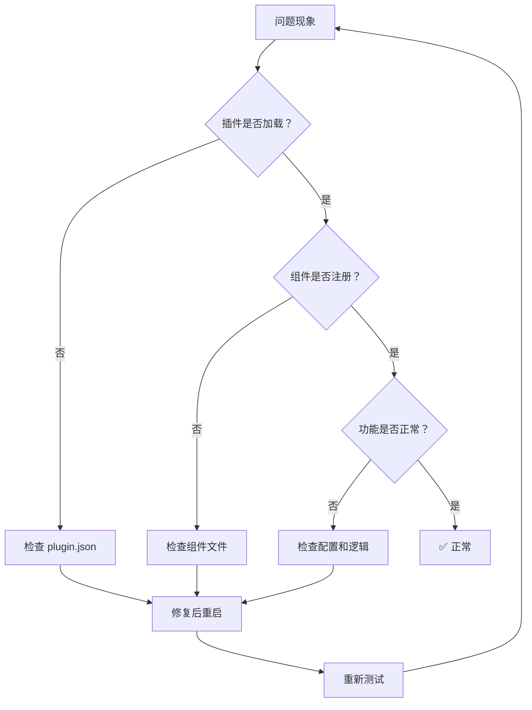

# 05-插件验证与测试

## 🎯 本章导读

验证和测试是保证插件质量的最后一道防线。本章将带你掌握完整的验证工具链和调试技巧。

**你将学到**：
- ✅ 为什么需要验证（重要性）
- ✅ Hook schema 验证工具详解
- ✅ Agent 格式验证工具详解
- ✅ Plugin Validator Agent 使用
- ✅ 调试模式与日志分析
- ✅ 常见问题排查流程
- ✅ 自动化测试策略

**前置知识**：
- 了解插件基本结构（参考 01-插件系统详解.md）
- 基本的 Bash 和 JSON 知识

**预计耗时**：1.5-2 小时

---

## 一、为什么需要验证

### 1.1 真实案例：小错误导致的大问题

**案例 1：拼写错误导致插件失效**

```json
// plugin.json
{
  "anme": "my-plugin",  // ❌ 应该是 "name"
  "version": "1.0.0"
}
```

**后果**：Claude Code 无法识别插件，所有功能失效

**发现方式**：用户反馈"插件不工作" → 人工检查 → 发现拼写错误

**如果有自动验证**：立即报错提示 `Unknown field 'anme', did you mean 'name'?`

---

**案例 2：YAML frontmatter 格式错误**

```markdown
<!-- agents/my-agent.md -->
---
name: my-agent
description: 我的助手
model: inherit
color: bluee  // ❌ 无效颜色值
---

你是智能助手...
```

**后果**：Agent 无法加载，用户点击命令无响应

**如果有自动验证**：立即提示 `Invalid color 'bluee', must be one of: blue, cyan, green, yellow, magenta, red`

---

**案例 3：Hook 配置引用不存在的脚本**

```json
// hooks/hooks.json
{
  "PreToolUse": [{
    "matcher": "Edit",
    "hooks": [{
      "type": "command",
      "command": "python3 ${CLAUDE_PLUGIN_ROOT}/hooks/validate.py"  // ❌ 文件不存在
    }]
  }]
}
```

**后果**：每次编辑文件时报错，用户体验极差

**如果有自动验证**：创建配置时就提示 `Script not found: hooks/validate.py`

---

### 1.2 验证的价值

#### 对用户

- ✅ **避免低级错误** - 拼写、格式等简单问题
- ✅ **节省调试时间** - 立即发现问题，而非运行时
- ✅ **提升使用信心** - 通过验证的插件更可靠

#### 对开发者

- ✅ **快速反馈** - 编写时立即知道是否正确
- ✅ **标准化** - 确保符合最佳实践
- ✅ **减少支持成本** - 自动捕获常见问题

#### 对生态系统

- ✅ **质量保障** - Marketplace 插件整体质量更高
- ✅ **信任建立** - 用户更放心使用插件
- ✅ **社区发展** - 降低新手入门门槛

---

### 1.3 验证的层次

```
验证金字塔（从低到高）：

        ▲
       /│\
      / │ \         ⑤ 发布前全面检查
     /──┼──\        
    /   │   \       ④ 功能测试
   /────┼────\      
  /     │     \     ③ 组件验证
 /──────┼──────\    
/       │       \   ② Schema 验证
─────────────────   
        │          ① 语法检查
```

**每层含义**：
1. **语法检查** - JSON/YAML 格式正确性
2. **Schema 验证** - 字段类型、必需字段
3. **组件验证** - 每个组件的完整性
4. **功能测试** - 实际运行测试
5. **全面检查** - 安全、性能、文档

---

## 二、验证工具链详解

### 2.1 工具链全景图

```
plugin-dev/agents/
└── plugin-validator.md          ← 总指挥（综合验证 Agent）
    │
    ├── scripts/
    │   ├── validate-hook-schema.sh    ← Hook 专用验证
    │   ├── validate-agent.sh          ← Agent 专用验证
    │   └── validate-settings.sh       ← 配置验证
    │
    └── skills/
        ├── hook-development/
        │   └── scripts/validate-hook-schema.sh
        └── agent-development/
            └── scripts/validate-agent.sh
```

---

### 2.2 Hook Schema 验证器

**位置**：`plugins/plugin-dev/skills/hook-development/scripts/validate-hook-schema.sh`

**用途**：验证 `hooks/hooks.json` 文件格式是否正确

---

#### 使用方法

```bash
# 进入插件目录
cd plugins/my-plugin

# 运行验证
./scripts/validate-hook-schema.sh hooks/hooks.json

# 或直接指定路径
plugins/plugin-dev/scripts/validate-hook-schema.sh plugins/my-plugin/hooks/hooks.json
```

---

#### 验证内容

**① JSON 语法正确性**

```bash
# 使用 jq 验证 JSON
jq . hooks/hooks.json > /dev/null

# 如果失败，输出错误信息
if [ $? -ne 0 ]; then
  echo "❌ JSON syntax error in hooks/hooks.json"
  exit 1
fi
```

**示例错误**：
```json
{
  "description": "My hooks"
  "hooks": {  // ❌ 缺少逗号
    ...
  }
}
```

**错误提示**：
```
❌ JSON syntax error
Error: Expected ',' or '}' but found '"'
at line 3, column 3
```

---

**② 必需字段存在性**

```bash
# 检查顶层 description 字段
if ! jq -e '.description' hooks.json > /dev/null; then
  echo "❌ Missing required field: description"
  exit 1
fi

# 检查 hooks 字段
if ! jq -e '.hooks' hooks.json > /dev/null; then
  echo "❌ Missing required field: hooks"
  exit 1
fi
```

**示例错误**：
```json
{
  "hooks": {  // ❌ 缺少 description
    "PreToolUse": [...]
  }
}
```

**错误提示**：
```
❌ Missing required field: description
Please add a description field to explain your hooks
```

---

**③ Event 名称合法性**

```bash
# 定义合法的 event 名称
VALID_EVENTS=("PreToolUse" "PostToolUse" "Stop" "SubagentStop" "SessionStart" "SessionEnd" "UserPromptSubmit" "PreCompact" "Notification")

# 提取所有 event 名称
EVENTS=$(jq -r '.hooks | keys[]' hooks.json)

# 逐个验证
for EVENT in $EVENTS; do
  if [[ ! " ${VALID_EVENTS[@]} " =~ " ${EVENT} " ]]; then
    echo "❌ Invalid event name: $EVENT"
    echo "Valid events: ${VALID_EVENTS[*]}"
    exit 1
  fi
done
```

**示例错误**：
```json
{
  "hooks": {
    "BeforeToolUse": [...]  // ❌ 应该是 PreToolUse
  }
}
```

**错误提示**：
```
❌ Invalid event name: BeforeToolUse
Valid events: PreToolUse PostToolUse Stop SubagentStop SessionStart SessionEnd UserPromptSubmit PreCompact Notification
Did you mean: PreToolUse?
```

---

**④ Hook 类型正确性**

```bash
# 检查每个 hook 的 type 字段
HOOK_TYPES=$(jq -r '.hooks[][][].type' hooks.json)

for TYPE in $HOOK_TYPES; do
  if [[ "$TYPE" != "command" && "$TYPE" != "prompt" ]]; then
    echo "❌ Invalid hook type: $TYPE"
    echo "Valid types: command, prompt"
    exit 1
  fi
done
```

**示例错误**：
```json
{
  "hooks": {
    "PreToolUse": [{
      "hooks": [{
        "type": "script"  // ❌ 应该是 command 或 prompt
      }]
    }]
  }
}
```

**错误提示**：
```
❌ Invalid hook type: script
Valid types: command, prompt
```

---

**⑤ Command 引用有效性**

```bash
# 提取所有 command 引用
COMMANDS=$(jq -r '.hooks[][][] | select(.type=="command") | .command' hooks.json)

for CMD in $COMMANDS; do
  # 检查是否使用 ${CLAUDE_PLUGIN_ROOT}
  if [[ "$CMD" == *"${CLAUDE_PLUGIN_ROOT}"* ]]; then
    # 提取脚本路径
    SCRIPT_PATH=$(echo "$CMD" | sed 's/.*\(${CLAUDE_PLUGIN_ROOT}\/[^"]*\).*/\1/')
    SCRIPT_PATH=${SCRIPT_PATH/\$\{CLAUDE_PLUGIN_ROOT\}/.}
    
    # 检查文件是否存在
    if [[ ! -f "$SCRIPT_PATH" ]]; then
      echo "❌ Script not found: $SCRIPT_PATH"
      exit 1
    fi
    
    # 检查是否有执行权限
    if [[ ! -x "$SCRIPT_PATH" ]]; then
      echo "⚠️  Script not executable: $SCRIPT_PATH"
      echo "Run: chmod +x $SCRIPT_PATH"
    fi
  fi
done
```

**示例错误**：
```json
{
  "hooks": {
    "PreToolUse": [{
      "hooks": [{
        "type": "command",
        "command": "python3 ${CLAUDE_PLUGIN_ROOT}/hooks/validate.py"  // ❌ 文件不存在
      }]
    }]
  }
}
```

**错误提示**：
```
❌ Script not found: ./hooks/validate.py
Make sure the script exists and path is correct
```

---

#### 完整验证流程

```bash
#!/bin/bash
set -euo pipefail

HOOKS_FILE="${1:-hooks/hooks.json}"

echo "🔍 Validating hooks configuration..."
echo

# 1. 检查文件存在
if [[ ! -f "$HOOKS_FILE" ]]; then
  echo "❌ File not found: $HOOKS_FILE"
  exit 1
fi

# 2. JSON 语法检查
echo "✓ Checking JSON syntax..."
if ! jq . "$HOOKS_FILE" > /dev/null 2>&1; then
  echo "❌ Invalid JSON format"
  jq . "$HOOKS_FILE" 2>&1 | head -5
  exit 1
fi
echo "  ✓ JSON syntax valid"

# 3. 必需字段检查
echo "✓ Checking required fields..."
if ! jq -e '.description' "$HOOKS_FILE" > /dev/null; then
  echo "❌ Missing 'description' field"
  exit 1
fi
if ! jq -e '.hooks' "$HOOKS_FILE" > /dev/null; then
  echo "❌ Missing 'hooks' field"
  exit 1
fi
echo "  ✓ Required fields present"

# 4. Event 名称验证
echo "✓ Validating event names..."
# ... (验证逻辑如上)
echo "  ✓ Event names valid"

# 5. Hook 类型验证
echo "✓ Validating hook types..."
# ... (验证逻辑如上)
echo "  ✓ Hook types valid"

# 6. 脚本引用验证
echo "✓ Checking script references..."
# ... (验证逻辑如上)
echo "  ✓ Scripts exist"

echo
echo "✅ All checks passed!"
echo "Your hooks configuration is valid."
```

---

#### 实际运行示例

**成功情况**：

```bash
$ ./scripts/validate-hook-schema.sh hooks/hooks.json

🔍 Validating hooks configuration...

✓ Checking JSON syntax...
  ✓ JSON syntax valid
✓ Checking required fields...
  ✓ Required fields present
✓ Validating event names...
  ✓ Event names valid
✓ Validating hook types...
  ✓ Hook types valid
✓ Checking script references...
  ✓ Scripts exist

✅ All checks passed!
Your hooks configuration is valid.
```

---

**失败情况**：

```bash
$ ./scripts/validate-hook-schema.sh hooks/hooks.json

🔍 Validating hooks configuration...

✓ Checking JSON syntax...
  ✓ JSON syntax valid
✓ Checking required fields...
  ✓ Required fields present
✓ Validating event names...
❌ Invalid event name: BeforeToolUse
Valid events: PreToolUse PostToolUse Stop SubagentStop SessionStart SessionEnd UserPromptSubmit PreCompact Notification
Did you mean: PreToolUse?

Validation failed. Please fix the errors above.
```

---

### 2.3 Agent 格式验证器

**位置**：`plugins/plugin-dev/skills/agent-development/scripts/validate-agent.sh`

**用途**：验证 `agents/*.md` 文件格式是否正确

---

#### 使用方法

```bash
# 验证单个 Agent
./scripts/validate-agent.sh agents/code-reviewer.md

# 验证所有 Agents
for file in agents/*.md; do
  ./scripts/validate-agent.sh "$file"
done
```

---

#### 验证内容

**① YAML Frontmatter 完整性**

```bash
# 检查是否以 --- 开头
if ! head -1 "$AGENT_FILE" | grep -q '^---$'; then
  echo "❌ File must start with YAML frontmatter (---)"
  exit 1
fi

# 提取 frontmatter
FRONTMATTER=$(sed -n '/^---$/,/^---$/{ /^---$/d; p; }' "$AGENT_FILE")

# 检查必需字段
REQUIRED_FIELDS=("name" "description" "model" "color")

for FIELD in "${REQUIRED_FIELDS[@]}"; do
  if ! echo "$FRONTMATTER" | grep -q "^$FIELD:"; then
    echo "❌ Missing required field: $FIELD"
    exit 1
  fi
done
```

**示例错误**：
```markdown
<!-- agents/my-agent.md -->
---
name: my-agent
description: 我的助手
# ❌ 缺少 model 和 color
---
```

**错误提示**：
```
❌ Missing required field: model
Required fields: name, description, model, color
```

---

**② Name 字段格式**

```bash
NAME=$(echo "$FRONTMATTER" | grep '^name:' | sed 's/name: *//')

# 检查命名规范
if ! echo "$NAME" | grep -qE '^[a-z][a-z0-9-]{2,49}$'; then
  echo "❌ Invalid name format: $NAME"
  echo "Name must:"
  echo "  - Start with lowercase letter"
  echo "  - Contain only lowercase letters, numbers, hyphens"
  echo "  - Be 3-50 characters long"
  echo "Examples: code-reviewer, test-generator"
  exit 1
fi
```

**示例错误**：
```yaml
name: CodeReviewer      # ❌ 包含大写字母
name: code_reviewer     # ❌ 使用下划线
name: cr                # ❌ 太短（< 3 字符）
name: a                 # ❌ 只有 1 个字符
```

**错误提示**：
```
❌ Invalid name format: CodeReviewer
Name must:
  - Start with lowercase letter
  - Contain only lowercase letters, numbers, hyphens
  - Be 3-50 characters long
Examples: code-reviewer, test-generator
```

---

**③ Description 包含示例**

```bash
DESCRIPTION=$(echo "$FRONTMATTER" | grep '^description:' | sed 's/description: *//')

# 检查是否包含 <example> 标签
if ! echo "$DESCRIPTION" | grep -q '<example>'; then
  echo "⚠️  Warning: Description should include <example> blocks"
  echo "Examples help users understand when to use this agent"
fi
```

**良好示例**：
```yaml
description: |
  Use this agent for code review tasks.
  
  <example>
  Context: User wants PR review
  user: "Please review my pull request"
  assistant: "I'll use the code-reviewer agent."
  </example>
```

---

**④ Model 值合法性**

```bash
MODEL=$(echo "$FRONTMATTER" | grep '^model:' | sed 's/model: *//')

VALID_MODELS=("inherit" "sonnet" "opus" "haiku")

if [[ ! " ${VALID_MODELS[@]} " =~ " ${MODEL} " ]]; then
  echo "❌ Invalid model: $MODEL"
  echo "Valid models: ${VALID_MODELS[*]}"
  exit 1
fi
```

**示例错误**：
```yaml
model: claude-3-opus    # ❌ 应该使用简称
model: gpt-4           # ❌ 不是 Claude 模型
```

**错误提示**：
```
❌ Invalid model: claude-3-opus
Valid models: inherit sonnet opus haiku
```

---

**⑤ Color 值合法性**

```bash
COLOR=$(echo "$FRONTMATTER" | grep '^color:' | sed 's/color: *//')

VALID_COLORS=("blue" "cyan" "green" "yellow" "magenta" "red")

if [[ ! " ${VALID_COLORS[@]} " =~ " ${COLOR} " ]]; then
  echo "❌ Invalid color: $COLOR"
  echo "Valid colors: ${VALID_COLORS[*]}"
  exit 1
fi
```

**示例错误**：
```yaml
color: purple    # ❌ 不在允许的颜色列表中
color: Blue      # ❌ 应该小写
```

**错误提示**：
```
❌ Invalid color: purple
Valid colors: blue cyan green yellow magenta red
```

---

**⑥ System Prompt 充分性**

```bash
# 提取 system prompt（frontmatter 之后的内容）
SYSTEM_PROMPT=$(awk '/^---$/{i++; next} i>=2' "$AGENT_FILE" | wc -l)

# 检查长度
if [[ $SYSTEM_PROMPT -lt 20 ]]; then
  echo "⚠️  Warning: System prompt seems too short ($SYSTEM_PROMPT lines)"
  echo "Consider adding more detailed instructions"
fi
```

**良好示例**：
```markdown
---
name: code-reviewer
# ... other fields
---

你是专业的代码审查员。

**你的核心职责：**
1. 检测代码异味
2. 提供重构建议
3. 检查潜在 bug
4. 验证测试覆盖

**工作流程：**
1. 读取修改的文件
2. 逐行分析问题
3. 按严重程度分类
4. 提供具体建议

**输出格式：**
## 代码审查报告

### 🔴 严重问题
- ...

### 🟡 警告
- ...

### ✅ 优点
- ...
```

---

#### 完整验证脚本示例

```bash
#!/bin/bash
set -euo pipefail

AGENT_FILE="${1:-agents/*.md}"

echo "🔍 Validating agent definition..."
echo "File: $AGENT_FILE"
echo

# 1. 检查文件存在
if [[ ! -f "$AGENT_FILE" ]]; then
  echo "❌ File not found: $AGENT_FILE"
  exit 1
fi

# 2. 检查 frontmatter 起始
if ! head -1 "$AGENT_FILE" | grep -q '^---$'; then
  echo "❌ File must start with YAML frontmatter (---)"
  exit 1
fi

# 3. 提取 frontmatter
FRONTMATTER=$(sed -n '/^---$/,/^---$/{ /^---$/d; p; }' "$AGENT_FILE")

# 4. 检查必需字段
echo "✓ Checking required fields..."
REQUIRED_FIELDS=("name" "description" "model" "color")
for FIELD in "${REQUIRED_FIELDS[@]}"; do
  if ! echo "$FRONTMATTER" | grep -q "^$FIELD:"; then
    echo "❌ Missing required field: $FIELD"
    exit 1
  fi
done
echo "  ✓ All required fields present"

# 5. 验证 name 格式
echo "✓ Validating name format..."
NAME=$(echo "$FRONTMATTER" | grep '^name:' | sed 's/name: *//')
if ! echo "$NAME" | grep -qE '^[a-z][a-z0-9-]{2,49}$'; then
  echo "❌ Invalid name format: $NAME"
  exit 1
fi
echo "  ✓ Name format valid ($NAME)"

# 6. 验证 model 值
echo "✓ Validating model..."
MODEL=$(echo "$FRONTMATTER" | grep '^model:' | sed 's/model: *//')
VALID_MODELS=("inherit" "sonnet" "opus" "haiku")
if [[ ! " ${VALID_MODELS[@]} " =~ " ${MODEL} " ]]; then
  echo "❌ Invalid model: $MODEL"
  exit 1
fi
echo "  ✓ Model valid ($MODEL)"

# 7. 验证 color 值
echo "✓ Validating color..."
COLOR=$(echo "$FRONTMATTER" | grep '^color:' | sed 's/color: *//')
VALID_COLORS=("blue" "cyan" "green" "yellow" "magenta" "red")
if [[ ! " ${VALID_COLORS[@]} " =~ " ${COLOR} " ]]; then
  echo "❌ Invalid color: $COLOR"
  exit 1
fi
echo "  ✓ Color valid ($COLOR)"

# 8. 检查 system prompt 长度
echo "✓ Checking system prompt..."
PROMPT_LENGTH=$(awk '/^---$/{i++; next} i>=2' "$AGENT_FILE" | wc -l)
if [[ $PROMPT_LENGTH -lt 20 ]]; then
  echo "⚠️  Warning: System prompt is short ($PROMPT_LENGTH lines)"
  echo "  Consider adding more detailed instructions"
else
  echo "  ✓ System prompt adequate ($PROMPT_LENGTH lines)"
fi

# 9. 检查 description 是否包含示例
echo "✓ Checking description examples..."
DESCRIPTION=$(echo "$FRONTMATTER" | grep '^description:' | sed 's/description: *//')
if ! echo "$DESCRIPTION" | grep -q '<example>'; then
  echo "⚠️  Warning: Consider adding <example> blocks to description"
else
  echo "  ✓ Description includes examples"
fi

echo
echo "✅ Agent validation complete!"
```

---

### 2.4 Plugin Validator Agent

**位置**：`plugins/plugin-dev/agents/plugin-validator.md`

**用途**：全面的插件验证（所有组件）

---

#### 如何触发

**方法 1：直接使用**

```markdown
用户：帮我验证一下这个插件

Claude：好的，我来使用 plugin-validator agent 进行全面检查。
```

**方法 2：自动触发**

当检测到以下情况时，自动触发验证：
- 用户创建了新的插件
- 修改了 plugin.json
- 添加了新的 commands/agents
- 请求发布插件

---

#### 验证范围（10 项检查）

**① 插件 Manifest 验证**

```markdown
检查 `.claude-plugin/plugin.json`：
- ✅ JSON 语法正确性
- ✅ 必需字段：name
- ✅ name 格式（kebab-case）
- ✅ version 语义化版本
- ✅ author 结构
- ✅ mcpServers 配置（如果存在）
```

**② 目录结构验证**

```markdown
检查标准组件目录：
- ✅ commands/ - 是否存在，有 .md 文件
- ✅ agents/ - 是否存在，有 .md 文件
- ✅ skills/ - 是否存在 SKILL.md
- ✅ hooks/hooks.json - 是否存在
```

**③ Commands 验证**

```markdown
检查每个 command/*.md：
- ✅ YAML frontmatter 完整性
- ✅ description 字段存在
- ✅ argument-hint 格式（如果存在）
- ✅ allowed-tools 数组（如果存在）
- ✅ markdown 正文存在
```

**④ Agents 验证**

```markdown
检查每个 agent/*.md：
- ✅ 使用 validate-agent.sh 工具
- ✅ name/description/model/color 完整
- ✅ name 格式正确
- ✅ description 包含示例
- ✅ system prompt 充分
```

**⑤ Skills 验证**

```markdown
检查每个 skills/*/SKILL.md：
- ✅ SKILL.md 文件存在
- ✅ YAML frontmatter 有 name 和 description
- ✅ description 清晰简洁
- ✅ 子目录结构合理（references/, examples/）
- ✅ 引用的文件存在
```

**⑥ Hooks 验证**

```markdown
检查 hooks/hooks.json：
- ✅ 使用 validate-hook-schema.sh 工具
- ✅ JSON 语法正确
- ✅ event 名称合法
- ✅ hook 类型正确
- ✅ command 引用存在的脚本
- ✅ 使用 ${CLAUDE_PLUGIN_ROOT}
```

**⑦ MCP 配置验证**

```markdown
检查 .mcp.json 或 manifest 中的 mcpServers：
- ✅ JSON 语法正确
- ✅ stdio 服务器有 command 字段
- ✅ SSE/HTTP/WebSocket 有 url 字段
- ✅ 类型特定字段完整
- ✅ 使用 ${CLAUDE_PLUGIN_ROOT}
```

**⑧ 文件组织验证**

```markdown
检查整体组织：
- ✅ README.md 存在且详尽
- ✅ 没有不必要的文件（node_modules, .DS_Store）
- ✅ .gitignore 存在（如果需要）
- ✅ LICENSE 文件存在
```

**⑨ 安全检查**

```markdown
检查安全问题：
- ✅ 没有硬编码的凭证
- ✅ MCP 服务器使用 HTTPS/WSS
- ✅ Hooks 没有明显安全问题
- ✅ 示例文件不包含密钥
```

**⑩ 质量评分**

```markdown
综合评估：
- 错误数量统计
- 警告数量统计
- 正面发现列举
- 改进建议优先级排序
```

---

#### 输出格式

```markdown
## Plugin Validation Report

### Plugin: my-awesome-plugin
Location: /path/to/plugin

### Summary
✅ **PASS** - No critical issues found

Found 0 critical issues, 2 warnings

### Critical Issues (0)
None! 🎉

### Warnings (2)
- `README.md` - Missing installation instructions
  → Add step-by-step installation guide
  
- `agents/reviewer.md` - System prompt could be more detailed
  → Consider adding specific workflow steps

### Component Summary
- Commands: 3 found, 3 valid
- Agents: 2 found, 2 valid
- Skills: 1 found, 1 valid
- Hooks: Present and valid
- MCP Servers: 1 configured

### Positive Findings
✅ Good use of ${CLAUDE_PLUGIN_ROOT} for portability
✅ Comprehensive README with examples
✅ Proper .gitignore configuration
✅ Clear separation of concerns

### Recommendations
1. **High Priority**: Add installation instructions to README
2. **Medium Priority**: Expand agent system prompts
3. **Low Priority**: Consider adding more usage examples

### Overall Assessment
**PASS** - Plugin is ready for use!
Minor improvements suggested but no blockers.
```

---

## 三、调试技巧大全

### 3.1 启用调试模式

**方法 1：命令行参数**

```bash
claude --debug
```

**方法 2：环境变量**

```bash
export CLAUDE_DEBUG=true
claude
```

---

### 3.2 查看日志输出

**实时查看日志**：

```bash
tail -f ~/.claude/debug.log
```

**搜索特定插件日志**：

```bash
grep "my-plugin" ~/.claude/debug.log | tail -20
```

**查看错误日志**：

```bash
grep -i "error\|warning" ~/.claude/debug.log | tail -50
```

---

### 3.3 常见日志模式

**Hook 加载日志**：

```
[DEBUG] Loading hooks from /path/to/plugin/hooks/hooks.json
[DEBUG] Registered 3 hooks for event PreToolUse
[DEBUG] Hook matched for tool Edit
[DEBUG] Executing hook command: python3 /path/to/hook.py
```

**Agent 加载日志**：

```
[DEBUG] Loading agent from /path/to/plugin/agents/reviewer.md
[DEBUG] Parsed frontmatter: name=code-reviewer, model=inherit
[DEBUG] Registered agent code-reviewer
```

**MCP 服务器日志**：

```
[DEBUG] Starting MCP server: database
[DEBUG] Spawning process: node /path/to/server.js
[DEBUG] MCP server connected
```

**错误日志**：

```
[ERROR] Failed to load plugin: Invalid JSON in plugin.json
[ERROR] Hook execution failed: Script not found
[ERROR] Agent selection failed: No matching capabilities
```

---

### 3.4 分步调试法

**步骤 1：确认插件加载**

```bash
# 启动时查看详细日志
claude --debug 2>&1 | grep "my-plugin"

# 应该看到：
# [DEBUG] Loading plugin: my-plugin
# [DEBUG] Plugin loaded successfully
```

**步骤 2：确认组件注册**

```bash
# 查看注册的组件
grep "Registered" ~/.claude/debug.log | grep "my-plugin"

# 应该看到：
# [DEBUG] Registered 2 commands
# [DEBUG] Registered 1 agent
# [DEBUG] Registered 3 hooks
```

**步骤 3：触发测试**

```bash
# 触发特定的操作
# 例如：让 Claude 编辑文件（触发 Hook）

# 同时观察日志
tail -f ~/.claude/debug.log | grep "my-plugin"
```

**步骤 4：分析结果**

```bash
# 查看完整的交互过程
grep -A 10 -B 5 "my-plugin" ~/.claude/debug.log
```

---

### 3.5 使用测试工具

**测试 Hook 脚本**：

```bash
# 创建测试输入
echo '{"tool_input": {"file_path": "test.ts", "content": "console.log(1)"}}' | \
  python3 hooks/test-hook.py

# 观察输出
# 应该有警告信息输出到 stderr
```

**模拟 Claude Code 环境**：

```bash
# 设置必要的环境变量
export CLAUDE_PLUGIN_ROOT="/path/to/plugin"
export CLAUDE_DEBUG=true

# 手动运行 Hook 脚本
./hooks/scripts/test-hook.sh
```

---

## 四、常见问题排查流程

### 4.1 问题排查流程图



---

### 4.2 具体问题排查

#### 问题 1：插件不加载

**症状**：
- Claude 找不到插件的命令
- Hook 不生效
- Agent 无法选择

**排查步骤**：

```bash
# 1. 检查 plugin.json 位置
ls -la .claude-plugin/plugin.json

# 2. 验证 JSON 格式
jq . .claude-plugin/plugin.json

# 3. 检查 name 字段
cat .claude-plugin/plugin.json | jq -r '.name'

# 4. 查看加载日志
grep "Loading plugin" ~/.claude/debug.log

# 5. 查找错误信息
grep -i "error.*plugin" ~/.claude/debug.log
```

**常见原因**：
- ❌ plugin.json 不在 `.claude-plugin/` 目录
- ❌ JSON 格式错误
- ❌ 缺少必需的 name 字段
- ❌ name 格式不正确

**解决方案**：
```bash
# 修正目录结构
mkdir -p .claude-plugin
mv plugin.json .claude-plugin/

# 修正 JSON 格式
jq . .claude-plugin/plugin.json > /tmp/fixed.json
mv /tmp/fixed.json .claude-plugin/plugin.json

# 添加必需的字段
echo '{"name": "my-plugin"}' > .claude-plugin/plugin.json

# 重启 Claude Code
exit
claude
```

---

#### 问题 2：Hook 不触发

**症状**：
- 编辑文件时无警告
- Bash 命令执行前无检查

**排查步骤**：

```bash
# 1. 检查 hooks.json 位置
ls -la hooks/hooks.json

# 2. 验证配置
jq . hooks/hooks.json

# 3. 检查 event 名称
jq -r '.hooks | keys[]' hooks/hooks.json

# 4. 检查脚本存在
jq -r '.hooks[][][] | select(.type=="command") | .command' hooks.json

# 5. 测试脚本
echo '{"tool_input": {}}' | bash hooks/scripts/test.sh

# 6. 查看 Hook 日志
grep "Hook" ~/.claude/debug.log | tail -20
```

**常见原因**：
- ❌ matcher 配置错误
- ❌ 脚本路径不正确
- ❌ 脚本没有执行权限
- ❌ timeout 设置太短

**解决方案**：
```bash
# 修正 matcher
jq '.hooks.PreToolUse[0].matcher = "Edit|Write"' hooks.json > /tmp/fixed.json
mv /tmp/fixed.json hooks.json

# 修正脚本路径
chmod +x hooks/scripts/*.sh

# 增加 timeout
jq '.hooks.PreToolUse[0].hooks[0].timeout = 30' hooks.json > /tmp/fixed.json
mv /tmp/fixed.json hooks.json

# 测试脚本
chmod +x hooks/scripts/check.sh
echo '{"tool_input": {"test": true}}' | ./hooks/scripts/check.sh
```

---

#### 问题 3：Agent 无响应

**症状**：
- 调用 Agent 没反应
- Claude 说"没有找到合适的 Agent"

**排查步骤**：

```bash
# 1. 检查 Agent 文件
ls -la agents/*.md

# 2. 验证 frontmatter
head -20 agents/my-agent.md

# 3. 检查必需字段
grep -E '^(name|description|model|color):' agents/my-agent.md

# 4. 运行验证脚本
./scripts/validate-agent.sh agents/my-agent.md

# 5. 查看 Agent 日志
grep "Agent" ~/.claude/debug.log | tail -20
```

**常见原因**：
- ❌ frontmatter 格式错误
- ❌ description 不够清晰
- ❌ model 或 color 值无效
- ❌ system prompt 太短

**解决方案**：
```bash
# 修正 frontmatter
cat > agents/my-agent.md << 'EOF'
---
name: my-agent
description: |
  Use this agent for testing.
  
  <example>
  Context: User needs tests
  user: "Write tests"
  assistant: "I'll use the test-agent."
  </example>
model: inherit
color: blue
---

你是专业的测试工程师...
EOF

# 运行验证
./scripts/validate-agent.sh agents/my-agent.md

# 确保有足够的 system prompt
wc -l agents/my-agent.md
# 应该 > 20 行
```

---

## 五、自动化测试策略

### 5.1 预提交检查

**使用 Git Hooks**：

```bash
#!/bin/bash
# .git/hooks/pre-commit

set -euo pipefail

echo "Running pre-commit checks..."

# 1. 验证 plugin.json
if [[ -f ".claude-plugin/plugin.json" ]]; then
  echo "✓ Validating plugin.json"
  jq . .claude-plugin/plugin.json > /dev/null || {
    echo "❌ Invalid plugin.json"
    exit 1
  }
fi

# 2. 验证 hooks.json
if [[ -f "hooks/hooks.json" ]]; then
  echo "✓ Validating hooks.json"
  ./scripts/validate-hook-schema.sh hooks/hooks.json || exit 1
fi

# 3. 验证 agents
for file in agents/*.md; do
  if [[ -f "$file" ]]; then
    echo "✓ Validating $file"
    ./scripts/validate-agent.sh "$file" || exit 1
  fi
done

echo "✅ All pre-commit checks passed!"
```

---

### 5.2 CI/CD 集成

**GitHub Actions 示例**：

```yaml
# .github/workflows/validate.yml
name: Plugin Validation

on:
  push:
    branches: [ main ]
  pull_request:
    branches: [ main ]

jobs:
  validate:
    runs-on: ubuntu-latest
    
    steps:
    - uses: actions/checkout@v2
    
    - name: Install dependencies
      run: |
        sudo apt-get install jq
    
    - name: Validate plugin.json
      run: |
        jq . .claude-plugin/plugin.json
    
    - name: Validate hooks
      run: |
        ./scripts/validate-hook-schema.sh hooks/hooks.json
    
    - name: Validate agents
      run: |
        for file in agents/*.md; do
          ./scripts/validate-agent.sh "$file"
        done
    
    - name: Run tests
      run: |
        npm test
```

---

## 六、总结

### 📝 知识点回顾

**验证工具链**：
- ✅ Hook schema 验证器 - 验证 hooks.json
- ✅ Agent 格式验证器 - 验证 agents/*.md
- ✅ Plugin Validator Agent - 全面验证

**调试技巧**：
- ✅ 启用调试模式（--debug）
- ✅ 查看日志（tail -f）
- ✅ 分步调试法
- ✅ 使用测试工具

**常见问题排查**：
- ✅ 插件不加载 → 检查 plugin.json
- ✅ Hook 不触发 → 检查 matcher 和脚本
- ✅ Agent 无响应 → 检查 frontmatter

**自动化测试**：
- ✅ 预提交检查（Git Hooks）
- ✅ CI/CD 集成
- ✅ 持续质量保障

---

### 🎯 下一步

1. **实战练习**：为你的插件添加验证脚本
2. **参考实现**：研究 `plugins/plugin-dev/scripts/` 的工具
3. **深入学习**：阅读 Plugin Validator Agent 的完整验证逻辑

---

**恭喜！** 🎉 你已经掌握了插件验证与测试的完整技能，开始构建高质量的插件吧！