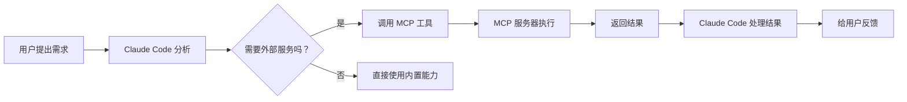

# MCP 基础概念 - Model Context Protocol 入门指南

## 📖 什么是 MCP？

### 从一个生活例子开始理解

想象一下，你家里有很多电器：冰箱、洗衣机、空调、电视。每个电器都有自己的遥控器：
- 格力空调的遥控器只能控制格力空调
- 海尔洗衣机的遥控器只能控制海尔洗衣机
- 小米电视的遥控器只能控制小米电视

**问题来了：** 你需要记住一堆遥控器，用起来很不方便！

**解决方案：** 买一个"万能遥控器"，它能控制所有电器。

**MCP 就是这样的"万能遥控器"** —— 它是 Claude Code 与外部服务（数据库、API、文件系统）通信的标准协议。

---

## 🎯 MCP 的作用

### 1. 连接外部世界

Claude Code 本身很强大，但有时候需要访问外部资源：

```
┌─────────────────┐
│  Claude Code   │
│   (大脑)       │
└────────┬────────┘
         │
         │ MCP 协议
         ↓
┌─────────────────┐
│  外部服务        │
│  - 数据库        │
│  - API          │
│  - 文件系统      │
│  - 第三方工具    │
└─────────────────┘
```

### 2. 提供标准化工具接口

MCP 让外部服务以"工具"的形式暴露给 Claude Code：

```
外部服务功能 → MCP 服务器 → 标准化工具 → Claude Code 使用
```

**举个例子：**

假设你有一个 Asana（项目管理工具）账号，想通过 Claude Code 管理任务：

```json
// 配置 MCP 服务器连接到 Asana
{
  "asana": {
    "type": "sse",
    "url": "https://mcp.asana.com/sse"
  }
}
```

配置后，Claude Code 就能使用这些工具：
- `mcp__plugin_asana_asana__create_task` - 创建任务
- `mcp__plugin_asana_asana__search_tasks` - 搜索任务
- `mcp__plugin_asana_asana__update_task` - 更新任务

---

## 🔍 MCP 的核心概念

### 概念 1：MCP 服务器

**定义：** MCP 服务器是一个程序，它提供一组工具给 Claude Code 使用。

**类比：** 就像手机上的 App，每个 App 提供特定功能：
- 微信 App → 聊天功能
- 支付宝 App → 支付功能
- 美团 App → 外卖功能

**MCP 服务器类型：**
- 本地文件服务器 → 访问文件系统
- 数据库服务器 → 操作数据库
- API 服务器 → 调用 REST API
- 云服务服务器 → 连接 SaaS 服务（如 Asana、GitHub）

---

### 概念 2：工具（Tools）

**定义：** 工具是 MCP 服务器提供的具体功能。

**命名规则：**
```
mcp__plugin_<插件名>_<服务器名>__<工具名>
```

**实际例子：**

| 完整工具名 | 解释 |
|-----------|------|
| `mcp__plugin_asana_asana__create_task` | Asana 插件的 Asana 服务器的创建任务工具 |
| `mcp__plugin_myapp_db__query` | myapp 插件的 db 服务器的查询工具 |
| `mcp__plugin_files_local__read` | files 插件的 local 服务器的读取文件工具 |

**如何查看可用工具？**
```bash
/mcp
```
这个命令会显示所有已配置的 MCP 服务器和它们提供的工具。

---

### 概念 3：MCP 配置

**位置：** 在插件的 `.mcp.json` 文件或 `plugin.json` 中配置。

**基本结构：**
```json
{
  "服务器名称": {
    "配置内容"
  }
}
```

**简单示例：**
```json
{
  "filesystem": {
    "command": "npx",
    "args": ["-y", "@modelcontextprotocol/server-filesystem", "/Users/yourname/projects"]
  }
}
```

这个配置告诉 Claude Code：
- 启动一个叫 `filesystem` 的 MCP 服务器
- 使用 `npx` 命令运行
- 参数是安装并运行 `@modelcontextprotocol/server-filesystem` 包
- 允许访问 `/Users/yourname/projects` 目录

---

## 🚀 为什么需要 MCP？

### 场景 1：访问数据库

**没有 MCP 时：**
```
你想查询数据库 → 手动打开数据库工具 → 写 SQL → 复制结果 → 粘贴给 Claude
```

**有 MCP 后：**
```
你想查询数据库 → 告诉 Claude → Claude 自动调用 MCP 工具查询 → 直接分析结果
```

### 场景 2：调用外部 API

**没有 MCP 时：**
```
你想调用 GitHub API → 查找 API 文档 → 写代码调用 → 处理响应 → 交给 Claude 分析
```

**有 MCP 后：**
```
你想调用 GitHub API → 告诉 Claude → Claude 自动调用 MCP 工具 → 直接获取结构化数据
```

### 场景 3：操作云服务商服

**没有 MCP 时：**
```
你想管理 Asana 任务 → 登录 Asana 网站 → 手动操作 → 效率低
```

**有 MCP 后：**
```
你想管理 Asana 任务 → 告诉 Claude → Claude 自动调用 MCP 工具完成
```

---

## 💡 MCP 的实际价值

### 对个人开发者

1. **提升效率** - 自动化重复操作
2. **减少错误** - 避免手动复制粘贴出错
3. **专注核心** - 不用写繁琐的集成代码

### 对团队

1. **标准化集成** - 统一的工具接口
2. **知识沉淀** - MCP 配置可共享
3. **安全可控** - 集中管理权限和认证

### 对企业

1. **系统集成** - 连接内部系统
2. **流程自动化** - 自动化工作流
3. **数据打通** - 跨系统数据访问

---

## 📊 MCP 工作原理

### 完整工作流程



### 详细步骤说明

**步骤 1：用户需求**
```
用户：帮我创建一个 Asana 任务，标题是"完成项目报告"
```

**步骤 2：Claude 分析**
```
Claude: 创建 Asana 任务需要调用 Asana MCP 服务
```

**步骤 3：调用 MCP 工具**
```
Claude 调用：mcp__plugin_asana_asana__create_task
参数：{
  name: "完成项目报告",
  workspace: "12345"
}
```

**步骤 4：MCP 服务器执行**
```
Asana MCP 服务器 → 调用 Asana API → 创建任务
```

**步骤 5：返回结果**
```
{
  id: "67890",
  name: "完成项目报告",
  created_at: "2026-04-02T10:00:00Z"
}
```

**步骤 6：用户反馈**
```
Claude: 任务已创建！ID 是 67890，链接：https://app.asana.com/0/67890
```

---

## 🎓 MCP 配置方法详解

### 方法 1：独立 .mcp.json 文件（推荐）

**优点：**
- ✅ 清晰分离关注点
- ✅ 易于维护
- ✅ 适合多个服务器

**位置：** 插件根目录

**示例：**
```json
{
  "database": {
    "command": "${CLAUDE_PLUGIN_ROOT}/servers/db-server",
    "args": ["--config", "${CLAUDE_PLUGIN_ROOT}/config/db.json"],
    "env": {
      "DB_URL": "${DB_URL}"
    }
  },
  "github": {
    "type": "sse",
    "url": "https://mcp.github.com/sse"
  }
}
```

---

### 方法 2：内嵌到 plugin.json

**优点：**
- ✅ 单一配置文件
- ✅ 适合简单插件

**示例：**
```json
{
  "name": "my-plugin",
  "version": "1.0.0",
  "description": "我的插件",
  "mcpServers": {
    "api-server": {
      "command": "${CLAUDE_PLUGIN_ROOT}/servers/api",
      "args": ["--port", "8080"]
    }
  }
}
```

---

## 🔧 环境变量使用

### 什么是环境变量？

环境变量是一种配置方式，让你可以在不修改代码的情况下改变程序行为。

### 为什么要用环境变量？

**❌ 错误做法（硬编码）：**
```json
{
  "env": {
    "API_KEY": "sk-abc123456789"
  }
}
```
问题：密钥泄露风险！

**✅ 正确做法（环境变量）：**
```json
{
  "env": {
    "API_KEY": "${MY_API_KEY}"
  }
}
```
好处：密钥存储在系统环境变量中，更安全。

### 常用环境变量

| 变量名 | 用途 | 设置方法 |
|--------|------|----------|
| `${CLAUDE_PLUGIN_ROOT}` | 插件根目录 | 自动设置 |
| `${DB_URL}` | 数据库连接地址 | 用户手动设置 |
| `${API_TOKEN}` | API 访问令牌 | 用户手动设置 |

### 如何设置用户环境变量？

**在 macOS/Linux：**
```bash
export MY_API_KEY="你的密钥"
```

**在 Windows PowerShell：**
```powershell
$env:MY_API_KEY="你的密钥"
```

**永久设置（推荐）：**

编辑 `~/.bashrc` 或 `~/.zshrc`：
```bash
export MY_API_KEY="你的密钥"
```

---

## 🎯 学习检查清单

完成本节后，你应该能够：

- [ ] 解释 MCP 是什么
- [ ] 说出 MCP 的 3 个主要作用
- [ ] 理解 MCP 服务器的概念
- [ ] 理解工具（Tools）的命名规则
- [ ] 写出基本的 MCP 配置
- [ ] 解释环境变量的重要性

---

## 📝 实战练习

### 练习 1：识别 MCP 使用场景

判断以下场景是否需要 MCP：

1. 你想让 Claude 帮你分析本地代码文件
2. 你想让 Claude 查询公司内部的 PostgreSQL 数据库
3. 你想让 Claude 帮你写一封邮件
4. 你想让 Claude 自动创建 Jira 工单

**答案：**
1. ❌ 不需要（Claude 可以直接读取文件）
2. ✅ 需要（需要 MCP 连接数据库）
3. ❌ 不需要（Claude 可以直接生成文本）
4. ✅ 需要（需要 MCP 连接 Jira API）

### 练习 2：解析工具命名

解析以下工具名的各个部分：

`mcp__plugin_mydb_postgres__execute_query`

**答案：**
- 插件名：`mydb`
- 服务器名：`postgres`
- 工具名：`execute_query`
- 含义：mydb 插件的 postgres 服务器的执行查询工具

---

## 🔗 相关资源

### 官方文档
- [MCP 官方文档](https://modelcontextprotocol.io/)
- [Claude Code MCP 文档](https://docs.claude.com/en/docs/claude-code/mcp)

### 下一篇预告
下一节我们将深入学习 **MCP 服务器类型**，包括：
- stdio（本地进程）
- SSE（Server-Sent Events）
- HTTP（REST API）
- WebSocket（实时通信）

每种类型的适用场景、配置方法、优缺点对比。

---

## 💬 常见问题

### Q1: MCP 是必须的吗？

**答：** 不是必须的。如果你只需要 Claude 处理本地文件和分析代码，不需要连接外部服务，就不需要 MCP。

### Q2: MCP 配置复杂吗？

**答：** 基础配置很简单，通常只需几行 JSON。复杂的配置（如认证）我们会在第 3 节详细讲解。

### Q3: 一个插件可以配置多个 MCP 服务器吗？

**答：** 可以！你可以同时配置多个 MCP 服务器，比如一个连接数据库，一个连接 GitHub API。

### Q4: MCP 服务器在哪里运行？

**答：** 
- stdio 类型：在你本地计算机上运行
- SSE/HTTP/WebSocket 类型：可能在云端服务器上运行

---

**恭喜你完成了 MCP 基础概念的学习！** 🎉

接下来，让我们深入学习 [MCP 服务器类型](./02-MCP 服务器类型详解.md)。
