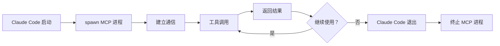
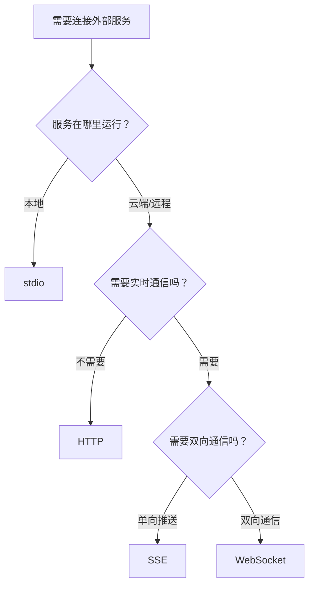

# MCP 服务器类型详解 - stdio/SSE/HTTP/WebSocket

## 📋 本节学习目标

学完本节后，你将能够：
- ✅ 区分 4 种 MCP 服务器类型
- ✅ 选择适合的服务器类型
- ✅ 配置每种类型的服务器
- ✅ 理解各自的优缺点和适用场景

---

## 🎯 四种服务器类型总览

### 一张表看懂区别

| 特性 | stdio | SSE | HTTP | WebSocket |
|------|-------|-----|------|-----------|
| **通信方式** | 进程输入输出 | Server-Sent Events | REST API | WebSocket |
| **连接方向** | 双向 | 单向（服务器→客户端） | 请求/响应 | 双向 |
| **状态** | 有状态 | 有状态 | 无状态 | 有状态 |
| **运行位置** | 本地 | 云端/远程 | 云端/远程 | 云端/远程 |
| **认证方式** | 环境变量 | OAuth/Headers | Token | Token |
| **延迟** | 最低 | 中等 | 中等 | 低 |
| **适用场景** | 本地工具 | 云服务 | REST API | 实时通信 |

---

## 1️⃣ stdio 服务器 - 本地进程通信

### 什么是 stdio？

**stdio = Standard Input/Output（标准输入/输出）**

Claude Code 在本地启动一个子进程，通过 stdin/stdout 与这个进程通信。

### 工作原理

```
┌──────────────┐
│ Claude Code  │
└──────┬───────┘
       │ stdin/stdout
       ↓
┌──────────────┐
│ MCP 服务器    │ (本地进程)
│ (Node.js/   │
│  Python)     │
└──────────────┘
```

### 完整配置示例

#### 示例 1：使用 NPM 包

```json
{
  "filesystem": {
    "command": "npx",
    "args": [
      "-y",
      "@modelcontextprotocol/server-filesystem",
      "/Users/yourname/projects"
    ],
    "env": {
      "LOG_LEVEL": "info"
    }
  }
}
```

**逐行解读：**
- `command`: `"npx"` - 使用 npx 命令（Node.js 包执行器）
- `args`: 
  - `"-y"` - 自动确认安装
  - `"@modelcontextprotocol/server-filesystem"` - 包名
  - `"/Users/yourname/projects"` - 允许访问的目录
- `env`: 设置环境变量

#### 示例 2：运行自定义脚本

```json
{
  "database": {
    "command": "${CLAUDE_PLUGIN_ROOT}/servers/db-server.js",
    "args": [
      "--config",
      "${CLAUDE_PLUGIN_ROOT}/config/db.json"
    ],
    "env": {
      "DATABASE_URL": "${DB_URL}",
      "DB_POOL_SIZE": "10"
    }
  }
}
```

**逐行解读：**
- `command`: 插件根目录下的 db-server.js 脚本
- `args`: 传递配置文件路径
- `env`: 
  - `DATABASE_URL` - 数据库连接地址（从用户环境变量读取）
  - `DB_POOL_SIZE` - 连接池大小（固定值 10）

#### 示例 3：Python MCP 服务器

```json
{
  "custom-tools": {
    "command": "python",
    "args": [
      "-m",
      "my_mcp_server",
      "--port",
      "8080"
    ],
    "env": {
      "API_KEY": "${CUSTOM_API_KEY}",
      "DEBUG": "false"
    }
  }
}
```

**逐行解读：**
- `command`: `"python"` - 使用 Python 解释器
- `args`: 
  - `"-m"` - 运行模块
  - `"my_mcp_server"` - 模块名
  - `"--port", "8080"` - 指定端口

---

### stdio 的生命周期



**特点：**
- MCP 进程伴随 Claude Code 整个会话
- Claude Code 退出时自动清理进程
- 不需要手动管理进程

---

### stdio 的最佳实践

#### ✅ DO（推荐做法）

1. **使用 ${CLAUDE_PLUGIN_ROOT}**
```json
✅ "command": "${CLAUDE_PLUGIN_ROOT}/servers/my-server"
❌ "command": "/Users/zhangsan/projects/my-plugin/servers/my-server"
```

2. **设置 PYTHONUNBUFFERED（Python 服务器）**
```json
{
  "env": {
    "PYTHONUNBUFFERED": "1"
  }
}
```
原因：确保日志实时输出，不缓冲。

3. **日志输出到 stderr**
```python
# ✅ 正确
import sys
print("Debug info", file=sys.stderr)

# ❌ 错误
print("Debug info")  # 会干扰 MCP 协议通信
```

4. **传递配置 via args/env**
```json
{
  "args": ["--config", "${CLAUDE_PLUGIN_ROOT}/config.json"],
  "env": {
    "API_KEY": "${API_KEY}"
  }
}
```

#### ❌ DON'T（避免做法）

1. **不要硬编码绝对路径**
2. **不要在 stdout 输出调试信息**
3. **不要从 stdin 读取配置**
4. **不要忘记处理进程崩溃**

---

### stdio 故障排查

#### 问题 1：服务器无法启动

**检查清单：**
```bash
# 1. 检查命令是否存在
which npx
which python

# 2. 检查脚本是否可执行
chmod +x servers/db-server.js

# 3. 查看调试日志
claude --debug
```

#### 问题 2：通信失败

**常见原因：**
- MCP 服务器输出了非 JSON-RPC 格式的内容
- 调试信息污染了 stdout
- 进程启动后立即退出

**解决方法：**
```bash
# 手动测试服务器
npx -y @modelcontextprotocol/server-filesystem /path/to/dir

# 应该看到 JSON-RPC 格式的输入提示
```

---

## 2️⃣ SSE 服务器 - Server-Sent Events

### 什么是 SSE？

**SSE = Server-Sent Events（服务器发送事件）**

一种单向通信技术，服务器可以主动推送消息给客户端。

### 工作原理

```
┌──────────────┐                    ┌──────────────┐
│ Claude Code  │ ←─── SSE 流 ────   │ MCP 服务器    │
│ (客户端)     │                    │ (云端服务)    │
└──────┬───────┘                    └──────────────┘
       │                                    ↑
       │         HTTP POST                  │
       └────────────────────────────────────┘
              (工具调用请求)
```

**通信流程：**
1. Claude Code 连接到 SSE URL
2. 保持长连接，服务器可以推送事件
3. Claude Code 发送 HTTP POST 请求调用工具
4. 服务器通过 SSE 流返回结果

---

### 完整配置示例

#### 示例 1：Asana MCP 服务器

```json
{
  "asana": {
    "type": "sse",
    "url": "https://mcp.asana.com/sse"
  }
}
```

**解读：**
- `type`: `"sse"` - 指定服务器类型
- `url`: Asana 官方提供的 SSE 端点

#### 示例 2：添加自定义 Headers

```json
{
  "custom-service": {
    "type": "sse",
    "url": "https://mcp.example.com/sse",
    "headers": {
      "X-API-Version": "v1",
      "X-Client-ID": "${CLIENT_ID}"
    }
  }
}
```

**解读：**
- `headers`: 额外的 HTTP 头
- 可用于传递客户端标识、版本号等

---

### SSE 的认证方式

#### 方式 1：OAuth（自动处理）

**配置：**
```json
{
  "github": {
    "type": "sse",
    "url": "https://mcp.github.com/sse"
  }
}
```

**OAuth 流程：**


**优点：**
- ✅ 用户无需手动获取 Token
- ✅ 自动刷新，永不过期
- ✅ 安全，Token 不暴露给插件

#### 方式 2：自定义 Headers

```json
{
  "api-service": {
    "type": "sse",
    "url": "https://mcp.example.com/sse",
    "headers": {
      "Authorization": "Bearer ${API_TOKEN}"
    }
  }
}
```

**适用场景：**
- 不支持 OAuth 的自定义服务
- 内部部署的服务
- 使用静态 Token 的服务

---

### SSE 的最佳实践

#### ✅ DO（推荐做法）

1. **始终使用 HTTPS**
```json
✅ "url": "https://mcp.example.com/sse"
❌ "url": "http://mcp.example.com/sse"
```

2. **让 OAuth 处理认证（如果支持）**
```json
✅ {
  "type": "sse",
  "url": "https://mcp.asana.com/sse"
}
// 无需额外配置，Claude Code 自动处理 OAuth
```

3. **记录 OAuth Scopes**
在插件 README 中说明需要的权限：
```markdown
## 认证要求

本插件需要以下 Asana 权限：
- 读取任务和项目
- 创建和更新任务
- 访问工作区数据
```

#### ❌ DON'T（避免做法）

1. **不要使用 HTTP（不安全）**
2. **不要硬编码 Token**
3. **不要混合使用多种认证方式**

---

### SSE 故障排查

#### 问题 1：连接被拒绝

**可能原因：**
- URL 错误
- 网络不通
- 防火墙阻止
- HTTPS 证书无效

**解决方法：**
```bash
# 测试 URL 是否可达
curl -I https://mcp.example.com/sse

# 检查返回的 HTTP 状态码
# 应该是 200 或其他成功状态
```

#### 问题 2：OAuth 循环

**症状：** 反复要求授权，无法正常化用

**解决方法：**
1. 清除缓存的 Token
2. 重新授权
3. 检查 OAuth scopes 是否匹配

---

## 3️⃣ HTTP 服务器 - REST API 集成

### 什么是 HTTP MCP？

基于 REST API 的 MCP 服务器，使用标准的 HTTP 请求/响应模式。

### 工作原理

```
┌──────────────┐                    ┌──────────────┐
│ Claude Code  │  HTTP POST        │ MCP 服务器    │
│              │ ─────────────────> │ (REST API)   │
└──────────────┘                    └──────────────┘
       ↑                                    │
       │         JSON Response              │
       └────────────────────────────────────┘
```

**特点：**
- 无状态连接（每个请求独立）
- 标准的 HTTP 方法（GET/POST/PUT/DELETE）
- JSON 格式的请求和响应

---

### 完整配置示例

#### 示例 1：基础配置

```json
{
  "rest-api": {
    "type": "http",
    "url": "https://api.example.com/mcp"
  }
}
```

#### 示例 2：带 Token 认证

```json
{
  "rest-api": {
    "type": "http",
    "url": "https://api.example.com/mcp",
    "headers": {
      "Authorization": "Bearer ${API_TOKEN}",
      "Content-Type": "application/json",
      "X-API-Version": "2024-01-01"
    }
  }
}
```

#### 示例 3：多 Headers 组合

```json
{
  "internal-service": {
    "type": "http",
    "url": "https://api.internal.com/mcp",
    "headers": {
      "Authorization": "Bearer ${API_TOKEN}",
      "X-Service-Name": "claude-plugin",
      "X-Request-ID": "${REQUEST_ID}"
    }
  }
}
```

---

### HTTP vs SSE 对比

| 特性 | HTTP | SSE |
|------|------|-----|
| **连接方式** | 无状态 | 有状态长连接 |
| **服务器推送** | ❌ 不支持 | ✅ 支持 |
| **实时性** | 较低 | 较高 |
| **配置复杂度** | 简单 | 中等 |
| **适用场景** | 简单 API 调用 | 需要实时通知 |

**选择建议：**
- 如果只是简单的 API 调用 → 选 HTTP
- 如果需要服务器主动推送 → 选 SSE

---

### HTTP 的最佳实践

#### ✅ DO（推荐做法）

1. **使用 HTTPS**
```json
✅ "url": "https://api.example.com/mcp"
```

2. **使用环境变量存储 Token**
```json
"headers": {
  "Authorization": "Bearer ${API_TOKEN}"
}
```

3. **实现重试逻辑**
在命令中说明重试策略：
```markdown
Steps:
1. 调用 API
2. 如果失败（5xx 错误），等待 1 秒后重试
3. 最多重试 3 次
4. 仍然失败则报告错误
```

4. **处理速率限制**
```markdown
如果遇到 429 Too Many Requests:
- 等待 Retry-After 指定的时间
- 或使用指数退避策略
```

#### ❌ DON'T（避免做法）

1. **不要硬编码敏感信息**
2. **不要忽略错误处理**
3. **不要一次性发送大量请求**

---

## 4️⃣ WebSocket 服务器 - 实时双向通信

### 什么是 WebSocket MCP？

WebSocket 提供全双工（双向）通信通道，适合实时应用。

### 工作原理

```
┌──────────────┐                    ┌──────────────┐
│ Claude Code  │ ←═══════════════> │ MCP 服务器    │
│              │   WebSocket 连接   │ (实时服务)    │
└──────────────┘                    └──────────────┘
       ↑                                ↑
       │                                │
   随时发送消息                     随时推送数据
```

**特点：**
- 持久连接
- 双向实时通信
- 低延迟
- 支持服务器主动推送

---

### 完整配置示例

#### 示例 1：基础 WebSocket

```json
{
  "realtime-service": {
    "type": "ws",
    "url": "wss://mcp.example.com/ws"
  }
}
```

#### 示例 2：带认证的 WebSocket

```json
{
  "realtime-service": {
    "type": "ws",
    "url": "wss://mcp.example.com/ws",
    "headers": {
      "Authorization": "Bearer ${TOKEN}",
      "X-Client-ID": "${CLIENT_ID}"
    }
  }
}
```

---

### WebSocket 适用场景

#### ✅ 适合使用 WebSocket 的场景

1. **实时数据流**
   - 股票行情推送
   - 传感器数据监控
   - 实时日志流

2. **协作编辑**
   - 多人同时编辑文档
   - 实时评论系统

3. **即时通知**
   - 聊天消息
   - 系统告警
   - 推送通知

4. **在线游戏**
   - 实时对战
   - 多人互动

#### ❌ 不适合 WebSocket 的场景

1. **简单的 CRUD 操作** → 用 HTTP
2. **偶尔的数据同步** → 用 HTTP
3. **文件上传下载** → 用 HTTP

---

### WebSocket vs SSE vs HTTP

| 需求 | 推荐方案 |
|------|----------|
| 简单 API 调用 | HTTP |
| 服务器单向推送 | SSE |
| 双向实时通信 | WebSocket |
| 低延迟要求 | WebSocket |
| 最简单配置 | HTTP |

---

## 🎯 四种类型的选择指南

### 决策树



### 实际案例对照

| 案例 | 推荐类型 | 理由 |
|------|----------|------|
| 访问本地 SQLite 数据库 | stdio | 本地进程，低延迟 |
| 连接 Asana/GitHub | SSE | 官方支持 OAuth |
| 调用公司内部 REST API | HTTP | 简单直接 |
| 实时股票行情推送 | WebSocket | 双向实时 |
| 本地文件系统访问 | stdio | 本地安全访问 |
| SaaS 服务集成 | SSE | 托管服务 + OAuth |

---

## 📊 性能对比

### 延迟对比（典型值）

| 类型 | 首次连接 | 后续调用 | 服务器推送 |
|------|----------|----------|-----------|
| stdio | ~10ms | ~5ms | ❌ 不支持 |
| SSE | ~100ms | ~50ms | ✅ <10ms |
| HTTP | ~100ms | ~50ms | ❌ 不支持 |
| WebSocket | ~150ms | ~10ms | ✅ <10ms |

### 资源消耗

| 类型 | 内存占用 | CPU 占用 | 网络带宽 |
|------|----------|----------|----------|
| stdio | 中 | 中 | 低（本地） |
| SSE | 低 | 低 | 中（长连接） |
| HTTP | 低 | 低 | 低（按需） |
| WebSocket | 中 | 中 | 中高（持久连接） |

---

## 🔧 实战配置模板

### 模板 1：本地开发环境

```json
{
  "local-db": {
    "command": "npx",
    "args": ["-y", "mcp-server-sqlite", "./data.db"]
  },
  "local-files": {
    "command": "npx",
    "args": ["-y", "@modelcontextprotocol/server-filesystem", "${CLAUDE_PROJECT_DIR}"]
  }
}
```

### 模板 2：生产环境（云服务）

```json
{
  "github": {
    "type": "sse",
    "url": "https://mcp.github.com/sse"
  },
  "asana": {
    "type": "sse",
    "url": "https://mcp.asana.com/sse"
  },
  "internal-api": {
    "type": "http",
    "url": "https://api.company.com/mcp",
    "headers": {
      "Authorization": "Bearer ${COMPANY_API_TOKEN}"
    }
  }
}
```

### 模板 3：混合配置

```json
{
  "filesystem": {
    "command": "npx",
    "args": ["-y", "@modelcontextprotocol/server-filesystem", "/projects"]
  },
  "database": {
    "type": "http",
    "url": "https://db-api.example.com/mcp",
    "headers": {
      "Authorization": "Bearer ${DB_TOKEN}"
    }
  },
  "notifications": {
    "type": "ws",
    "url": "wss://notify.example.com/ws"
  }
}
```

---

## 📝 学习检查清单

完成本节后，你应该能够：

- [ ] 区分 4 种 MCP 服务器类型
- [ ] 说出每种类型的适用场景
- [ ] 写出 stdio 服务器的完整配置
- [ ] 写出 SSE 服务器的 OAuth 配置
- [ ] 写出 HTTP 服务器的 Token 配置
- [ ] 解释 WebSocket 的适用场景
- [ ] 根据需求选择合适的服务器类型

---

## 💡 常见问题

### Q1: 可以同时配置多个同类型的服务器吗？

**答：** 可以！比如配置多个 stdio 服务器：
```json
{
  "db1": {
    "command": "node",
    "args": ["server1.js"]
  },
  "db2": {
    "command": "node",
    "args": ["server2.js"]
  }
}
```

### Q2: stdio 服务器会在后台一直运行吗？

**答：** 是的，只要 Claude Code 开着，stdio 服务器就会运行。关闭 Claude Code 后会自动终止。

### Q3: SSE 和 WebSocket 哪个更省电？

**答：** SSE 更省电，因为它是单向通信。WebSocket 需要维护双向连接，耗电略高。

### Q4: 如何测试配置的服务器是否可用？

**答：** 使用 `/mcp` 命令查看所有已连接的 MCP 服务器和工具。

---

## 🎯 实战练习

### 练习 1：选择服务器类型

为以下场景选择合适的 MCP 服务器类型：

1. 你想让 Claude 访问本地的 PostgreSQL 数据库
2. 你想集成公司内部的 REST API（使用 Token 认证）
3. 你想接收实时的系统告警通知
4. 你想使用官方的 Asana MCP 服务

**答案：**
1. stdio（本地数据库）
2. HTTP（REST API + Token）
3. WebSocket（实时推送）
4. SSE（官方服务 + OAuth）

### 练习 2：配置纠错

找出以下配置的错误：

```json
{
  "my-server": {
    "type": "stdio",
    "url": "http://localhost:8080"
  }
}
```

**答案：**
- stdio 类型不应该有 `url` 字段
- stdio 应该有 `command` 字段
- 如果是本地服务器，应该用 `command` 而不是 `url`

**正确配置：**
```json
{
  "my-server": {
    "command": "node",
    "args": ["server.js"]
  }
}
```

---

## 🔗 相关资源

### 参考文档
- [server-types.md](../../plugins/plugin-dev/skills/mcp-integration/references/server-types.md) - 深度技术文档
- [authentication.md](../../plugins/plugin-dev/skills/mcp-integration/references/authentication.md) - 认证指南
- [tool-usage.md](../../plugins/plugin-dev/skills/mcp-integration/references/tool-usage.md) - 工具使用

### 下一篇预告
下一节我们将学习 **MCP 认证与鉴权**，包括：
- OAuth 2.0 完整流程
- Token 管理和刷新
- 环境变量安全实践
- 常见认证问题排查

---

**恭喜你完成了 MCP 服务器类型的学习！** 🎉

接下来，让我们深入学习 [MCP 认证与鉴权](./03-MCP 认证与鉴权.md)。
