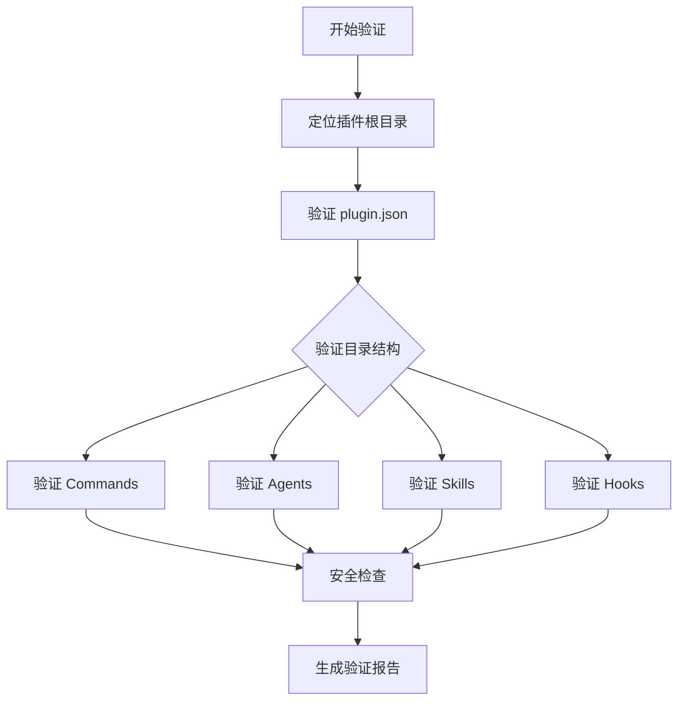
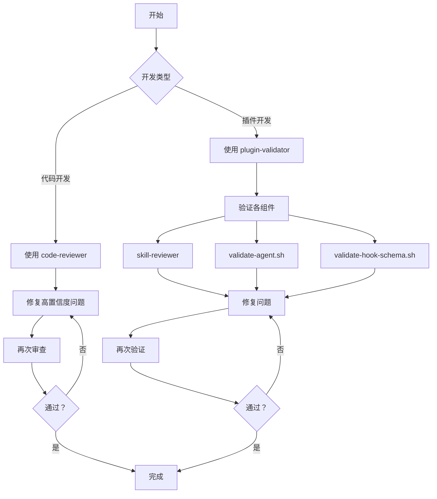

# 质量保障工具详解

> **重要提示**：Claude Code 提供了多种质量保障工具，包括插件验证、Skill 审查、Agent 验证等。本章将详细介绍这些工具的使用方法和最佳实践。

---

## 一、质量保障工具概览

### 1.1 工具分类

Claude Code 的质量保障工具分为以下几类：

| 工具类型 | 工具名称 | 用途 |
|---------|---------|------|
| **插件验证** | plugin-validator | 验证插件结构和配置 |
| **Skill 审查** | skill-reviewer | 审查 Skill 质量 |
| **Agent 验证** | validate-agent.sh | 验证 Agent 配置 |
| **Hook 验证** | validate-hook-schema.sh | 验证 Hook 配置 |
| **代码审查** | code-reviewer | 审查代码质量 |

### 1.2 工具位置

```
plugins/plugin-dev/
├── agents/
│   ├── plugin-validator.md      ← 插件验证 Agent
│   ├── skill-reviewer.md        ← Skill 审查 Agent
│   └── agent-creator.md         ← Agent 创建工具
├── skills/
│   ├── agent-development/
│   │   └── scripts/
│   │       └── validate-agent.sh  ← Agent 验证脚本
│   └── hook-development/
│       └── scripts/
│           └── validate-hook-schema.sh  ← Hook 验证脚本
└── agents/
    └── code-reviewer.md         ← 代码审查 Agent
```

---

## 二、plugin-validator 详解

### 2.1 功能介绍

**plugin-validator** 是一个专门用于验证 Claude Code 插件结构和配置的 Agent。

**核心功能：**
- 验证插件目录结构
- 检查 plugin.json 配置
- 验证所有组件文件（commands、agents、skills、hooks）
- 检查命名规范和文件组织
- 识别常见问题和反模式

### 2.2 使用方法

**方式一：手动调用**

```
"请用 plugin-validator 验证我的插件"
```

**方式二：自动触发**

plugin-validator 会在以下情况自动触发：
- 用户创建或修改插件后
- 用户明确请求验证时
- 用户修改 plugin.json 后

### 2.3 验证流程



### 2.4 验证内容详解

#### 1. 验证 plugin.json

```json
{
  "name": "my-plugin",
  "version": "1.0.0",
  "description": "A sample plugin"
}
```

**验证规则：**

| 字段 | 要求 | 验证内容 |
|------|------|---------|
| **name** | 必填 | kebab-case 格式，无空格 |
| **version** | 可选 | 语义化版本格式（X.Y.Z） |
| **description** | 可选 | 非空字符串 |
| **mcpServers** | 可选 | 有效的服务器配置 |

#### 2. 验证目录结构

```
my-plugin/
├── .claude-plugin/
│   └── plugin.json      ← 必需
├── commands/            ← 可选
│   └── *.md
├── agents/              ← 可选
│   └── *.md
├── skills/              ← 可选
│   └── */SKILL.md
└── hooks/               ← 可选
    └── hooks.json
```

#### 3. 验证 Commands

**验证规则：**

```markdown
✅ 有效的 Command：
---
description: Create a new feature
argument-hint: feature-name
allowed-tools: ["Read", "Write"]
---

[Command content]

❌ 无效的 Command：
---
description:    ← 缺少值
---

[缺少 frontmatter]
```

**检查项：**
- [ ] YAML frontmatter 存在
- [ ] description 字段存在
- [ ] argument-hint 格式正确（如有）
- [ ] allowed-tools 是数组（如有）
- [ ] Markdown 内容存在

#### 4. 验证 Agents

**验证规则：**

```markdown
✅ 有效的 Agent：
---
name: code-reviewer
description: Use this agent when...
model: inherit
color: blue
---

You are an expert code reviewer...

❌ 无效的 Agent：
---
name: ag    ← 太短（< 3 字符）
description: Helper
model: unknown    ← 无效的模型
color: pink    ← 无效的颜色
---
```

**检查项：**
- [ ] name 格式正确（3-50 字符，小写，连字符）
- [ ] description 包含触发示例
- [ ] model 有效（inherit/sonnet/opus/haiku）
- [ ] color 有效（blue/cyan/green/yellow/magenta/red）
- [ ] System Prompt 存在且充实

#### 5. 验证 Skills

**验证规则：**

```markdown
✅ 有效的 Skill：
---
name: hook-development
description: This skill should be used when the user asks to "create a hook"...
version: 0.1.0
---

[Skill content]

❌ 无效的 Skill：
---
name: skill    ← 太通用
---

[缺少 description]
```

**检查项：**
- [ ] SKILL.md 文件存在
- [ ] frontmatter 包含 name 和 description
- [ ] description 简洁清晰
- [ ] 引用的文件存在

#### 6. 验证 Hooks

**验证规则：**

```json
✅ 有效的 Hook 配置：
{
  "hooks": [
    {
      "event": "PreToolUse",
      "matcher": "Write",
      "type": "prompt",
      "prompt": "Check before writing..."
    }
  ]
}

❌ 无效的 Hook 配置：
{
  "hooks": [
    {
      "event": "InvalidEvent",    ← 无效的事件名
      "type": "unknown"           ← 无效的类型
    }
  ]
}
```

**检查项：**
- [ ] JSON 语法正确
- [ ] 事件名有效（PreToolUse、PostToolUse、Stop 等）
- [ ] 每个 hook 有 matcher 和 hooks 数组
- [ ] hook 类型有效（command 或 prompt）
- [ ] 命令引用的脚本存在

### 2.5 输出示例

```markdown
## Plugin Validation Report

### Plugin: my-plugin
Location: /path/to/my-plugin

### Summary
✅ PASS - Plugin structure is valid

### Component Summary
- Commands: 3 found, 3 valid
- Agents: 2 found, 2 valid
- Skills: 1 found, 1 valid
- Hooks: present, valid
- MCP Servers: 0 configured

### Critical Issues (0)
None

### Warnings (2)
1. `README.md` - Missing README file
2. `agents/reviewer.md` - Description could include more trigger examples

### Positive Findings
- ✅ All components follow naming conventions
- ✅ plugin.json is well-structured
- ✅ All agents have comprehensive system prompts
- ✅ Hooks use secure patterns

### Recommendations
1. Add a README.md to document the plugin
2. Consider adding more trigger examples to agent descriptions
```

---

## 三、skill-reviewer 详解

### 3.1 功能介绍

**skill-reviewer** 是专门用于审查 Skill 质量的 Agent。

**核心功能：**
- 审查 Skill 结构和组织
- 评估 description 质量和触发效果
- 检查渐进式披露实现
- 验证写作风格规范
- 提供具体改进建议

### 3.2 使用方法

```
"用 skill-reviewer 审查我的 Skill"
"检查这个 Skill 是否符合最佳实践"
```

### 3.3 审查维度

#### 1. Description 分析

**评估标准：**

```markdown
✅ 好的 Description：
description: This skill should be used when the user asks to "create a hook", "add a PreToolUse hook", "validate tool use", "implement prompt-based hooks", or mentions hook events (PreToolUse, PostToolUse, Stop).

❌ 糟糕的 Description：
description: Use this skill for hooks.
```

**检查项：**
- [ ] 使用第三人称
- [ ] 包含具体触发短语
- [ ] 覆盖多种表达方式
- [ ] 长度适中（50-500 字符）

#### 2. 内容质量

**评估标准：**

```markdown
✅ 好的内容：
- SKILL.md 字数：1,500-2,000 字
- 写作风格：命令式/不定式
- 组织清晰：有明确的章节

❌ 糟糕的内容：
- SKILL.md 字数：8,000 字（太长）
- 写作风格：第二人称
- 组织混乱：没有清晰结构
```

**检查项：**
- [ ] SKILL.md 字数适中（1,000-3,000 字）
- [ ] 使用命令式/不定式形式
- [ ] 组织清晰
- [ ] 内容具体可执行

#### 3. 渐进式披露

**评估标准：**

```markdown
✅ 好的渐进式披露：
skill-name/
├── SKILL.md (1,800 字 - 核心内容)
└── references/
    ├── patterns.md (2,500 字 - 详细模式)
    └── advanced.md (3,700 字 - 高级技巧)

❌ 糟糕的渐进式披露：
skill-name/
└── SKILL.md (8,000 字 - 所有内容都在一个文件)
```

**检查项：**
- [ ] 核心 SKILL.md 精简
- [ ] 详细内容移到 references/
- [ ] 工作示例在 examples/
- [ ] 工具脚本在 scripts/

### 3.4 输出示例

```markdown
## Skill Review: hook-development

### Summary
- SKILL.md: 1,651 words ✅
- references/: 3 files
- examples/: 3 files
- scripts/: 3 files

### Description Analysis
**Current:** This skill should be used when the user asks to "create a hook"...

**Issues:** None

**Recommendations:** Description is well-written with strong trigger phrases.

### Content Quality

**SKILL.md Analysis:**
- Word count: 1,651 (good)
- Writing style: Imperative form ✅
- Organization: Clear sections ✅

### Progressive Disclosure

**Current Structure:**
- SKILL.md: 1,651 words
- references/: 3 files, 6,200 total words
- examples/: 3 files
- scripts/: 3 files

**Assessment:** Progressive disclosure is well implemented.

### Overall Rating
✅ PASS - Skill follows best practices

### Priority Recommendations
1. Consider adding more edge case examples
2. Add troubleshooting section to references
```

---

## 四、validate-agent.sh 脚本详解

### 4.1 功能介绍

**validate-agent.sh** 是一个用于验证 Agent 配置文件的 Shell 脚本。

**位置：** `plugins/plugin-dev/skills/agent-development/scripts/validate-agent.sh`

### 4.2 使用方法

```bash
# 验证单个 Agent 文件
./validate-agent.sh agents/my-agent.md

# 验证所有 Agent 文件
./validate-agent.sh agents/*.md
```

### 4.3 验证规则

```bash
#!/bin/bash

# 验证规则：
# 1. name: 3-50 字符，小写，连字符
# 2. description: 包含触发条件
# 3. model: 有效值（inherit/sonnet/opus/haiku）
# 4. color: 有效值（blue/cyan/green/yellow/magenta/red）
# 5. System Prompt: 存在且 > 20 字符
```

### 4.4 输出示例

```bash
$ ./validate-agent.sh agents/code-reviewer.md

✅ Valid: agents/code-reviewer.md
  - name: code-reviewer ✅
  - description: has trigger examples ✅
  - model: inherit ✅
  - color: red ✅
  - system prompt: 1,234 chars ✅

$ ./validate-agent.sh agents/bad-agent.md

❌ Invalid: agents/bad-agent.md
  - name: ag ❌ (too short, min 3 chars)
  - description: missing trigger examples ❌
  - model: unknown ❌ (must be inherit/sonnet/opus/haiku)
  - color: pink ❌ (must be blue/cyan/green/yellow/magenta/red)
```

---

## 五、validate-hook-schema.sh 脚本详解

### 5.1 功能介绍

**validate-hook-schema.sh** 是一个用于验证 Hook 配置文件的 Shell 脚本。

**位置：** `plugins/plugin-dev/skills/hook-development/scripts/validate-hook-schema.sh`

### 5.2 使用方法

```bash
# 验证 hooks.json 文件
./validate-hook-schema.sh hooks/hooks.json
```

### 5.3 验证规则

```bash
#!/bin/bash

# 验证规则：
# 1. JSON 语法正确
# 2. 事件名有效（PreToolUse, PostToolUse, Stop 等）
# 3. 每个 hook 有 matcher 字段
# 4. hook 类型有效（command 或 prompt）
# 5. 命令引用的脚本存在
```

### 5.4 输出示例

```bash
$ ./validate-hook-schema.sh hooks/hooks.json

✅ Valid: hooks/hooks.json
  - JSON syntax: valid ✅
  - hooks array: present ✅
  - events: all valid ✅
  - matchers: all present ✅
  - types: all valid ✅

$ ./validate-hook-schema.sh hooks/bad-hooks.json

❌ Invalid: hooks/bad-hooks.json
  - JSON syntax: invalid ❌ (line 12: missing comma)
  - event: InvalidEvent ❌ (must be PreToolUse/PostToolUse/Stop/etc)
```

---

## 六、code-reviewer 详解

### 6.1 功能介绍

**code-reviewer** 是用于审查代码质量的 Agent，结合了置信度评分机制。

**核心功能：**
- 审查代码 Bug 和安全漏洞
- 检查项目规范遵守情况
- 评估代码质量
- 使用置信度过滤问题

### 6.2 使用方法

```
"用 code-reviewer 审查我的代码"
"检查这段代码有没有问题"
```

### 6.3 审查维度

| 维度 | 说明 |
|------|------|
| **项目规范遵守** | 检查是否遵循 CLAUDE.md 中的规范 |
| **Bug 检测** | 识别逻辑错误、空指针、竞态条件等 |
| **安全漏洞** | 检测 SQL 注入、XSS、认证问题等 |
| **代码质量** | 评估重复代码、错误处理、测试覆盖等 |

### 6.4 输出示例

```markdown
# code-reviewer 审查报告

## 审查概况
- 审查对象：用户登录功能修改
- 审查范围：git diff 中的未暂存更改
- 审查文件：3 个文件，共 234 行变更

## Critical（严重问题）

### 1. 🐛 SQL 注入漏洞
**置信度：100/100**

📍 位置：src/auth/repository.ts:67

📋 问题描述：
使用字符串拼接构建 SQL 查询，存在 SQL 注入风险

🔧 修复建议：
```javascript
// 错误代码
db.query(`SELECT * FROM users WHERE email = '${email}'`);

// 修复代码
db.query('SELECT * FROM users WHERE email = ?', [email]);
```

## 审查结论

❌ **不建议提交**

发现 1 个严重问题，必须在提交前修复。
```

---

## 七、质量保障工作流

### 7.1 开发阶段质量保障

```
开发新功能
    ↓
使用 code-reviewer 审查代码
    ↓
修复高置信度问题
    ↓
继续开发
```

### 7.2 插件开发质量保障

```
创建插件
    ↓
开发组件（Commands/Agents/Skills/Hooks）
    ↓
使用 plugin-validator 验证
    ↓
使用 skill-reviewer 审查 Skills
    ↓
使用 validate-agent.sh 验证 Agents
    ↓
使用 validate-hook-schema.sh 验证 Hooks
    ↓
修复所有问题
    ↓
发布插件
```

### 7.3 完整质量保障流程



---

## 八、最佳实践

### 8.1 定期验证

```
✅ 推荐：
- 每次提交前运行 code-reviewer
- 每次创建新组件后验证
- 发布前全面验证

❌ 不推荐：
- 只在最后才验证
- 忽略警告信息
- 跳过验证步骤
```

### 8.2 问题优先级

```
Critical（严重）→ 立即修复
Warning（警告）→ 尽快修复
Info（信息）→ 考虑修复
```

### 8.3 持续改进

```
1. 记录常见问题
2. 更新项目规范
3. 优化验证规则
4. 分享最佳实践
```

---

## 九、总结

### ✅ 核心要点

1. **plugin-validator** - 验证插件整体结构
2. **skill-reviewer** - 审查 Skill 质量
3. **validate-agent.sh** - 验证 Agent 配置
4. **validate-hook-schema.sh** - 验证 Hook 配置
5. **code-reviewer** - 审查代码质量

### 📚 延伸学习

- [Agent vs Skill 选择指南](./05-Agent%20vs%20Skill%20选择指南.md) - 扩展机制选择

---

**最后更新：** 2026 年 4 月 6 日  
**版本：** v1.0  
**维护者：** Claude Code 项目学习文档团队
